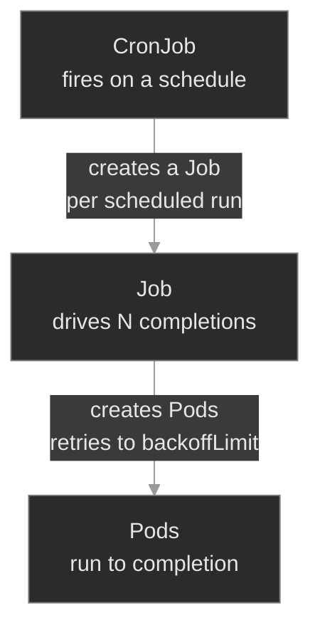

# M01b — Workloads: Jobs & CronJobs

> The other half of the workload family: controllers whose goal is *finishing*, not *staying up*. How a Job drives Pods to successful completion, how `backoffLimit` and `restartPolicy` decide what a failure costs, how `completions`/`parallelism` shard the work, and how a CronJob turns a Job into a clock-driven task.

## What you'll learn

- Explain how a Job differs from a Deployment — desired state is *N successful exits*, not *N running Pods*
- Choose `restartPolicy: OnFailure` vs `Never` for batch work and predict what each does on failure
- Read `backoffLimit` and tell a Job that's *retrying* from one that's permanently *Failed*
- Use `completions` and `parallelism` to run fixed-count and sharded work, and recognize when a "Complete" Job is still wrong
- Trace the CronJob → Job → Pod owner chain, and diagnose a CronJob that never fires (`suspend`, schedule, missed-deadline)

## Why it matters

Not everything on the platform is a server that runs forever. A schema migration runs once before a release and must either succeed or block the rollout. The nightly Call Detail Record rollup has to fire every night or billing drifts. A usage export fans out across shards and is only correct when *all* of them finish. These are batch workloads, and they fail in ways a Deployment never does: a migration Job that silently retries past its limit and gives up, a CronJob that's been suspended since the last maintenance window and hasn't run in three weeks, an export that reports `Complete` while quietly processing a quarter of the data.

The trap is that batch failures are *quiet*. A crash-looping Deployment pages you because traffic drops. A CronJob that stopped firing pages no one — until someone downstream notices the data is stale. At Polyphone, `cdr-rollup` not running doesn't drop a call; it shows up two days later as a billing discrepancy nobody can explain. Learning to read batch state — `COMPLETIONS`, `LAST SCHEDULE`, `backoffLimit`, the controller chain — is learning to catch the failures that don't announce themselves.

## Scope

**Covers:** the Job controller (run-to-completion, `restartPolicy` `OnFailure`/`Never`, `backoffLimit`, `activeDeadlineSeconds`, `ttlSecondsAfterFinished`), fixed-count and parallel execution (`completions`, `parallelism`, a note on `completionMode: Indexed`), and the CronJob controller (`schedule`, `concurrencyPolicy`, `startingDeadlineSeconds`, `suspend`, history limits) including the CronJob → Job → Pod owner chain.

**Doesn't cover:** the Pod lifecycle, container states, probes, and graceful shutdown — that's M01, and this module assumes it. Deployments and ReplicaSets (M01). StatefulSets and DaemonSets (M07). Scheduling, requests/limits, and how batch Pods compete for capacity (M06). Argo Workflows / Tekton and other batch frameworks layered on top of Jobs (out of scope for the core curriculum).

**Assumes:** you finished M01 — Pod phases, container states, `restartPolicy` as a concept, the owner-chain diagnostic instinct (a controller's failure event lands on the controller, not the missing child), and `kubectl get/describe/logs`. You know that `Running` is not the same as `healthy`; this module adds that `Complete` is not the same as `correct`.

## Vocabulary

| Term | Definition |
|------|------------|
| **Job** | A controller that runs Pods until a specified number of them **terminate successfully**, then stops. The unit of run-to-completion work. |
| **CronJob** | A controller that creates a Job on a repeating **schedule**. A Job factory on a clock. |
| **run-to-completion** | The batch model: a Pod does work and **exits**. Success = exit 0. Contrast a Deployment Pod, which is expected to run forever. |
| **restartPolicy** | Pod-level rule for container exits. Jobs allow only **`OnFailure`** (restart the same Pod's container) or **`Never`** (leave it; the Job creates a *new* Pod). `Always` is forbidden — it would never let the Job finish. |
| **backoffLimit** | How many failed Pods/retries a Job tolerates before it gives up and marks itself **`Failed`**. Default 6. |
| **podFailurePolicy** | Rules that react to *why* a Pod failed (container exit code, or a disruption condition) — fail fast on a non-retriable error, or refuse to count an infra-caused failure against `backoffLimit`. |
| **completions** | How many Pods must succeed for the Job to be **Complete**. Default 1. Set it to N for N units of work. |
| **parallelism** | How many Pods the Job runs **at once**. Caps concurrency; independent of `completions`. |
| **completionMode** | `NonIndexed` (default — any N successes count) or `Indexed` (each Pod gets a fixed `JOB_COMPLETION_INDEX` 0…N-1; for sharded work that needs stable identity). |
| **activeDeadlineSeconds** | Wall-clock cap on the whole Job. Past it, the Job is terminated and marked `Failed` regardless of `backoffLimit`. |
| **ttlSecondsAfterFinished** | Auto-delete the Job (and its Pods) this many seconds after it finishes. Keeps finished Jobs from piling up. |
| **schedule** | A CronJob's cron expression (`min hour dom month dow`). Standard cron semantics. |
| **concurrencyPolicy** | What a CronJob does if the previous run is still going: `Allow` (default, overlap), `Forbid` (skip the new one), `Replace` (kill the old, start the new). |
| **startingDeadlineSeconds** | If a scheduled run is missed (controller down, cluster busy), how long late it may still start. Miss the window and that run is skipped. |
| **suspend** | A CronJob (or Job) field; `true` pauses it. A suspended CronJob creates no Jobs and looks otherwise healthy. |
| **Native sidecar** | A helper container that lives as long as the Pod, declared as an init container with `restartPolicy: Always`. In a Job it's terminated when the main container exits — an ordinary sidecar isn't, and blocks completion (see M01). |

## Mental model

A Deployment and a Job are the same machinery — a controller reconciling `spec` against `status` — pointed at **opposite goals**.

- A **Deployment**'s desired state is *“N Pods are Running.”* A Pod that exits is a failure to be corrected: the ReplicaSet starts a replacement, forever. There is no “done.”
- A **Job**'s desired state is *“N Pods have exited 0.”* A Pod that exits successfully is **progress**, not failure. When the count is reached, the Job is `Complete` and stops creating Pods. There is no “keep running.”

That single inversion explains every rule that follows. `restartPolicy: Always` is forbidden on a Job because “always restart” and “run to completion” are contradictions. `backoffLimit` exists because a Job needs a *give-up* condition a Deployment never needs. `completions`/`parallelism` exist because batch work has a known size a long-running server doesn't.

A **CronJob** sits one level up: it doesn't run Pods, it **creates Jobs** on a schedule. So the owner chain grows a link:



This is the M01 diagnostic instinct extended one rung: when a *scheduled* run misbehaves, the question is *which link broke* — did the CronJob create a Job (look at the CronJob's events and `LAST SCHEDULE`), did the Job create Pods (look at the Job's `COMPLETIONS` and events), did the Pods succeed (look at the Pod logs and exit codes)? The load-bearing insight, the batch sibling of M01's “`Running` ≠ healthy”: **`Complete` ≠ correct.** A Job reports `Complete` the instant it hits its `completions` target — even if that target was set wrong.

## Concept walkthrough

The walkthrough follows batch work from the smallest unit up: a single Job, then a parallel Job, then a CronJob scheduling them.

### The Job: run-to-completion and what a failure costs

A Job creates a Pod, waits for it to exit, and judges the exit code. Exit 0 counts toward `completions`; a non-zero exit is a failure subject to `backoffLimit`<sup><a href="https://kubernetes.io/docs/concepts/workloads/controllers/job/">[1]</a></sup>. Because the Pod is *supposed* to exit, a Job's `restartPolicy` can only be `OnFailure` or `Never` — never `Always`, which the API rejects<sup><a href="https://kubernetes.io/docs/concepts/workloads/pods/pod-lifecycle/#restart-policy">[3]</a></sup>.

Those two values produce visibly different failure behavior, and knowing which you're looking at speeds diagnosis:

- **`OnFailure`** — the kubelet restarts the *same* Pod's container in place. You see one Pod with a climbing `RESTARTS` count (and `CrashLoopBackOff` between attempts, exactly as in M01).
- **`Never`** — the Job leaves the failed Pod and creates a *new* one. You see a growing list of Pods in `Error`, one per attempt, restart count stuck at 0.

Either way, `backoffLimit` is the give-up condition. It counts failures; once exceeded, the Job stops retrying and goes to `Failed`<sup><a href="https://kubernetes.io/docs/concepts/workloads/controllers/job/#pod-backoff-failure-policy">[1]</a></sup>. This is the single most misread piece of Job state: a Job at `COMPLETIONS 0/1` with Pods erroring is **retrying**; the same Job after `backoffLimit` is exhausted is **done failing** and will never make another attempt. The fix for the latter is not to wait — it's to find why every attempt failed and run a fresh Job. `kubectl describe job` tells you which state you're in: a `BackoffLimitExceeded` event with a `status.conditions` entry of type `Failed` means the controller has given up; their absence on a `0/1` Job means it's still mid-retry.

Two more bounds worth knowing. `activeDeadlineSeconds` is a wall-clock cap on the whole Job — it overrides `backoffLimit` and kills a Job that's taking too long, useful for batch work that must not run into the next window. `ttlSecondsAfterFinished` auto-deletes a finished Job and its Pods after a delay, so completed Jobs don't accumulate as clutter you have to garbage-collect by hand<sup><a href="https://kubernetes.io/docs/concepts/workloads/controllers/ttlafterfinished/">[5]</a></sup>.

<details>
<summary>📖 Going deeper: podFailurePolicy — not every failure deserves a retry<sup><a href="https://kubernetes.io/docs/tasks/job/pod-failure-policy/">[7]</a></sup></summary>

`backoffLimit` is blunt: it treats every failure the same. A config-error exit code and a node preemption both burn one retry. `podFailurePolicy` (stable since v1.31) lets the Job react to *why* a Pod failed<sup><a href="https://kubernetes.io/docs/tasks/job/pod-failure-policy/">[7]</a></sup>:

- **`FailJob`** on a specific container exit code — an exit `42` that means "bad config" will never succeed on retry, so fail the Job immediately instead of grinding through all of `backoffLimit`.
- **`Ignore`** on a `DisruptionTarget` condition — a Pod killed by node preemption, drain, or a spot reclaim wasn't the app's fault, so don't count it against the limit; just reschedule and try again.
- **`Count`** — the default: count it normally.

For an SRE this is the gap between a migration that fails *fast* on a real bug (you see it in a minute, not after six exponential-backoff retries) and one that doesn't give up just because a spot node got reclaimed mid-run. `podFailurePolicy` decides the *kind* of failure; `backoffLimit` remains the backstop for how many of the countable ones you tolerate.

</details>

<details>
<summary>📖 Going deeper: Jobs are immutable — you delete and recreate, you don't patch<sup><a href="https://kubernetes.io/docs/concepts/workloads/controllers/job/">[1]</a></sup></summary>

A Deployment is built to be edited: change the Pod template and it rolls a new ReplicaSet. A Job is not. Most of a Job's `spec` — the Pod template, `completions`, `completionMode`, `selector` — is **immutable** after creation. Try to `kubectl patch` the command or the completion count and the API server rejects it with `field is immutable`.

The reason is semantic, not arbitrary: a Job represents *one execution of a unit of work*. Mutating its template mid-flight would mean the Pods already created and the Pods not yet created ran different code — there'd be no coherent answer to “what did this Job do.” So the model is: a Job is disposable. To change it, delete it and apply a corrected one (`kubectl delete job <name>` then `kubectl apply -f`, or `kubectl replace --force`). A handful of fields *are* mutable — `parallelism`, `suspend`, `activeDeadlineSeconds`, `ttlSecondsAfterFinished` — because they govern *how* the remaining work runs, not *what* it is.

This immutability has an operational edge that surprises people coming from Deployments: **a `Failed` Job does not self-heal.** Correct a Deployment's image in your GitOps repo and the next reconcile rolls it back to health. Correct a Job's command in the same repo and nothing happens — the Job object already exists, so the controller sees no drift, and the corrected spec sits inert until the old Job is deleted and a new one applied. Recreation isn't just *a* fix for a Job; it's the only thing that makes the corrected version run at all.

</details>

One multi-container gotcha is specific to batch. A Job's Pod is "done" only when **every** container in it terminates. A sidecar that runs forever — a log shipper, a mesh proxy injected as an ordinary container — keeps the Pod `Running` even after the main workload exits 0, so the Job never reaches completion and hangs at `0/1`. The work succeeded; the Pod just can't finish. **Native sidecar containers** (init containers with `restartPolicy: Always`, introduced in M01) fix this: the kubelet stops them once the main container exits, so the Pod completes. The tell for this failure is a Pod stuck `Running` at `READY 1/2` — the main container shows `Completed`, the helper is still up — long after the work itself is done.

### completions and parallelism: fixed-count and sharded work

By default a Job runs one Pod to one success (`completions: 1`). Set `completions: N` and the Job needs N successful Pods; set `parallelism: P` and it runs at most P at a time<sup><a href="https://kubernetes.io/docs/concepts/workloads/controllers/job/#parallel-jobs">[1]</a></sup>. The two are independent knobs: `completions: 4, parallelism: 2` runs four units of work, two at a time. `parallelism` without `completions` (default 1) just means “run one, but you may use up to P slots” — which mostly matters for the work-queue pattern.

The failure mode here is subtler than a crash. A Job marks itself `Complete` the moment its *succeeded* count reaches `completions`. If `completions` is set to 1 when the work is really 4 shards, the Job runs one shard, sees `1/1`, and reports `Complete` — green, healthy, done — while three-quarters of the data is never processed. Nothing errors. Nothing restarts. The status lies the same way a `Running`-but-unready Pod lied in M01. **A Job's correctness lives in whether `completions` matches the real size of the work — not in whether it reached `Complete`.**

<details>
<summary>📖 Going deeper: Indexed completion for sharded work that needs identity<sup><a href="https://kubernetes.io/docs/tasks/job/indexed-parallel-processing-static/">[6]</a></sup></summary>

`NonIndexed` (the default) treats all completions as interchangeable: any N successful Pods finish the Job. That's right when each Pod pulls the next item off a shared queue. But when the work is *statically sharded* — “process partition 0, 1, 2, 3” — each Pod needs to know *which* shard it owns. That's `completionMode: Indexed`: the Job assigns each Pod a unique `JOB_COMPLETION_INDEX` (0…`completions`-1), exposed as an env var and an annotation, and the Job is Complete only when every index has succeeded exactly once.

A sharded export in Indexed mode has each Pod handle exactly one partition by reading its index — no coordination, no double-processing. The operational payoff is diagnosability: a missing index in the succeeded set tells you *exactly which shard* failed, instead of just “one of four didn't finish.” When you see statically-sharded batch work, ask whether it should be Indexed.

</details>

### The CronJob: a Job factory on a clock

A CronJob holds a `jobTemplate` and a `schedule`, and on each schedule tick it stamps out a Job from the template<sup><a href="https://kubernetes.io/docs/concepts/workloads/controllers/cron-jobs/">[2]</a></sup>. Everything you know about Jobs applies to the Jobs it creates; the CronJob layer only adds *when* and *whether*.

The schedule is standard cron — `min hour day-of-month month day-of-week` — so `0 2 * * *` is 02:00 daily and `*/5 * * * *` is every five minutes<sup><a href="https://kubernetes.io/docs/tasks/job/automated-tasks-with-cron-jobs/">[4]</a></sup>. Three controls govern behavior around the schedule:

- **`concurrencyPolicy`** — if the previous run hasn't finished when the next is due: `Allow` (let them overlap), `Forbid` (skip the new run), `Replace` (kill the running one, start fresh). For a CDR rollup you almost always want `Forbid` — two rollups racing on the same data is worse than skipping one.
- **`startingDeadlineSeconds`** — if a run is missed (the controller was down, or the cluster was too busy to start it on time), how many seconds late it may still launch. Past that, the run is dropped. Set it too low and transient delays silently eat scheduled runs.
- **`suspend`** — `true` pauses the CronJob entirely. It creates no Jobs and otherwise looks fine. This is the most common reason a CronJob “stopped working”: someone suspended it for a maintenance window and never un-suspended it. Nothing in `kubectl get cronjob` looks alarming — which is why `SUSPEND` is the first column to read.

History is bounded by `successfulJobsHistoryLimit` and `failedJobsHistoryLimit` — the CronJob keeps the last few finished Jobs (and their Pods) so you can inspect them, and garbage-collects the rest. `kubectl get cronjob` shows `LAST SCHEDULE` (when it last fired) and `ACTIVE` (how many of its Jobs are running now) — the two fields you read first when a scheduled task is suspect.

A CronJob that appears stuck has a short differential: is it **suspended** (`SUSPEND True`)? Is the **schedule** valid but never matching (`0 0 31 2 *` — the 31st of February — is legal cron that never fires)? Were runs **missed and deadlined out**? Is a previous run **stuck Active** with `concurrencyPolicy: Forbid`, blocking all successors? Each is a one-field read on the CronJob spec — make those reads before assuming the controller itself is broken.

To trigger a scheduled task on demand — to test it, or to run a missed CDR rollup by hand — you create a one-off Job from the CronJob's template:

```bash
kubectl create job --from=cronjob/cdr-rollup cdr-rollup-manual -n cdr-storage
```

That's the standard “run it now” move, and it's how you confirm the Job template works independently of whether the schedule is firing.

## Hands-on

Four steps in the baseline, four break/fix scenarios — all on the full Polyphone fleet, now with batch workloads layered on: `schema-migrate` (a one-shot Job), `usage-export` (a parallel Job), and `cdr-rollup` (a CronJob).

- **`baseline/`** — Tour healthy batch workloads: the Job → Pod and CronJob → Job → Pod owner chains, run-to-completion and `restartPolicy`, `completions`/`parallelism` in action, and a CronJob firing on schedule. The reference for what good batch looks like.
- **`breakfix-01-cronjob-never-fires/`** — The nightly `cdr-rollup` hasn't run. No errors, no pods, nothing in the logs. Tests the CronJob differential — `suspend` first.
- **`breakfix-02-job-backofflimit/`** — A `schema-migrate` Job won't complete; its Pods keep failing. Tests reading `backoffLimit`/`restartPolicy` and the fact that a Job is immutable — you recreate to fix it.
- **`breakfix-03-completions-shortfall/`** — `usage-export` reports `Complete`, but downstream only sees a fraction of the data. Tests `completions`/`parallelism` and that `Complete` is not `correct`.
- **`breakfix-04-cronjob-concurrency-stuck/`** — `cdr-rollup` isn't suspended, yet no new runs fire: one run is stuck `Active` and `concurrencyPolicy: Forbid` blocks every successor. Tests the stuck-Active branch of the CronJob differential and the `activeDeadlineSeconds` guardrail.

Check yourself against `ANSWER-KEY.md` after each.

## Common failure modes

| Symptom | Likely cause | Where to look |
|---------|--------------|---------------|
| CronJob `LAST SCHEDULE <none>`, no Jobs ever created | CronJob is **suspended** | `kubectl get cronjob` → `SUSPEND` column; `.spec.suspend` |
| CronJob never fires but isn't suspended | Schedule valid but never matches, or runs missed past `startingDeadlineSeconds` | Read `.spec.schedule`; `describe cronjob` for missed-schedule events |
| CronJob stopped firing; one Job stuck `ACTIVE` | Previous run hung + `concurrencyPolicy: Forbid` blocks successors | `kubectl get jobs` → the stuck Active Job; fix or delete it |
| Job `COMPLETIONS 0/1`, one Pod with climbing `RESTARTS` | App failing every attempt, `restartPolicy: OnFailure`, retrying to `backoffLimit` | `kubectl logs job/<name>`; `describe job` for backoff/failed events |
| Job `COMPLETIONS 0/1`, growing list of `Error` Pods | Same, but `restartPolicy: Never` (new Pod per attempt) | `kubectl logs` on the most recent failed Pod |
| Job `Failed`, no more attempts | `backoffLimit` exhausted or `activeDeadlineSeconds` hit | `describe job` → `BackoffLimitExceeded` / `DeadlineExceeded` |
| Job `Complete` but downstream data is partial | `completions` set lower than the real work size | `.spec.completions` vs the intended shard/unit count |
| Job stuck `0/1`, Pod `Running` with one container `Completed` + a helper still up | An ordinary (non-native) sidecar runs forever, so the Pod never terminates | `get pod -o jsonpath` container states; move the helper to a native sidecar |

## Recap

- A Job's desired state is *N successful exits*, not *N running Pods* — the same controller machinery as a Deployment, inverted. That inversion explains `restartPolicy` (no `Always`), `backoffLimit`, and `completions`/`parallelism`.
- `restartPolicy: OnFailure` restarts the same Pod (climbing `RESTARTS`); `Never` spawns a new Pod per attempt (a list of `Error` Pods). `backoffLimit` is the give-up count — a retrying Job and a `Failed` one look similar but mean opposite things.
- `Complete` ≠ correct. A Job hits `Complete` when `succeeded` reaches `completions`, even if `completions` was set wrong — the batch analog of M01's `Running` ≠ ready.
- A CronJob creates Jobs on a schedule: CronJob → Job → Pod. When a scheduled task misbehaves, find which link broke. The first reads are `SUSPEND`, `LAST SCHEDULE`, `ACTIVE`, and the schedule itself.
- Jobs are immutable — fix one by deleting and recreating. CronJobs are patchable for the run-governing fields (`suspend`, `schedule`, `concurrencyPolicy`).

## Production thinking

- `cdr-rollup` hasn't fired in three weeks and no alert fired either. A crash-looping Deployment pages you; a silently-not-running CronJob doesn't. What signal would you alert on so a missed scheduled run is as loud as a down service — and where does that signal come from?
- A migration Job exhausted its `backoffLimit` and is `Failed`. The durable fix lives in the GitOps repo, but a `Failed` Job won't re-run itself on the next reconcile the way a Deployment self-heals. What has to happen for the corrected Job to actually execute, and who or what triggers it?
- You're setting `concurrencyPolicy` and `activeDeadlineSeconds` for a rollup that occasionally runs long. Talk through the failure you're protecting against with each, and the cost of choosing `Forbid` (a skipped run) versus `Allow` (two runs racing the same data).

## References

1. Kubernetes — Jobs: https://kubernetes.io/docs/concepts/workloads/controllers/job/
2. Kubernetes — CronJob: https://kubernetes.io/docs/concepts/workloads/controllers/cron-jobs/
3. Kubernetes — Pod Lifecycle (restart policy): https://kubernetes.io/docs/concepts/workloads/pods/pod-lifecycle/#restart-policy
4. Kubernetes — Running Automated Tasks with a CronJob: https://kubernetes.io/docs/tasks/job/automated-tasks-with-cron-jobs/
5. Kubernetes — TTL After Finished: https://kubernetes.io/docs/concepts/workloads/controllers/ttlafterfinished/
6. Kubernetes — Indexed Job for Parallel Processing: https://kubernetes.io/docs/tasks/job/indexed-parallel-processing-static/
7. Kubernetes — Handling retriable and non-retriable Pod failures with a Pod failure policy: https://kubernetes.io/docs/tasks/job/pod-failure-policy/
