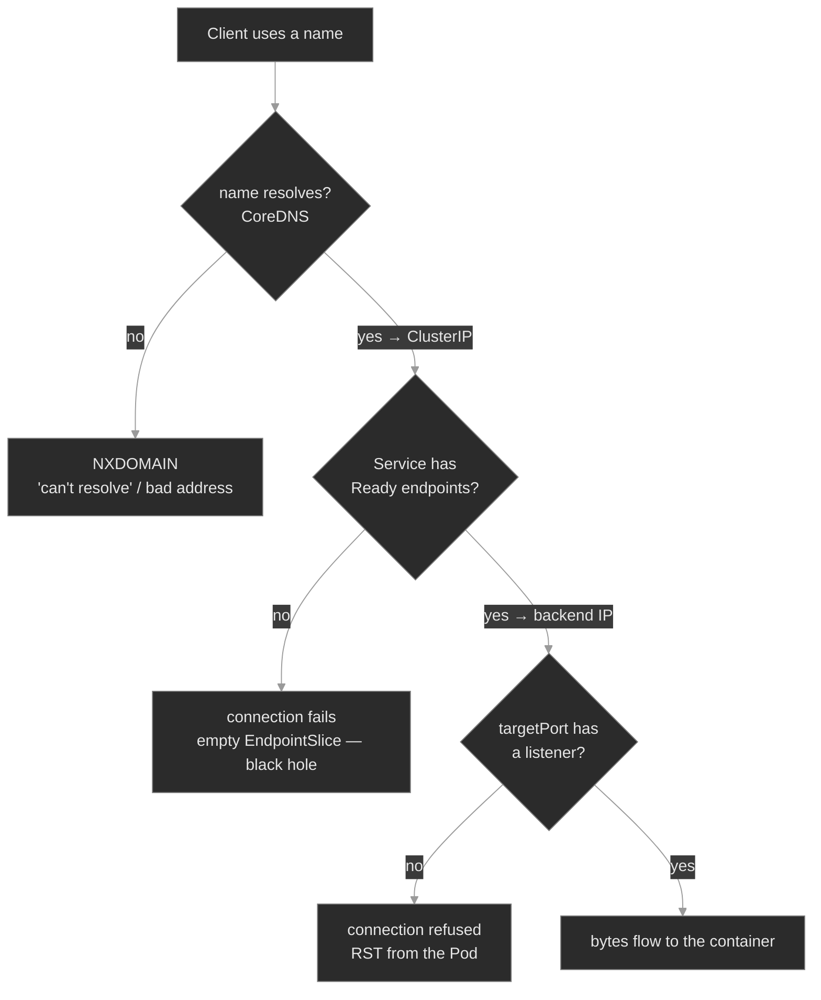

# M04 — Networking I: Services & DNS

> How a stable name reaches a moving set of Pods — Services, selectors, EndpointSlices, kube-proxy, and cluster DNS — and the three places on that path where traffic silently stops flowing.

## What you'll learn

- Describe what already works before any Service exists: every Pod holds a routable IP, and Pods reach each other across nodes with no address translation
- Explain what a Service is and why it exists: a stable virtual IP and DNS name in front of a set of Pods whose own IPs change constantly
- Trace a request from a client all the way to a container: name → ClusterIP → node rules → Pod IP → listening socket, and name the component that owns each hop
- Read a Service's real backend set with `kubectl describe svc` or `kubectl get endpointslice`, and recognize the empty-endpoints black hole
- Distinguish `port`, `targetPort`, and `containerPort`, and diagnose the connection-refused you get when `targetPort` points at nothing
- Resolve a Service by DNS the way a Pod does — short name, `<svc>.<ns>`, and the FQDN — and explain why a bare name fails across namespaces
- Work the connectivity differential: split a failed request into *name didn't resolve* vs *no endpoints* vs *wrong port*

## Why it matters

Pods are disposable. A Deployment rolls, a node drains, an HPA scales, and the Pod IPs you had a minute ago are gone — no application could function while tracking them. Every call between Polyphone components therefore goes through a Service and a DNS lookup. When that plumbing breaks, the failure is rarely where you first look.

The trap is that the failure is quiet and the top-line objects look healthy. `kubectl get svc` shows a ClusterIP. `kubectl get pods` shows everything `Running` and `Ready`. The request still hangs or comes back refused, because the one thing that carries traffic — the EndpointSlice — is empty, or points at a port nothing listens on, or the client asked for a name that never resolved. An SRE who knows the request path checks the endpoints and the DNS answer first. One who doesn't restarts Pods that were never the problem.

## Scope

**Covers:** the flat Pod-network model a Service sits on, the Service object and its types (ClusterIP, NodePort, LoadBalancer, ExternalName, headless), how a selector becomes an EndpointSlice, the `port`/`targetPort`/`containerPort` distinction, the node datapath (network namespace, veth pair, kube-proxy rewrite, connection tracking), cluster DNS via CoreDNS, the five access paths, and the name-resolves / has-endpoints / port-answers differential.

**Doesn't cover:** NetworkPolicy and Ingress → M14 (traffic is default-allow here), service mesh and mesh mTLS → M15, CNI internals and the host-networking escape hatches (`hostNetwork`, `hostPort`, secondary interfaces) → M22, and cloud-specific load balancer provisioning. This module is the in-cluster L4 path: name to Pod.

**Assumes:** M00 (`get → describe → events → logs`; spec vs status), M01 (Pods, Deployments, labels, readiness — a Pod can be `Running` but not `Ready`).

## Vocabulary

| Term | Definition |
|------|------------|
| **Service** | A namespaced API object giving a stable identity (a virtual IP and a DNS name) to a logical set of Pods. The set is defined by a label selector. |
| **ClusterIP** | The default Service type: a virtual IP reachable only inside the cluster. The IP is stable for the Service's life and backed by no single Pod. |
| **selector** | The set of labels on a Service that defines which Pods are its backends. Matching is identical to a ReplicaSet's selector (M01). |
| **Endpoints / EndpointSlice** | The derived object listing a Service's real backend addresses (Pod IP + port). `Endpoints` is the original form — one object holding every backend. **EndpointSlice** is the modern one, which shards a large backend set across several objects so a single Pod change doesn't rewrite the whole list. `kubectl get endpoints` reads the old API, `kubectl get endpointslice` the new. **Only `Ready` Pods appear.** |
| **kube-proxy** | The node agent that watches Services and EndpointSlices and programs the node's forwarding state, so ClusterIP traffic reaches a backend. Some clusters use another dataplane. |
| **`port`** | The port the Service listens on — what clients connect to (`<svc>:<port>`). |
| **`targetPort`** | The Pod port the Service forwards to. Defaults to `port` if omitted. Can be a number or a named port. |
| **`containerPort`** | A port the container declares in its Pod spec. Informational — it does **not** open or close anything; the process listens (or doesn't) regardless. |
| **headless Service** | A Service with `clusterIP: None`. No virtual IP and no kube-proxy load-balancing; DNS returns the Pod IPs directly. Used for StatefulSets and client-side discovery. |
| **NodePort / LoadBalancer / ExternalName** | Exposure types layered outward from ClusterIP. **NodePort** keeps the ClusterIP and also opens the Service on one port on every node, so traffic from outside can reach it. **LoadBalancer** keeps both of those and asks the cloud provider for an external load balancer in front of the node ports. **ExternalName** proxies nothing at all — it is a CNAME to a DNS name outside the cluster. |
| **CNI plugin** | The component that attaches each Pod to the node network and carries Pod traffic between nodes. The kubelet calls it when a Pod starts. |
| **network namespace** | The kernel isolation giving a Pod its own interfaces, routing table, and port space. Every container in the Pod shares one, so they reach each other on `localhost` and cannot both bind the same port. |
| **veth pair** | A virtual cable with one end in the Pod's network namespace and the other in the node's. Every packet a Pod sends crosses it. |
| **connection tracking** | The kernel's record of an open connection, including the rewrite kube-proxy applied to it. It reverses that rewrite on the reply. |
| **`kubectl port-forward`** | A stream from your workstation to one Pod, carried by the apiserver and the kubelet. It uses no ClusterIP and no kube-proxy rule. |
| **CoreDNS** | The cluster DNS server (Pods in `kube-system`), itself fronted by a Service (`kube-dns`). Resolves Service and Pod names to cluster IPs. |
| **FQDN / search domains / `ndots`** | A Service's full name is `<svc>.<ns>.svc.cluster.local`. A Pod's `/etc/resolv.conf` lists `search` domains that expand short names, and `ndots` decides when a name is tried as-is instead. |

## Mental model

A request to a Service travels a fixed path, and each hop is owned by a different component. You write one field of that chain; named components write the rest.

| On the path | Written by | Written from |
|-------------|------------|--------------|
| Service + selector | you | your intent |
| ClusterIP | the apiserver | the Service IP range |
| DNS record | CoreDNS | the Service object |
| EndpointSlice | the EndpointSlice controller | the selector + `Ready` Pods |
| Kernel rules, per node | kube-proxy | the Service + its EndpointSlice |
| The listening socket | your process | your code or its config |

Read the table as failure domains. A broken path means one writer got the wrong input, or never ran.



The three red leaves are the three ways the path breaks, in the order a request meets them. The instinct, inherited from M02's pull-failure differential and M03's config differential: **`connection refused` is a category, not a diagnosis.** The client's error says it failed; the EndpointSlice and the DNS answer say *where*. Read those first<sup><a href="https://kubernetes.io/docs/tasks/debug/debug-application/debug-service/">[6]</a></sup>.

## Concept walkthrough

### Before the Service: every Pod already has an IP

Start one layer below the Service, because that layer already works. Kubernetes gives every Pod one IP address, shared by its containers, reachable from every other Pod in the cluster — including Pods on other nodes<sup><a href="https://kubernetes.io/docs/concepts/cluster-administration/networking/">[8]</a></sup>. Neither side's address is translated on the way, so a server sees the client's real Pod IP. The **CNI plugin** provides this: the kubelet calls it when a Pod starts, and the plugin attaches the Pod to the node and carries packets between nodes.

That no-translation guarantee stops at the cluster edge. Traffic leaving for an external endpoint is **source-NATed to the node's IP**, so the far side sees a node, not a Pod. It's why a partner's IP allowlist has to name your nodes, why external audit logs show node addresses, and why a Pod-level identity can't be inferred from an outbound connection.

So Pod-to-Pod calls need no Service at all. What Pod IPs cannot do is hold still. A rollout replaces a Pod and its IP is gone; an autoscaler adds three addresses nobody configured. No client can keep a Pod IP as configuration. **A Service is not a connectivity layer. It is a naming and load-balancing layer on top of one that already connects.** Keep that separation when a call fails: ask whether the name, the backend list, or the port broke — not whether the network is up.

### A Service is a stable identity for a moving target

A Service separates *who you call* from *which Pods answer*<sup><a href="https://kubernetes.io/docs/concepts/services-networking/service/">[1]</a></sup>. You create a `session-broker` Service with the selector `app: session-broker`, and from then on anything in the cluster reaches it at a fixed ClusterIP and DNS name, however often the Pods behind it are replaced<sup><a href="https://kubernetes.io/docs/tutorials/services/connect-applications-service/">[7]</a></sup>. The default type, **ClusterIP**, allocates that virtual IP from the Service CIDR; it answers only inside the cluster.

The selector is the whole mechanism. The control plane runs an EndpointSlice controller that watches for Pods matching the selector and writes their addresses and conditions into an **EndpointSlice**. Traffic normally uses the endpoints considered **ready**<sup><a href="https://kubernetes.io/docs/concepts/services-networking/endpoint-slices/">[2]</a></sup>. This is M01's readiness gate doing load-balancer duty: a Pod that fails its probe leaves the EndpointSlice and stops receiving traffic without being killed. The Service and its EndpointSlice are two different objects, and that is the module's most important diagnostic fact: `kubectl get svc` says the Service *exists*; `kubectl get endpointslice` says whether it has anywhere to send traffic.

That gives the module's instance of a recurring theme: the headline status lies (M01's `Running` ≠ `Ready`). A Service with a ClusterIP, the right ports, and no errors routes nowhere if its EndpointSlice lists no addresses. That happens for exactly two reasons — the selector matches no Pods, or the matched Pods are not `Ready` — and both look identical at the Service.

```yaml
apiVersion: v1
kind: Service
metadata: { name: session-broker, namespace: media }
spec:
  selector: { app: session-broker }   # must match the Pods' labels exactly
  ports:
    - port: 80           # clients connect here:  session-broker:80
      targetPort: 80     # forwarded to this Pod port
```

### Ports: `port` vs `targetPort` vs `containerPort`, and what kube-proxy does

Three port fields show up around a Service, and conflating them explains most of "the endpoints are right but it still won't connect." Vocabulary above defines each. What matters here is the division of labour: only **`targetPort`** decides *where* traffic is delivered, and only the **process** decides whether anything answers there. `containerPort` states intent and opens nothing<sup><a href="https://kubernetes.io/docs/concepts/services-networking/service/#defining-a-service">[1]</a></sup>. The failure mode: a Service whose `targetPort` points at a port no process is listening on. The EndpointSlice is fully populated (the selector matched, the Pods are Ready), the name resolves, the connection is delivered to the Pod — and the Pod's kernel sends a RST because nothing is bound there. The client sees `connection refused`, and the endpoints look perfect, which is exactly why this one sends people in circles.

Once a Service has endpoints, the **Service dataplane** on each node is what makes the ClusterIP work. On a normal cluster that is **kube-proxy**: it watches Services and EndpointSlices and *programs* the node's kernel — upstream, with nftables or iptables — so a packet sent to `ClusterIP:port` is redirected to one of the backend Pod addresses at its `targetPort`, selected per connection. kube-proxy is not a userspace proxy handling each packet; the kernel carries the traffic<sup><a href="https://kubernetes.io/docs/reference/networking/virtual-ips/">[3]</a></sup>. The ClusterIP itself is virtual: nothing holds it, no interface answers ARP for it; it exists only as forwarding state on the nodes running the dataplane. With **zero** usable endpoints there is nothing to forward to, and the client sees a refusal, a drop, or a timeout depending on the mode — which is why the EndpointSlice, not the client error, is what tells you why.

Zooming into one node makes that rewrite concrete. A packet leaves the client Pod through a **veth pair** — a virtual cable with one end in the Pod's network namespace and the other in the node's<sup><a href="https://kubernetes.io/docs/concepts/cluster-administration/networking/">[8]</a></sup>. In the node's network stack it meets kube-proxy's rules, which choose one backend from the EndpointSlice and rewrite the destination from `ClusterIP:port` to `PodIP:targetPort`. When that Pod sits on another node, the CNI routes or encapsulates the packet across. The reply needs no rule of its own: the kernel's **connection tracking** remembers the rewrite and reverses it, so the client sees an answer from the ClusterIP it dialed<sup><a href="https://kubernetes.io/docs/reference/networking/virtual-ips/">[3]</a></sup>. Two consequences follow. A backend is chosen once per connection, not per packet, so a backend dying mid-connection breaks that connection and not the next. And the state is per node, which is why one node can fail while the others serve the same Service.

<details>
<summary>📖 Going deeper: kube-proxy modes, and why the ClusterIP is "nowhere"<sup><a href="https://kubernetes.io/docs/reference/networking/virtual-ips/">[3]</a></sup></summary>

Upstream kube-proxy has two modes worth knowing<sup><a href="https://kubernetes.io/docs/reference/networking/virtual-ips/">[3]</a></sup>. **iptables**, the long-time default, writes one chain per Service and matches linearly, so its rule-update cost grows with Service count. **nftables** is its successor, addressing the same limits inside the nft framework. An **IPVS** mode also exists; it is legacy and deprecated, so do not build the mental model around it. Some networking implementations replace kube-proxy with their own dataplane, for example an eBPF one; the objects stay identical and only the tooling changes.

There is no "Service process" to restart and no host that owns the ClusterIP. On a node that can't reach a Service, read the mode first, then that mode's state — `iptables-save | grep <clusterip>`, or `nft list ruleset`. On a kube-proxy-free cluster, neither applies; you inspect the plugin's own state instead.

</details>

### Cluster DNS: how a Pod turns a name into a ClusterIP

A ClusterIP is stable, but nobody wants to hardcode `10.96.x.y`. Cluster DNS lets you use names. **CoreDNS** runs as a Deployment in `kube-system`, fronted by a Service named `kube-dns`, and every Pod is configured to use it: the Pod's `/etc/resolv.conf` points `nameserver` at the `kube-dns` ClusterIP<sup><a href="https://kubernetes.io/docs/concepts/services-networking/dns-pod-service/">[4]</a></sup>. Every Service automatically gets an A/AAAA record at:

```text
<service>.<namespace>.svc.cluster.local
```

So `session-broker` in `media` is fully `session-broker.media.svc.cluster.local`. You rarely type that, because of the **search domains** in `resolv.conf`. A Pod in `media` gets a search list like `media.svc.cluster.local  svc.cluster.local  cluster.local`, so a bare `session-broker` resolves. That convenience is also the most common cluster-DNS bug: **a short name resolves only within its own namespace.** A Pod in `provisioning` asking for bare `session-broker` searches `session-broker.provisioning.svc.cluster.local` first, which doesn't exist, and gets NXDOMAIN — the search domains are built from the *client's* namespace, not the target's. Qualify it as `session-broker.media`, or use the full FQDN.

The same `resolv.conf` carries `options ndots:5`. It means: if a name has fewer than 5 dots, try it with each search domain appended *first*, and as a literal name only if all of those fail<sup><a href="https://kubernetes.io/docs/concepts/services-networking/dns-pod-service/#pod-s-dns-config">[5]</a></sup>. It is why short in-cluster names work — and why an *external* name like `api.stripe.com` (3 dots) costs several failing cluster lookups first, which adds up at scale. A trailing dot marks a name fully-qualified and skips the search list.

One caveat costs real debugging time: `ndots` is a glibc resolver feature, and busybox does not implement it. busybox queries any name containing a dot literally, so `nslookup <svc>.<ns>` from a busybox debug Pod returns NXDOMAIN for a Service the application resolves fine. Use the full FQDN in throwaway debug containers, or you will diagnose a working name as broken.

<details>
<summary>📖 Going deeper: headless Services, and DNS for the cases ClusterIP can't serve<sup><a href="https://kubernetes.io/docs/concepts/services-networking/dns-pod-service/">[4]</a></sup></summary>

A normal Service's DNS name returns one ClusterIP and the dataplane balances behind it, so the client never knows which Pod it got. Two cases need something else, and both bend DNS instead.

A **headless Service** (`clusterIP: None`) has no virtual IP and no dataplane involvement. Its name resolves straight to every backing Pod IP, as multiple A records, and — when it backs a StatefulSet — each Pod also gets a *stable per-Pod* name, `<pod>.<svc>.<ns>.svc.cluster.local`<sup><a href="https://kubernetes.io/docs/concepts/services-networking/dns-pod-service/">[4]</a></sup>. That per-Pod identity is what stateful systems need for leader election and replication (M07). Read `clusterIP: None` as "DNS returns Pods, not a VIP."

An **ExternalName** Service is the other bend — a CNAME to an external name (`spec.externalName: postgres.prod.example.com`), giving in-cluster clients a stable internal name for something outside. It confuses people because `kubectl get endpointslice` on it is empty *by design*: resolution happens in DNS, not in a backend set.

</details>

### Reaching a Service: five paths, and what each one skips

Where a request starts decides which parts of the path can break — and a test that works proves every layer it crossed.

| Path | Starts at | Goes through | Skips |
|------|-----------|--------------|-------|
| Pod to Pod | a client Pod | the Pod network only | DNS, ClusterIP, kube-proxy |
| ClusterIP | a client Pod | DNS, node rules, Pod network | nothing |
| NodePort | any node's IP | that node's rules, then the Service | cluster DNS |
| LoadBalancer | outside the cluster | an external LB, then a NodePort | cluster DNS |
| `kubectl port-forward` | your workstation | the apiserver, the kubelet, one Pod | DNS, ClusterIP, kube-proxy |

`kubectl port-forward svc/session-broker 8080:80 -n media` looks like a test of the Service, and it is not. It uses the Service only to select **one** Pod, then streams to that Pod through the apiserver and the kubelet<sup><a href="https://kubernetes.io/docs/tasks/access-application-cluster/port-forward-access-application-cluster/">[9]</a></sup> — touching neither cluster DNS, the ClusterIP, nor kube-proxy's rules. That makes it a precise probe: if port-forward reaches the application and a ClusterIP call to the same Service does not, the fault is in the Service layer. Reverse the result and it's inside the container.

## Hands-on

Six steps in the baseline, three break/fix scenarios — all on the full Polyphone fleet, exercising the Services it already runs. Traffic comes from a throwaway in-cluster client, since the fleet's own Pods don't originate calls.

- **`baseline/`** — the request path working end to end: a Service's ClusterIP and how it's reached, the EndpointSlice behind a selector and who rebuilds it, `port`/`targetPort` resolved to a Pod, and DNS resolution from inside a Pod (short name, FQDN, headless). What healthy looks like before the differential breaks it.
- **`breakfix-01-dns-cross-namespace/`** — a name that won't resolve. Tests the DNS naming scheme: a bare Service name used across namespaces returns NXDOMAIN; the fix is the qualified name.
- **`breakfix-02-selector-mismatch/`** — a Service with an empty EndpointSlice. Tests reading `get endpointslice`: the Service exists and the Pods are Ready, but the selector matches none of them, so traffic goes nowhere.
- **`breakfix-03-port-mismatch/`** — endpoints populated, connection still refused. Tests the `targetPort` vs listener distinction: the Service forwards to a port nothing is bound to.

The three scenarios walk the request-path diagram top to bottom — NXDOMAIN → empty endpoints → refused-with-endpoints — so each isolates one hop and one signature. Check yourself against `ANSWER-KEY.md` after each.

## Common failure modes

| Symptom | Likely cause | Where to look |
|---------|--------------|---------------|
| `nslookup`/client says can't resolve, NXDOMAIN | Short name used cross-namespace, or a typo'd Service name | the name vs `<svc>.<ns>`; `kubectl get svc -n <target-ns>`; the client Pod's `/etc/resolv.conf` search list |
| Connection hangs/refused, the EndpointSlice lists no addresses | Selector matches no Pods, or matched Pods aren't `Ready` | `kubectl get endpointslice`; compare `svc.spec.selector` to the Pods' labels; Pod readiness |
| Connection refused, but endpoints **are** populated | `targetPort` points at a port with no listener | `svc.spec.ports[].targetPort` vs what the process actually binds; not `containerPort` |
| Service reachable in its namespace, not from another | Short name; or a NetworkPolicy (M14) | qualify the name; check for NetworkPolicies in either namespace |
| One node connects, another doesn't, same Service | That node's Service dataplane state | the dataplane Pod on the failing node; read the state for its mode |
| A name resolves, but to the wrong Service | Two Services share a name in different namespaces; the short name matched the caller's | the FQDN the client actually asked for; `kubectl get svc -A --field-selector metadata.name=<svc>` |
| All cluster DNS failing everywhere | CoreDNS down or misconfigured | `kubectl get pods -n kube-system -l k8s-app=kube-dns`; CoreDNS logs; the `kube-dns` Service endpoints |

## Recap

- **Pod-to-Pod already works.** Every Pod holds a routable IP and reaches every other Pod without translation. A Service exists because those IPs move, not because Pods cannot reach each other.
- A Service is a **stable name and virtual IP in front of a changing set of Pods**, defined by a label selector and materialized — for `Ready` Pods only — in an **EndpointSlice**. So a healthy-looking Service can route to nothing: an empty EndpointSlice is a black hole, from a selector that matches no Pods or from Pods that aren't `Ready`. Same "the headline status lies" instinct as `Running` ≠ `Ready` — `get svc` proves the Service exists, the endpoints prove it has somewhere to send traffic.
- **`port` is what clients hit; `targetPort` is the Pod port forwarded to; `containerPort` is documentation that opens nothing.** Endpoints can be perfect while `targetPort` points at a dead port — the connection is refused with a fully-populated EndpointSlice.
- **Cluster DNS names Services as `<svc>.<ns>.svc.cluster.local`.** Short names resolve only inside the client's own namespace, because search domains are built from the client's namespace — qualify cross-namespace calls with `<svc>.<ns>`.
- **The connectivity differential:** NXDOMAIN = name didn't resolve (DNS); connection fails + empty endpoints = no backends (selector/readiness); connection refused + populated endpoints = wrong port (`targetPort`). The client error says it broke; the EndpointSlice and DNS answer say where.

## Production thinking

- A rollout renames the `app` label on a Deployment's Pod template but not on the Service's selector. Every Pod is `Running` and `Ready`; the Service empties and traffic blackholes. What signal would have paged you before users noticed, given that no Pod is unhealthy and nothing is logged?
- Your services call each other by short name today, and it works because callers share a namespace with their callee. A team splits one namespace into two. What breaks, why, and what naming convention would have made the split a no-op?
- You're past 8,000 Services in one cluster and connection setup latency is creeping up, worst on the busiest nodes. What's the first thing you'd measure, and what does kube-proxy's mode have to do with it?

## References

1. Kubernetes — Service: https://kubernetes.io/docs/concepts/services-networking/service/
2. Kubernetes — EndpointSlices: https://kubernetes.io/docs/concepts/services-networking/endpoint-slices/
3. Kubernetes — Virtual IPs and Service Proxies (kube-proxy): https://kubernetes.io/docs/reference/networking/virtual-ips/
4. Kubernetes — DNS for Services and Pods: https://kubernetes.io/docs/concepts/services-networking/dns-pod-service/
5. Kubernetes — Pod's DNS Config (`ndots`, search): https://kubernetes.io/docs/concepts/services-networking/dns-pod-service/#pod-s-dns-config
6. Kubernetes — Debug Services: https://kubernetes.io/docs/tasks/debug/debug-application/debug-service/
7. Kubernetes — Connecting Applications with Services: https://kubernetes.io/docs/tutorials/services/connect-applications-service/
8. Kubernetes — Cluster Networking (the Pod network model): https://kubernetes.io/docs/concepts/cluster-administration/networking/
9. Kubernetes — Use Port Forwarding to Access an Application: https://kubernetes.io/docs/tasks/access-application-cluster/port-forward-access-application-cluster/
