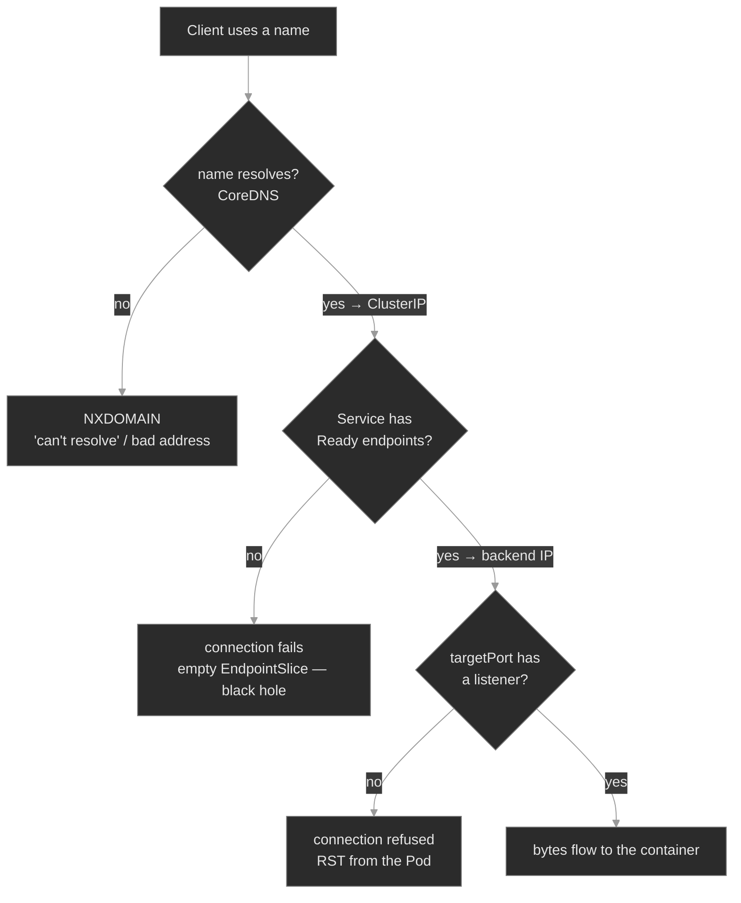

# M04 — Networking I: Services & DNS

> How a stable name reaches a moving set of Pods — Services, selectors, EndpointSlices, kube-proxy, and cluster DNS — and the three places on that path where traffic silently stops flowing.

## What you'll learn

- Explain what a Service is and why it exists: a stable virtual IP and DNS name in front of a set of Pods whose own IPs change constantly
- Trace a request from a client all the way to a container: name → ClusterIP → EndpointSlice → Pod port, and name the component that owns each hop
- Read a Service's real backend set with `kubectl get endpoints` / `kubectl get endpointslices`, and recognize the empty-endpoints black hole
- Distinguish `port`, `targetPort`, and `containerPort`, and diagnose the connection-refused you get when `targetPort` points at nothing
- Resolve a Service by DNS the way a Pod does — short name, `<svc>.<ns>`, and the FQDN — and explain why a bare name fails across namespaces
- Work the connectivity differential: split a failed request into *name didn't resolve* vs *no endpoints* vs *wrong port*

## Why it matters

Pods are disposable. A Deployment rolls, a node drains, an HPA scales, and the Pod IPs you had a minute ago are gone. Nothing in your application could function if it had to track those IPs. The Service is the abstraction that makes the platform usable: a name and an IP that don't move, sitting in front of a backend set that changes underneath them continuously. Every call between Polyphone components — `sip-app` to `session-broker`, `account-provisioner` to its dependencies — goes through a Service and a DNS lookup. When that plumbing breaks, calls fail, and the failure is rarely where you first look.

The trap in Service debugging is that the failure is quiet and the top-line objects look healthy. `kubectl get svc` shows a ClusterIP. `kubectl get pods` shows everything `Running` and `Ready`. And yet the request hangs or comes back refused, because the one thing that actually carries traffic — the Service's EndpointSlice — is empty, or points at a port nothing listens on, or the client asked for a name that never resolved. An SRE who knows the request path checks the endpoints and the DNS answer first and fixes it in two minutes. One who doesn't restarts Pods that were never the problem.

## Scope

**Covers:** the Service object and its types (ClusterIP, NodePort, LoadBalancer, ExternalName, and headless), how a selector becomes an EndpointSlice, what kube-proxy does with that EndpointSlice, the `port`/`targetPort`/`containerPort` distinction, cluster DNS via CoreDNS (the `<svc>.<ns>.svc.cluster.local` scheme, search domains, and `ndots`), and the name-resolves / has-endpoints / port-answers connectivity differential.

**Doesn't cover:** NetworkPolicy (default-allow today; locking traffic down is M14), Ingress and HTTP routing from outside the cluster → M14, service mesh / sidecar proxies and mesh mTLS → M15, the CNI and Pod-to-Pod L3 plumbing beneath Services (assumed working here) → M22, and external load balancer provisioning specifics (cloud-dependent). This module is the in-cluster L4 path: name to Pod.

**Assumes:** M00 (`get → describe → events → logs`; spec vs status), M01 (Pods, Deployments, labels, readiness — a Pod can be `Running` but not `Ready`), and that you know a Pod has its own cluster-internal IP. Labels and selectors from M01 are load-bearing here: a Service finds its Pods the same way a ReplicaSet does.

## Vocabulary

| Term | Definition |
|------|------------|
| **Service** | A namespaced API object giving a stable identity (a virtual IP and a DNS name) to a logical set of Pods. The set is defined by a label selector. |
| **ClusterIP** | The default Service type: a virtual IP reachable only inside the cluster. The IP is stable for the Service's life and backed by no single Pod. |
| **selector** | The set of labels on a Service that defines which Pods are its backends. Matching is identical to a ReplicaSet's selector (M01). |
| **Endpoints / EndpointSlice** | The derived object listing the actual backend addresses (Pod IP + port) for a Service. EndpointSlice is the modern, scalable form; the older `Endpoints` object still shows in `kubectl get endpoints`. **Only `Ready` Pods appear.** |
| **kube-proxy** | The node agent that watches Services and EndpointSlices and programs the kernel (iptables/IPVS/nftables) so traffic to a ClusterIP is load-balanced to a backend. |
| **`port`** | The port the Service listens on — what clients connect to (`<svc>:<port>`). |
| **`targetPort`** | The Pod port the Service forwards to. Defaults to `port` if omitted. Can be a number or a named port. |
| **`containerPort`** | A port the container declares in its Pod spec. Informational — it does **not** open or close anything; the process listens (or doesn't) regardless. |
| **headless Service** | A Service with `clusterIP: None`. No virtual IP and no kube-proxy load-balancing; DNS returns the Pod IPs directly. Used for StatefulSets and client-side discovery. |
| **NodePort / LoadBalancer / ExternalName** | Service types that expose a Service on each node's IP (NodePort), provision an external LB (LoadBalancer), or alias to an external DNS name via a CNAME (ExternalName). |
| **CoreDNS** | The cluster DNS server (Pods in `kube-system`), itself fronted by a Service (`kube-dns`). Resolves Service and Pod names to cluster IPs. |
| **FQDN / search domains / `ndots`** | A Service's fully-qualified name is `<svc>.<ns>.svc.cluster.local`. A Pod's `/etc/resolv.conf` lists `search` domains so short names expand, and `ndots` controls when a name is tried as-is vs. with the search domains appended. |

## Mental model

A request to a Service travels a fixed path, and each hop is owned by a different component. The name is resolved by **CoreDNS** into a ClusterIP. The ClusterIP is translated by **kube-proxy** into a specific backend address drawn from the Service's **EndpointSlice**. The EndpointSlice is populated by the **endpoints controller** from the Pods that match the Service's **selector** and are **Ready**. The request lands on that Pod's **`targetPort`**, where a process is — or isn't — listening.



The three red leaves are the three ways the path breaks, in the order a request hits them: the name didn't resolve, the Service had no backends, or the backend port had no listener. The instinct, inherited from M02's pull-failure differential and M03's config differential: **`connection refused` is a category, not a diagnosis.** The client's error tells you it failed; the EndpointSlice and the DNS answer tell you *where*. Read those first<sup><a href="https://kubernetes.io/docs/tasks/debug/debug-application/debug-service/">[6]</a></sup>.

## Concept walkthrough

### A Service is a stable identity for a moving target

A Service decouples *who you call* from *which Pods answer*<sup><a href="https://kubernetes.io/docs/concepts/services-networking/service/">[1]</a></sup>. You create a `session-broker` Service with a selector — `app: session-broker` — and from then on anything in the cluster can reach `session-broker` at a fixed ClusterIP and DNS name, no matter how many times the Pods behind it are replaced<sup><a href="https://kubernetes.io/docs/tutorials/services/connect-applications-service/">[7]</a></sup>. The default type, **ClusterIP**, allocates that virtual IP from the Service CIDR; it answers only inside the cluster.

The selector is the whole mechanism. The control plane runs an endpoints controller that continuously watches for Pods matching the selector, and writes their addresses into an **EndpointSlice** object — but only for Pods that are **`Ready`**<sup><a href="https://kubernetes.io/docs/concepts/services-networking/endpoint-slices/">[2]</a></sup>. This is the same readiness gate from M01, now doing load-balancer duty: a Pod that fails its readiness probe is pulled from the EndpointSlice and stops receiving traffic without being killed. The Service object and its EndpointSlice are two different things, and the distinction is the most important diagnostic fact in this module: `kubectl get svc` tells you the Service *exists*; `kubectl get endpoints <svc>` tells you whether it has anywhere to send traffic.

That gives the module's instance of a recurring theme. A Service can look completely healthy — a ClusterIP, the right ports, no errors anywhere — and route to nothing, because its EndpointSlice is empty. The headline status lies (M01's `Running` ≠ `Ready`, M01b's `Complete` ≠ correct, M03's `Running`-but-wrong); here, a Service that `get svc` shows as fine is a black hole if `get endpoints` shows `<none>`. Endpoints go empty for exactly two reasons: the selector matches no Pods (a label typo on either side), or the matched Pods are all not-`Ready`. Both look identical at the Service; both surface as an empty EndpointSlice.

```yaml
apiVersion: v1
kind: Service
metadata: { name: session-broker, namespace: media }
spec:
  selector: { app: session-broker }   # must match the Pods' labels exactly
  ports:
    - port: 80           # clients connect here:  session-broker:80
      targetPort: 80     # forwarded to this Pod port
```

### Ports: `port` vs `targetPort` vs `containerPort`, and what kube-proxy does

Three port fields show up around a Service, and conflating them is a classic source of "the endpoints are right but it still won't connect." **`port`** is what the Service listens on — the number clients use. **`targetPort`** is the Pod port the Service forwards to; omit it and it defaults to `port`. **`containerPort`** in the Pod spec is documentation only: it advertises that the container *intends* to use a port, but it neither opens nor closes anything — the process inside listens on whatever it listens on, `containerPort` or not<sup><a href="https://kubernetes.io/docs/concepts/services-networking/service/#defining-a-service">[1]</a></sup>. The failure mode: a Service whose `targetPort` points at a port no process is listening on. The EndpointSlice is fully populated (the selector matched, the Pods are Ready), the name resolves, the connection is delivered to the Pod — and the Pod's kernel sends a RST because nothing is bound there. The client sees `connection refused`, and the endpoints look perfect, which is exactly why this one sends people in circles.

Once a Service has endpoints, **kube-proxy** is what makes the ClusterIP actually work. It runs on every node, watches Services and EndpointSlices, and programs the node's kernel — by default with iptables rules — so that a packet sent to `ClusterIP:port` is destination-NAT'd to one of the backend Pod IPs at its `targetPort`, chosen pseudo-randomly per connection<sup><a href="https://kubernetes.io/docs/reference/networking/virtual-ips/">[3]</a></sup>. The ClusterIP itself is virtual: nothing holds it, no interface answers ARP for it; it exists only as kernel rules on every node. That has a sharp consequence for the black-hole case — when a Service has **zero** endpoints, kube-proxy installs a rule that *rejects* traffic to the ClusterIP, so the client gets a connection failure rather than a silent hang. Either way the diagnosis is the same: the EndpointSlice, not the client error, tells you why.

<details>
<summary>📖 Going deeper: kube-proxy modes, and why the ClusterIP is "nowhere"<sup><a href="https://kubernetes.io/docs/reference/networking/virtual-ips/">[3]</a></sup></summary>

kube-proxy has three backends that all do the same job — turn a ClusterIP into a backend Pod IP — with different scaling characteristics<sup><a href="https://kubernetes.io/docs/reference/networking/virtual-ips/">[3]</a></sup>. **iptables** (the long-time default) writes one chain per Service and matches linearly; it's simple and ubiquitous but its rule-update cost grows with Service count, and it falls over somewhere past a few thousand Services. **IPVS** uses the kernel's in-kernel load balancer (hash tables, real LB algorithms) and scales to tens of thousands of Services with far cheaper updates — reach for it on large clusters. **nftables** is the newer successor to the iptables backend, addressing the same scaling limits within the nft framework.

The mental shift that pays off at 3am: there is no "Service process" to restart and no host that owns the ClusterIP. The Service is *data* (the object plus its EndpointSlice) that kube-proxy compiles into kernel rules on every node. So when one node can reach a Service and another can't, suspect that node's kube-proxy or its rules — not the Service object, which is identical clusterwide. `iptables-save | grep <clusterip>` on the failing node shows whether the rules are even present.

</details>

### Cluster DNS: how a Pod turns a name into a ClusterIP

A ClusterIP is stable, but nobody wants to hardcode `10.96.x.y`. Cluster DNS lets you use names. **CoreDNS** runs as a Deployment in `kube-system`, fronted by a Service named `kube-dns`, and every Pod is configured to use it: the Pod's `/etc/resolv.conf` points `nameserver` at the `kube-dns` ClusterIP<sup><a href="https://kubernetes.io/docs/concepts/services-networking/dns-pod-service/">[4]</a></sup>. Every Service automatically gets an A/AAAA record at:

```text
<service>.<namespace>.svc.cluster.local
```

So `session-broker` in `media` is fully `session-broker.media.svc.cluster.local`. You rarely type the whole thing, because of the **search domains** in `resolv.conf`. A Pod in `media` gets a search list like `media.svc.cluster.local  svc.cluster.local  cluster.local`, so a bare `session-broker` is tried as `session-broker.media.svc.cluster.local` and resolves. That convenience is also the single most common cluster-DNS bug: **a short name only resolves within its own namespace.** A Pod in `provisioning` that asks for bare `session-broker` searches `session-broker.provisioning.svc.cluster.local` first — which doesn't exist — and gets NXDOMAIN, because the search domains are built from the *client's* namespace, not the target's. The fix is to qualify it: `session-broker.media` (which the search list completes to the right FQDN) or the full `session-broker.media.svc.cluster.local`.

The same `resolv.conf` carries `options ndots:5`, which trips people up. `ndots:5` means: if the name you're resolving has fewer than 5 dots, try it with each search domain appended *first*, and only as a literal name if all of those fail<sup><a href="https://kubernetes.io/docs/concepts/services-networking/dns-pod-service/#pod-s-dns-config">[5]</a></sup>. It's why short in-cluster names just work — and why resolving an *external* name like `api.stripe.com` (3 dots, under 5) makes several failing cluster lookups before the real one, a real latency cost at scale. A trailing dot (`api.stripe.com.`) marks a name fully-qualified and skips the search list.

<details>
<summary>📖 Going deeper: headless Services, and DNS for the cases ClusterIP can't serve<sup><a href="https://kubernetes.io/docs/concepts/services-networking/dns-pod-service/">[4]</a></sup></summary>

A normal Service's DNS name returns one ClusterIP and kube-proxy load-balances behind it — the client never knows which Pod it got, which is exactly what you want for a stateless pool. Two cases need something else, and both bend DNS rather than kube-proxy.

A **headless Service** (`clusterIP: None`) has no virtual IP and no kube-proxy involvement. Its DNS name resolves directly to the set of backing Pod IPs (all of them, as multiple A records), and — when it backs a StatefulSet — each Pod also gets a *stable per-Pod* name, `<pod>.<svc>.<ns>.svc.cluster.local`<sup><a href="https://kubernetes.io/docs/concepts/services-networking/dns-pod-service/">[4]</a></sup>. That's how `media-engine-0` and `media-engine-1` (the StatefulSets in the Polyphone fleet) are addressable individually — the per-Pod identity that stateful systems need for leader election and replication. M07 builds on this; here it's enough to recognize that `clusterIP: None` means "DNS returns Pods, not a VIP."

An **ExternalName** Service is the other bend: no selector, no endpoints, no proxying — just a CNAME from a cluster name to an external DNS name (`spec.externalName: postgres.prod.example.com`). It lets in-cluster clients use a stable internal name for something that lives outside the cluster, and it's a frequent point of confusion precisely because `kubectl get endpoints` on it is empty *by design* — there's nothing to debug there; the resolution happens in DNS, not in the Service's backend set.

</details>

## Hands-on

Four steps in the baseline, three break/fix scenarios — all on the full Polyphone fleet, exercising the Services it already runs (no new workloads). Traffic is driven from a throwaway in-cluster client (`kubectl run --rm … busybox`), since the fleet's own Pods don't originate calls.

- **`baseline/`** — the request path working end to end: a Service's ClusterIP and how it's reached, the EndpointSlice behind a selector, `port`/`targetPort` resolved to a Pod, and DNS resolution from inside a Pod (short name, `<svc>.<ns>`, FQDN). What healthy looks like before the differential breaks it.
- **`breakfix-01-dns-cross-namespace/`** — a name that won't resolve. Tests the DNS naming scheme: a bare Service name used across namespaces returns NXDOMAIN; the fix is the qualified name.
- **`breakfix-02-selector-mismatch/`** — a Service with an empty EndpointSlice. Tests reading `get endpoints`: the Service exists and the Pods are Ready, but the selector matches none of them, so traffic goes nowhere.
- **`breakfix-03-port-mismatch/`** — endpoints populated, connection still refused. Tests the `targetPort` vs listener distinction: the Service forwards to a port nothing is bound to.

The three scenarios walk the request-path diagram top to bottom — NXDOMAIN → empty endpoints → refused-with-endpoints — so each isolates one hop and one signature. Check yourself against `ANSWER-KEY.md` after each.

## Common failure modes

| Symptom | Likely cause | Where to look |
|---------|--------------|---------------|
| `nslookup`/client says can't resolve, NXDOMAIN | Short name used cross-namespace, or a typo'd Service name | the name vs `<svc>.<ns>`; `kubectl get svc -n <target-ns>`; the client Pod's `/etc/resolv.conf` search list |
| Connection hangs/refused, `get endpoints` is `<none>` | Selector matches no Pods, or matched Pods aren't `Ready` | `kubectl get endpoints <svc>`; compare `svc.spec.selector` to the Pods' labels; Pod readiness |
| Connection refused, but endpoints **are** populated | `targetPort` points at a port with no listener | `svc.spec.ports[].targetPort` vs what the process actually binds; not `containerPort` |
| Service reachable in its namespace, not from another | Short name; or a NetworkPolicy (M14) | qualify the name; check for NetworkPolicies in either namespace |
| One node connects, another doesn't, same Service | Node-local kube-proxy / kernel rules | kube-proxy Pod on the failing node; `iptables-save \| grep <clusterip>` |
| All cluster DNS failing everywhere | CoreDNS down or misconfigured | `kubectl get pods -n kube-system -l k8s-app=kube-dns`; CoreDNS logs; the `kube-dns` Service endpoints |
| `get endpoints` empty on an ExternalName Service | Working as intended — ExternalName has no backends | it's a DNS CNAME; resolution is in DNS, nothing to fix at the Service |

## Recap

- A Service is a **stable name and virtual IP in front of a changing set of Pods**. The set is defined by a label selector and materialized — for `Ready` Pods only — in an **EndpointSlice**. `get svc` proves it exists; `get endpoints` proves it has somewhere to send traffic.
- **A healthy-looking Service can route to nothing.** An empty EndpointSlice is a black hole, from a selector that matches no Pods or from Pods that aren't `Ready`. Same "the headline status lies" instinct as `Running` ≠ `Ready` — check the endpoints, not just `get svc`.
- **`port` is what clients hit; `targetPort` is the Pod port forwarded to; `containerPort` is documentation that opens nothing.** Endpoints can be perfect while `targetPort` points at a dead port — the connection is refused with a fully-populated EndpointSlice.
- **Cluster DNS names Services as `<svc>.<ns>.svc.cluster.local`.** Short names resolve only inside the client's own namespace, because search domains are built from the client's namespace — qualify cross-namespace calls with `<svc>.<ns>`.
- **The connectivity differential:** NXDOMAIN = name didn't resolve (DNS); connection fails + empty endpoints = no backends (selector/readiness); connection refused + populated endpoints = wrong port (`targetPort`). The client error says it broke; the EndpointSlice and DNS answer say where.

## Production thinking

- A rollout renames the `app` label on a Deployment's Pod template but not on the matching Service's selector. Every Pod is `Running` and `Ready`; the Service quietly empties and traffic blackholes. What signal would have paged you on this before users noticed, given that no Pod is unhealthy and no error is logged?
- Your services mostly call each other by short name today, and it works because most callers happen to share a namespace with their callee. A team splits one namespace into two for isolation. What breaks, why, and what naming convention would have made the split a no-op?
- You're past 8,000 Services in one cluster and connection setup latency is creeping up, worst on the busiest nodes. What's the first thing you'd measure, and what does kube-proxy's mode have to do with it?

## References

1. Kubernetes — Service: https://kubernetes.io/docs/concepts/services-networking/service/
2. Kubernetes — EndpointSlices: https://kubernetes.io/docs/concepts/services-networking/endpoint-slices/
3. Kubernetes — Virtual IPs and Service Proxies (kube-proxy): https://kubernetes.io/docs/reference/networking/virtual-ips/
4. Kubernetes — DNS for Services and Pods: https://kubernetes.io/docs/concepts/services-networking/dns-pod-service/
5. Kubernetes — Pod's DNS Config (`ndots`, search): https://kubernetes.io/docs/concepts/services-networking/dns-pod-service/#pod-s-dns-config
6. Kubernetes — Debug Services: https://kubernetes.io/docs/tasks/debug/debug-application/debug-service/
7. Kubernetes — Connecting Applications with Services: https://kubernetes.io/docs/tutorials/services/connect-applications-service/
</content>
</invoke>
