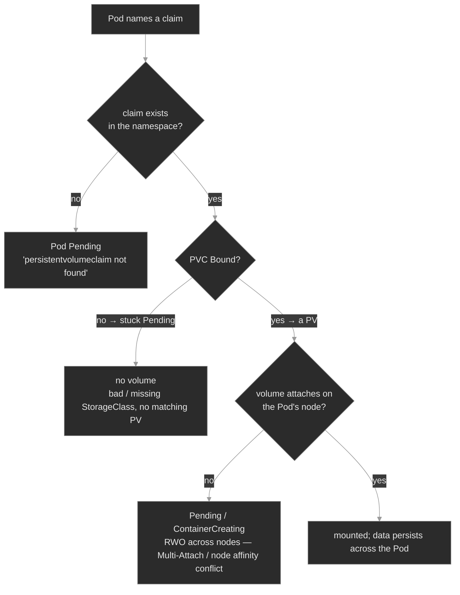

# M05 — Storage: PersistentVolumes, Claims & StorageClasses

> How a Pod gets durable storage that outlives it — PVCs, PVs, StorageClasses, dynamic provisioning, and access modes — and the three places on that path where a Pod stops before it ever runs.

## What you'll learn

- Explain the claim/volume split: a **PersistentVolumeClaim** is a request for storage, a **PersistentVolume** is the actual volume, and a **StorageClass** is the template that provisions one to satisfy the other
- Trace a Pod's storage from `claimName` to a mounted directory: Pod → PVC → StorageClass → PV → attach → mount, and name what owns each hop
- Read a claim's real state with `kubectl get pvc` and split a stuck Pod three ways: the claim is *absent*, *Pending* (unbound), or *Bound but unattachable*
- Distinguish **dynamic** provisioning (a StorageClass creates the PV on demand) from **static** (an admin pre-creates the PV), and recognize `WaitForFirstConsumer` binding as healthy, not broken
- Distinguish the access modes — **ReadWriteOnce**, **ReadOnlyMany**, **ReadWriteMany**, **ReadWriteOncePod** — and diagnose the Multi-Attach failure you get when an RWO volume is asked to span two nodes
- Reason about the reclaim policy (`Retain` vs `Delete`) and why deleting a PVC can quietly destroy data

## Why it matters

A container's own filesystem is ephemeral. Restart the container and it reverts to the image; delete the Pod and everything it wrote is gone. That's correct for stateless services, but Polyphone runs stateful ones too — `cdr-writer` persisting Call Detail Records, `media-engine` and `presence` holding per-instance state, `directory` keeping its address book. For those, the data has to outlive the Pod, survive a reschedule onto another node, and be there when a replacement Pod starts. The Kubernetes storage subsystem is what makes that possible: a claim the workload owns, a volume the platform provisions, and a binding between them that persists across the Pod's whole disposable lifecycle.

The trap in storage debugging is that the failure lands on the *Pod* — it sits in `Pending` or `ContainerCreating` and never starts — while the actual problem is one or two objects away, in a claim or a class the Pod never mentions by name in its own events. An SRE who knows the chain runs `kubectl get pvc` first and reads the claim's phase; the answer is almost always right there. One who doesn't reads Pod logs that don't exist yet, describes the Deployment, restarts the ReplicaSet, and loses twenty minutes to a workload that was never unhealthy — it was just waiting on storage that never arrived.

## Scope

**Covers:** the PersistentVolume / PersistentVolumeClaim model and how they bind, StorageClasses and dynamic provisioning, the difference between dynamic and static provisioning, the CSI provisioning pipeline at a mental-model level, `volumeBindingMode` (`Immediate` vs `WaitForFirstConsumer`), the access modes (RWO / ROX / RWX / RWOP) and the Multi-Attach failure, capacity and the bind-matching rules, the reclaim policy (`Retain` / `Delete`) and its data-safety consequence, and the *claim-absent / claim-Pending / claim-Bound-but-unattachable* storage differential.

**Doesn't cover:** the internals of specific CSI drivers and cloud volume plumbing (driver-dependent), StatefulSet `volumeClaimTemplates` and per-Pod storage identity → M07 (used in the fleet, glossed here), volume snapshots and CSI snapshot/restore → M25, `emptyDir` / `hostPath` / `configMap` / `secret` and other non-persistent volume types beyond a passing mention (config volumes were M03), and volume expansion / resize mechanics beyond naming them. This module is the durable-storage path: claim to mounted directory.

**Assumes:** M00 (`get → describe → events → logs`; spec vs status), M01 (Pods, Deployments, ReplicaSets, a Pod can be `Pending`), and the fact from M04 that a Pod runs on a specific node. The node detail is load-bearing here: a volume is attached to a node, and that ties a Pod's storage to where the Pod can run.

## Vocabulary

| Term | Definition |
|------|------------|
| **PersistentVolume (PV)** | A cluster-scoped object representing a real piece of storage (a cloud disk, an NFS export, a local directory). It exists independently of any Pod. Not namespaced. |
| **PersistentVolumeClaim (PVC)** | A namespaced request for storage — a size, an access mode, optionally a StorageClass. A Pod references a PVC by name; the PVC binds to a PV. |
| **binding** | The one-to-one association between a PVC and a PV. Once bound, that PV is exclusively the claim's; no other PVC can take it. A PVC's `STATUS` is `Pending` until it binds, then `Bound`. |
| **StorageClass (SC)** | A named template describing *how* to provision a PV — which provisioner to call, with what parameters. Referenced by a PVC's `storageClassName`. |
| **dynamic provisioning** | A PVC naming a StorageClass triggers the provisioner to create a matching PV automatically. No admin pre-creates volumes. The default path. |
| **static provisioning** | An admin creates PV objects by hand ahead of time; a PVC binds to a pre-existing PV that matches (size, access mode, class). |
| **provisioner / CSI driver** | The component that actually creates and deletes the storage. Modern drivers implement the **Container Storage Interface (CSI)**; `rancher.io/local-path` is a simple non-CSI provisioner used in this lab. |
| **access mode** | How the volume may be mounted: **ReadWriteOnce** (RWO, one *node* read-write), **ReadOnlyMany** (ROX), **ReadWriteMany** (RWX, many nodes read-write), **ReadWriteOncePod** (RWOP, exactly one Pod). A request, enforced by the volume plugin. |
| **`volumeBindingMode`** | On a StorageClass: `Immediate` binds the PV as soon as the PVC is created; **`WaitForFirstConsumer`** waits until a Pod uses the PVC, so the volume is placed on the Pod's node. |
| **reclaim policy** | What happens to the PV when its PVC is deleted: **`Delete`** destroys the underlying storage; **`Retain`** keeps it (moves the PV to `Released` for manual recovery). |
| **`volumeClaimTemplates`** | A StatefulSet field that mints one PVC per Pod, giving each replica its own stable volume (M07). The fleet's StatefulSets use this. |
| **Multi-Attach** | The error when an RWO volume already attached to one node is requested by a Pod on a second node. On local volumes the same rule surfaces as a *volume node affinity conflict*. |

## Mental model

A Pod's storage travels a fixed chain, and each hop is owned by a different object. The Pod names a **PVC** by `claimName`. The PVC binds to a **PV** — either one a **StorageClass** provisioned on demand, or one an admin pre-created. That PV is a real volume that gets **attached** to the node the Pod landed on and then **mounted** into the container. Break any link and the Pod never starts; it waits.



The three red leaves are the three ways a Pod fails to get its storage, and one command splits them: **`kubectl get pvc`**. If the claim the Pod names isn't in the list, the Pod points at a claim that doesn't exist. If it's there but `Pending`, the claim can't bind — a class problem or no matching volume. If it's `Bound` and the Pod is *still* stuck, the volume can't attach where the Pod is scheduled. This is the same instinct M04 built on `get endpoints`: **the Pod's status tells you it's stuck; the claim tells you why. Read the claim first.**

## Concept walkthrough

### The claim/volume split, and dynamic provisioning

Kubernetes separates *asking for storage* from *providing it*. A workload author writes a **PersistentVolumeClaim** — "I need 1Gi, ReadWriteOnce" — and never has to know what backs it. A cluster admin (or, more often, an automated provisioner) supplies a **PersistentVolume**, the real thing<sup><a href="https://kubernetes.io/docs/concepts/storage/persistent-volumes/">[1]</a></sup>. The two bind: the control plane matches the claim to a suitable volume, and from then on that PV belongs exclusively to that PVC. The Pod references only the claim, by name, in its own namespace — it never names a PV<sup><a href="https://kubernetes.io/docs/tasks/configure-pod-container/configure-persistent-volume-storage/">[8]</a></sup>. This indirection is the whole design: the Pod is portable and disposable, the claim is the durable handle to its data, and the volume underneath can be any storage technology the cluster supports.

The question is where the PV comes from. In **static provisioning**, an admin creates PV objects ahead of time and claims bind to whatever matches. That doesn't scale — someone has to pre-carve every volume. **Dynamic provisioning** is the default answer: the PVC names a **StorageClass**, and creating the claim triggers that class's provisioner to create a PV on the spot, sized and configured to match<sup><a href="https://kubernetes.io/docs/concepts/storage/dynamic-provisioning/">[3]</a></sup>. No pre-provisioning, no admin in the loop. A StorageClass is just a named recipe: which provisioner to call, with what parameters, at what reclaim policy and binding mode<sup><a href="https://kubernetes.io/docs/concepts/storage/storage-classes/">[2]</a></sup>. This lab's class is `local-path`, whose provisioner (`rancher.io/local-path`) carves a directory on a node's disk; a cloud cluster's class would call a CSI driver that provisions a network disk instead.

That gives the module's first failure. If a PVC names a `storageClassName` that doesn't exist — a typo, or a class that was never installed — there is no provisioner to call, so no PV is ever created, and the PVC sits in `Pending` forever. The Pod that references it can't start: it stays `Pending` with an event like `pod has unbound immediate PersistentVolumeClaims`. Nothing is crashing; nothing logs an error; the workload is simply waiting on a volume that will never arrive. `kubectl describe pvc` names the cause outright — `storageclass.storage.k8s.io "fast-ssd" not found` — which is why the claim, not the Pod, is where the diagnosis lives.

```yaml
apiVersion: v1
kind: PersistentVolumeClaim
metadata: { name: cdr-data, namespace: cdr-storage }
spec:
  accessModes: [ReadWriteOnce]      # one node, read-write
  storageClassName: local-path      # the class that provisions the PV
  resources: { requests: { storage: 1Gi } }
```

One sharp edge worth internalizing now: **`storageClassName` is immutable once the PVC exists.** You cannot `kubectl edit` a bound-to-the-wrong-class claim to fix it — the API rejects the change. The remedy is to delete the PVC and recreate it with the right class, which is safe when the claim never bound (no data to lose) and a genuine data-migration problem when it did.

### Binding, the `get pvc` triage, and what survives a delete

A PVC has a lifecycle you can read at a glance. It starts `Pending`, becomes `Bound` when it's matched to a PV, and — crucially — a Pod that mounts a `Pending` claim will not start. So the first move on any storage-stuck Pod is `kubectl get pvc -n <ns>`, and the claim's `STATUS` column splits the failure: `Bound` (the storage is fine, look elsewhere), `Pending` (the claim can't get a volume), or *the claim you expected isn't listed at all* (the Pod names a claim that doesn't exist — the second failure this module drills). A Pod referencing a `claimName` with no matching PVC in its namespace stays `Pending`, and `kubectl describe pod` says so plainly: `persistentvolumeclaim "directory-store" not found`. PVCs are namespaced; a claim in another namespace, or a one-character typo in the name, is invisible to the Pod.

`WaitForFirstConsumer` complicates the reading in a way you have to know cold, because it makes a *healthy* claim sit `Pending`. Most modern StorageClasses — `local-path` included — set `volumeBindingMode: WaitForFirstConsumer`, which deliberately delays binding until a Pod actually uses the claim<sup><a href="https://kubernetes.io/docs/concepts/storage/storage-classes/#volume-binding-mode">[5]</a></sup>. The reason is placement: for node-local or topology-constrained storage, the system can't know *which* node's volume to create until it knows where the Pod will run, so it waits for the scheduler to pick a node and then provisions there. The consequence for you: a PVC with no consuming Pod shows `Pending` and `describe` says `waiting for first consumer to be created before binding` — that is normal, not a bug. `Pending` means "broken" only once a Pod is trying to use the claim and it still won't bind.

The reclaim policy is the other half of the lifecycle, and it's the one that bites in production. When a PVC is deleted, the StorageClass's `reclaimPolicy` decides the PV's fate: **`Delete`** (the default for most dynamic classes, including `local-path`) destroys the underlying storage along with the PV — the data is gone. **`Retain`** keeps the PV and its data, moving it to a `Released` state that an admin can recover by hand<sup><a href="https://kubernetes.io/docs/concepts/storage/persistent-volumes/#reclaiming">[6]</a></sup>. This is why `kubectl delete pvc` is not a harmless cleanup command: on a `Delete`-policy class it is a data-destruction command, and the fact that the claim looks like a lightweight request object makes the blast radius easy to underestimate.

<details>
<summary>📖 Going deeper: reclaim policy, the PV lifecycle, and recovering a Released volume<sup><a href="https://kubernetes.io/docs/concepts/storage/persistent-volumes/#reclaiming">[6]</a></sup></summary>

A PV moves through phases: `Available` (free, not yet claimed), `Bound` (matched to a PVC), `Released` (its PVC was deleted but the storage wasn't reclaimed), and `Failed` (automatic reclamation errored)<sup><a href="https://kubernetes.io/docs/concepts/storage/persistent-volumes/">[1]</a></sup>. On a `Retain` policy, deleting the PVC leaves the PV `Released` with the data intact — but a `Released` PV will *not* automatically bind to a new claim, even an identical one, because it still carries a reference to the old (deleted) claim. Recovering it is a deliberate act: edit the PV, clear `spec.claimRef`, and it returns to `Available` so a new PVC can bind it.

The practical rule: for anything whose loss would be an incident — a database's volume, `cdr-writer`'s records — put the StorageClass (or the specific PV) on `Retain`, and accept that you'll clean up `Released` volumes manually. `Delete` is right for scratch and rebuildable data where automatic cleanup is worth more than the safety net. The mistake to avoid is running important data on a `Delete`-policy class and treating `kubectl delete pvc` as routine.

</details>

### Access modes, attach, and the Multi-Attach failure

A bound claim still has to become a mounted directory, and that happens in two steps the CSI model makes explicit: **attach** (make the volume available to a node) and **mount** (expose it inside the container's filesystem)<sup><a href="https://kubernetes.io/docs/concepts/storage/volumes/#csi">[4]</a></sup>. Attach is where the access mode bites. The **access mode** is a property of the claim/volume that declares how many places can mount it at once: **ReadWriteOnce** (RWO) allows read-write mounting by a single *node*; **ReadWriteMany** (RWX) allows many nodes to mount it read-write simultaneously; **ReadOnlyMany** (ROX) allows many read-only; **ReadWriteOncePod** (RWOP) narrows RWO to a single *Pod*<sup><a href="https://kubernetes.io/docs/concepts/storage/persistent-volumes/#access-modes">[7]</a></sup>. The word that trips people is "Once" meaning *one node*, not one Pod — two Pods on the *same* node can share an RWO volume; two Pods on *different* nodes cannot.

That distinction is the module's third failure, and it's the one that looks the strangest because the claim is perfectly `Bound`. Take a Deployment with a single RWO PVC and scale it so two replicas land on two different nodes. The first Pod's node attaches the volume; the second Pod, on another node, asks for the same RWO volume and can't have it — the volume is already exclusively attached elsewhere. On a network block volume the error is literally `Multi-Attach error for volume ... Volume is already exclusively attached to one node`; on a node-local volume the same rule surfaces as `volume node affinity conflict`, because the local PV carries a hard node affinity to the node that holds it. Either way the second Pod is stuck — `Pending` or `ContainerCreating` — with a `Bound` claim, which is exactly the signature that separates this from the first two failures. RWO is not a bug here; it's the volume doing what it promised. The fix is to stop asking an RWO volume to span nodes: run a single node-bound consumer, or move to RWX (network file storage) if you genuinely need replicas on many nodes writing one volume.

<details>
<summary>📖 Going deeper: the CSI provisioning pipeline — what actually creates, attaches, and mounts<sup><a href="https://kubernetes.io/docs/concepts/storage/volumes/#csi">[4]</a></sup></summary>

The **Container Storage Interface (CSI)** is the standard that lets storage vendors write one driver that any Kubernetes cluster can use, out-of-tree<sup><a href="https://kubernetes.io/docs/concepts/storage/volumes/#csi">[4]</a></sup>. A CSI driver ships as Pods, and the work splits across three logical operations. **CreateVolume** (dynamic provisioning) is driven by the `external-provisioner` sidecar watching for `Pending` PVCs that name the driver's class — it calls the driver to carve the real volume and creates the PV object. **ControllerPublishVolume** (attach) is driven by the `external-attacher` and the in-cluster attach/detach controller — it makes the volume available to a specific node, and it's the step that enforces RWO exclusivity. **NodeStageVolume / NodePublishVolume** (mount) run on the target node's kubelet via the driver's node plugin — they format if needed and bind-mount the volume into the container.

Reading that pipeline turns opaque symptoms into locatable ones. A PVC stuck `Pending` on a real class (not a missing one) points at provisioning — the `external-provisioner` or the driver's `CreateVolume`. A `Bound` PVC whose Pod is stuck in `ContainerCreating` with attach or Multi-Attach errors points at the attach stage — the attach/detach controller. A Pod past attach but failing to start with a `FailedMount` points at the node plugin's mount step. `local-path` in this lab is deliberately simpler — a single provisioner Pod that makes a directory, no attach step — so its failures are all provisioning-side; a production CSI driver gives you the full pipeline, and knowing which stage owns a symptom is how you skip straight to the right logs.

</details>

## Hands-on

Four steps in the baseline, three break/fix scenarios — all on the full Polyphone fleet, exercising the PVC-backed workloads it already runs (`cdr-writer`, `directory`, and the StatefulSets) with no new workloads. The class throughout is `local-path`, a dynamic `WaitForFirstConsumer`, RWO, `Delete`-policy provisioner.

- **`baseline/`** — durable storage working end to end: a `Bound` PVC and the PV a StorageClass provisioned for it, the `WaitForFirstConsumer` binding behavior (including a deliberately Pending-but-healthy claim), data that survives a Pod delete, and the `get pvc` triage. What healthy looks like before the differential breaks it.
- **`breakfix-01-pvc-storageclass-missing/`** — a PVC that never binds. Tests dynamic provisioning: the claim names a StorageClass that doesn't exist, so no PV is provisioned and the Pod hangs in `Pending`.
- **`breakfix-02-pvc-claim-missing/`** — a Pod that names a claim that isn't there. Tests the Pod↔PVC link: `describe pod` says `persistentvolumeclaim "..." not found`, and `get pvc` shows the real claim is `Bound` and fine.
- **`breakfix-03-rwo-multi-attach/`** — a `Bound` claim whose Pod is still stuck. Tests access modes: an RWO volume is asked to back replicas on two nodes, and the second can't attach it.

The three scenarios walk the storage diagram top to bottom — claim-absent → claim-Pending → claim-Bound-but-unattachable — so each isolates one hop and one `get pvc` signature. Check yourself against `ANSWER-KEY.md` after each.

## Common failure modes

| Symptom | Likely cause | Where to look |
|---------|--------------|---------------|
| Pod `Pending`, `describe pod` says `unbound ... PersistentVolumeClaims` | The PVC it uses is `Pending` — can't bind | `kubectl get pvc -n <ns>`; then `describe pvc` for the reason |
| PVC `Pending`, `describe pvc` says `storageclass ... not found` | `storageClassName` is a typo or an uninstalled class | `kubectl get storageclass`; fix the class name (delete+recreate — it's immutable) |
| PVC `Pending`, `describe pvc` says `waiting for first consumer` | Healthy `WaitForFirstConsumer` — no bug | schedule a Pod that uses it; it binds on the Pod's node |
| Pod `Pending`, `describe pod` says `persistentvolumeclaim "x" not found` | `claimName` typo, or claim is in another namespace | `kubectl get pvc -n <ns>`; correct the `claimName` |
| Pod `Bound` PVC but stuck `ContainerCreating`, `Multi-Attach error` | RWO volume asked for on a second node | `kubectl get pods -o wide`; scale to one node-bound consumer, or use RWX |
| Same, but `volume node affinity conflict` | RWO **local** volume; PV pinned to another node | `describe pv` node affinity vs the Pod's node; same fix as Multi-Attach |
| Data gone after a `kubectl delete pvc` | `Delete` reclaim policy destroyed the PV | `kubectl get storageclass -o yaml` `reclaimPolicy`; use `Retain` for data that matters |

## Recap

- **A PVC is a request, a PV is the volume, a StorageClass provisions one from the other.** The Pod names only the claim; the indirection is what keeps the Pod disposable while its data persists. `get pvc` proves the claim's state; the Pod's own status doesn't.
- **`kubectl get pvc` is the first look, and it splits every storage-stuck Pod three ways:** the claim is absent (Pod names a claim that doesn't exist), `Pending` (can't bind — bad class or no matching PV), or `Bound` but the Pod is still stuck (the volume can't attach where the Pod runs).
- **Not all `Pending` is broken.** `WaitForFirstConsumer` deliberately holds a claim `Pending` until a Pod uses it, so the volume lands on the Pod's node. A claim is only broken if a Pod is trying to use it and it still won't bind.
- **Access modes are about how many *nodes*, not Pods.** RWO is one node at a time; a shared RWO volume can't back replicas on two nodes — that's the Multi-Attach / node-affinity-conflict failure, always with a `Bound` claim. RWX is what spans nodes.
- **`reclaimPolicy: Delete` makes `kubectl delete pvc` a data-destruction command.** Put anything you can't lose on `Retain`, and treat claim deletion as a change with blast radius, not routine cleanup.

## Production thinking

- A team scales a stateful Deployment from one replica to three for headroom, all sharing one RWO PVC. It works in their single-node test cluster and fails the moment it hits a multi-node one, with two replicas stuck `ContainerCreating`. What's the failure, and what should they have reached for instead of more replicas on RWO?
- A cleanup script deletes "unused" PVCs in a namespace, and a service's data disappears. The StorageClass was on `reclaimPolicy: Delete`. What single StorageClass (or PV) change would have turned this from data loss into a recoverable `Released` volume, and what's the cost of that safety?
- You standardize on `WaitForFirstConsumer` classes and a colleague files a bug: "half our PVCs are stuck `Pending` right after `kubectl apply`, before any Pods exist." Is this a real problem? What one question tells you whether a `Pending` claim is healthy or broken, without describing anything?

## References

1. Kubernetes — Persistent Volumes: https://kubernetes.io/docs/concepts/storage/persistent-volumes/
2. Kubernetes — Storage Classes: https://kubernetes.io/docs/concepts/storage/storage-classes/
3. Kubernetes — Dynamic Volume Provisioning: https://kubernetes.io/docs/concepts/storage/dynamic-provisioning/
4. Kubernetes — Volumes (CSI): https://kubernetes.io/docs/concepts/storage/volumes/#csi
5. Kubernetes — Volume Binding Mode (`WaitForFirstConsumer`): https://kubernetes.io/docs/concepts/storage/storage-classes/#volume-binding-mode
6. Kubernetes — Reclaiming (reclaim policy, PV lifecycle): https://kubernetes.io/docs/concepts/storage/persistent-volumes/#reclaiming
7. Kubernetes — Access Modes: https://kubernetes.io/docs/concepts/storage/persistent-volumes/#access-modes
8. Kubernetes — Configure a Pod to Use a PersistentVolume: https://kubernetes.io/docs/tasks/configure-pod-container/configure-persistent-volume-storage/
</content>
</invoke>
