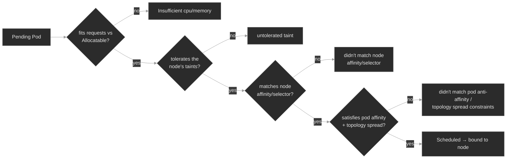

# M06 — Scheduling

> How the scheduler decides which node runs each Pod — requests, limits, QoS, taints, and affinity — and the handful of ways a Pod ends up `Pending` forever or gets killed the moment it starts.

## What you'll learn

- Explain what the scheduler actually does: filter the nodes a Pod *can* run on, score the survivors, and bind the Pod to the best one — and read the `FailedScheduling` event it emits when the filter empties
- Distinguish **requests** (what the scheduler fits against a node's Allocatable) from **limits** (what the kubelet and kernel enforce at runtime), and stop conflating a scheduling failure with a runtime one
- Derive a Pod's **QoS class** (Guaranteed / Burstable / BestEffort) from its requests and limits, and predict who gets OOM-killed or evicted first under pressure
- Use **taints and tolerations** to keep Pods off nodes — and recognize the `untolerated taint` that keeps them off by accident
- Steer placement with **nodeSelector / node affinity**, and spread replicas across failure domains with **pod anti-affinity** and **topology spread constraints** — and see how a hard spread rule wedges a Deployment when the node set shrinks
- Work the **Pending differential**: split "won't schedule" into insufficient resources vs. untolerated taint vs. unmatched affinity vs. unsatisfiable spread — one `FailedScheduling` signature each

## Why it matters

A Pod that won't schedule is one of the most common pages an SRE takes, and one of the most misread. It sits `Pending` — no container starts, no application log is written — so every instinct that worked for a crashing Pod (logs, `--previous`, restart) returns nothing. The answer isn't in the Pod's logs, because the Pod never ran; it's in one event that names, node by node, why the scheduler rejected each one.

At Polyphone the pressure is constant. A media node drains for a kernel patch and its Pods need somewhere to go. A new region comes online with tainted node pools before anyone writes the tolerations. Someone right-sizes a request during a capacity review and fat-fingers the unit. A signaling service meant to survive a node failure quietly runs every replica on one box because nobody spread them. Each is a scheduling decision — made, or refused, by one component reading a few fields. Once you can read those fields, "why won't this Pod schedule?" becomes a two-minute lookup. The flip side matters as much: a Pod that schedules cleanly and then OOM-kills on a loop is *also* a resource problem, but a different one (its request fit, its limit didn't hold), and telling the two apart is half the skill.

## Scope

**Covers:** what the kube-scheduler does (filter → score → bind); resource **requests** and **limits** for CPU and memory, node **capacity** vs. **Allocatable**, and how requests drive placement; **QoS classes** and their role in OOM and node-pressure eviction; **taints and tolerations** (the three effects, the control-plane taint, and NoSchedule-vs-NoExecute); **nodeSelector** and **node affinity**; **pod anti-affinity** and **topology spread constraints** for HA placement; and the `Pending`/`FailedScheduling` differential that ties them together.

**Doesn't cover:** the Horizontal/Vertical Pod Autoscalers and Cluster Autoscaler that *change* how much you're asking for or how many nodes exist → M09; **PriorityClass and preemption** (a higher-priority Pod evicting a lower one to schedule) — related but a distinct mechanism, noted where it intersects QoS but taught in M09; CPU pinning, NUMA, and the Topology Manager for latency-sensitive media → M23; PodDisruptionBudgets and graceful drain mechanics → M09; storage-driven scheduling (a Pod pinned by where its volume can bind) touched only in passing → M05.

**Assumes:** M00 (`get → describe → events → logs`, and that a Pod's story lives in the gap between `spec` and `status`), M01 (Pods, Deployments, ReplicaSets, labels and selectors, and that a controller — not you — creates the Pods), and a working idea of a Linux **cgroup** as the kernel mechanism that caps a process's CPU and memory. Labels from M01 are load-bearing again here: affinity and spread are label queries against nodes and Pods.

## Vocabulary

| Term | Definition |
|------|------------|
| **kube-scheduler** | The control-plane component that watches for Pods with no `spec.nodeName` and assigns each to a node: it **filters** out nodes the Pod can't run on, **scores** the survivors, and **binds** the Pod to the best one. An empty filter result means `Pending`. |
| **request** | The amount of CPU/memory a container asks for. The scheduler sums a Pod's requests and places it only on a node whose **Allocatable** can still cover them. Requests are the *only* resource number scheduling uses. |
| **limit** | The runtime ceiling for a container. CPU over-limit is **throttled** (CFS quota); memory over-limit is **OOM-killed**. Limits do not affect scheduling. |
| **capacity vs. Allocatable** | A node's **Capacity** is its total CPU/memory; **Allocatable** is what's left for Pods after the kubelet and system daemons reserve their share. The scheduler fits against Allocatable, not Capacity. |
| **QoS class** | A label Kubernetes derives from a Pod's requests/limits: **Guaranteed**, **Burstable**, or **BestEffort**. It sets the order in which the kubelet kills Pods under node pressure. |
| **OOMKilled** | A container terminated by the kernel out-of-memory killer for exceeding its memory limit. Shows as `Reason: OOMKilled`, exit code **137** (128 + SIGKILL). |
| **eviction (node-pressure)** | The kubelet proactively killing Pods when a node runs low on memory/disk, in QoS order (BestEffort first). Distinct from scheduler preemption. |
| **taint** | A `key=value:effect` mark on a **node** that repels Pods. Effects: `NoSchedule`, `PreferNoSchedule`, `NoExecute`. |
| **toleration** | A mark on a **Pod** that lets it schedule onto a node with a matching taint. A taint repels; a matching toleration is the exception that lets one through. |
| **nodeSelector / node affinity** | Ways a Pod requires (or prefers) nodes carrying certain labels. `nodeSelector` is an exact-match hard filter; node affinity adds `required…` (hard) and `preferred…` (soft, weighted) forms. |
| **pod affinity / anti-affinity** | Rules that place a Pod near (affinity) or away from (anti-affinity) other Pods matching a label selector, within a **topologyKey** domain (e.g. per-hostname, per-zone). |
| **topologyKey** | A node-label key that defines the domain for spreading or co-location — `kubernetes.io/hostname` (per node), `topology.kubernetes.io/zone` (per zone). |
| **topology spread constraint** | A rule bounding how unevenly a Pod's replicas may be distributed across a topology (`maxSkew`), with `whenUnsatisfiable: DoNotSchedule` (hard) or `ScheduleAnyway` (soft). |

## Mental model

Scheduling is a fitting problem solved in two moves. For each `Pending` Pod, the scheduler runs every node through a set of **filters** (does the Pod fit the node's free resources? does the Pod tolerate the node's taints? does the node match the Pod's affinity and selectors? can the Pod's topology spread still be satisfied here?). Nodes that fail any filter are out. The scheduler **scores** whatever survives and **binds** the Pod to the best node by writing `spec.nodeName`; the kubelet on that node takes it from there<sup><a href="https://kubernetes.io/docs/concepts/scheduling-eviction/kube-scheduler/">[9]</a></sup>. When *no* node survives the filters, the Pod stays `Pending` and the scheduler records one event that lists, per node, the first filter each one failed:

```text
0/2 nodes are available: 1 node(s) had untolerated taint {node-role.kubernetes.io/control-plane: },
                         1 Insufficient memory.
```

That line is the whole diagnosis. Read right to left from "why won't it schedule": the message enumerates the reasons, and the reasons *are* the differential.



Two facts make this model pay off. First, **the scheduler fits requests, not limits** — a node can be overcommitted on limits and still accept Pods, because scheduling only sums requests against Allocatable. That's why a giant *request* won't schedule while a too-small *limit* schedules fine and then dies at runtime. Second, this lab's control-plane node is tainted, so **every** `FailedScheduling` message here carries an `untolerated taint {node-role.kubernetes.io/control-plane}` line — expected noise. The actionable cause is whatever the *worker* line says; skim past the control-plane line and read the rest.

## Concept walkthrough

### The resource contract: requests, limits, and QoS

Every container can declare two numbers per resource. The **request** is a reservation: "I need at least this much." The scheduler adds up a Pod's requests and will only place it on a node whose **Allocatable** — total capacity minus what the kubelet and OS reserve for themselves — still has room<sup><a href="https://kubernetes.io/docs/concepts/configuration/manage-resources-containers/">[1]</a></sup>. That reservation is then held for the Pod whether or not it uses it. The **limit** is a runtime ceiling the node enforces, and the two resources enforce it differently: over its **CPU** limit a container is **throttled** — the kernel's CFS scheduler hands it fewer time slices, and it runs slower; over its **memory** limit it is **killed**, because memory can't be throttled — the OOM killer terminates the process and you see `OOMKilled`, exit code 137<sup><a href="https://kubernetes.io/docs/concepts/configuration/manage-resources-containers/">[1]</a></sup>.

This split is the single most useful distinction in the module. **Requests are what you fit; limits are what kills you.** A too-large request is a *scheduling* failure — the Pod never starts, it sits `Pending` with `Insufficient memory`. A too-small limit is a *runtime* failure — the Pod schedules, starts, and gets OOM-killed into `CrashLoopBackOff`. Same resource, opposite symptom, opposite fix. `Pending` → look at requests and node headroom; a running Pod dead with exit 137 → look at the memory limit.

From those same two numbers Kubernetes derives the Pod's **QoS class**, which decides its survival priority when a node runs out of memory<sup><a href="https://kubernetes.io/docs/concepts/workloads/pods/pod-qos/">[2]</a></sup>:

- **Guaranteed** — every container sets a CPU *and* memory limit equal to its request. The Pod gets exactly what it reserved and is the last to be evicted.
- **Burstable** — at least one request or limit is set, but it's not Guaranteed (the common case: requests below limits). It may use spare capacity but has no guarantee it'll keep it.
- **BestEffort** — no requests or limits anywhere. First to be killed when the node is under pressure.

Under **node-pressure eviction**, the kubelet reclaims memory by killing Pods in exactly that order — BestEffort, then Burstable, then Guaranteed — and within a class, those most over their requests go first<sup><a href="https://kubernetes.io/docs/concepts/scheduling-eviction/node-pressure-eviction/">[3]</a></sup>. That's why "just don't set limits" is bad advice: a BestEffort Pod is the first casualty of any node that gets tight, and you don't pick which one. Honest requests matter too — a Pod that requests far less than it uses gets packed onto a node that can't actually hold it, and the whole node starts evicting.

<details>
<summary>📖 Going deeper: OOMKill vs. eviction vs. preemption — three different killers<sup><a href="https://kubernetes.io/docs/concepts/scheduling-eviction/node-pressure-eviction/">[3]</a></sup></summary>

Three mechanisms end a running Pod's life, and conflating them sends you to the wrong fix:

- **OOMKill** is the **kernel**, acting on **one container** that touched its own **memory limit** (or a cgroup limit the node imposes). It's synchronous and local: the process dies, the container restarts per its `restartPolicy`, and you see `Last State: Terminated, Reason: OOMKilled`. Fix: the container's memory limit or its actual usage.
- **Node-pressure eviction** is the **kubelet**, acting on **whole Pods**, when the **node** as a whole crosses a memory or disk threshold. It picks victims by **QoS class** and by how far each Pod exceeds its requests. The Pod is deleted (and rescheduled elsewhere if it's controller-owned). Fix: node capacity, or requests that reflect reality.
- **Preemption** is the **scheduler**, deleting a **lower-PriorityClass** Pod to make room for a higher-priority `Pending` one. It is driven by **PriorityClass, not QoS** — a common and costly conflation. QoS never influences which Pod the scheduler preempts. Preemption and PriorityClass are M09.

The tell: OOMKill leaves the Pod in place with a climbing restart count; eviction and preemption make it *disappear* from its node. `kubectl get events` names which — `OOMKilling`, `Evicted`, and `Preempted` are three different reasons.

</details>

<details>
<summary>📖 Going deeper: resizing without a restart, and where sidecars land in the math<sup><a href="https://kubernetes.io/docs/tasks/configure-pod-container/resize-container-resources/">[8]</a></sup></summary>

Two facts that changed recently enough to be worth pinning:

**In-place Pod resize is stable (GA in v1.35, on by default).** You can change a running container's CPU/memory requests and limits without recreating the Pod, via the `resize` subresource (`kubectl patch pod … --subresource=resize`). CPU changes apply live; a memory *increase* often needs a container restart, controlled per-resource by `resizePolicy`. It does **not** change the Pod's QoS class — that's fixed at creation. Before this, giving a running Pod more memory meant deleting and rescheduling it; now a too-tight limit can sometimes be widened in place (subject to the node having the room).

**Native sidecar containers are stable (GA in v1.33)** — an init container with `restartPolicy: Always`. For scheduling, a sidecar's request counts toward the Pod's effective request for its *whole* life, unlike a plain init container whose reservation only spikes during init. A mesh or log-shipper sidecar (M13, M15) at 100m/128Mi adds that to every Pod's footprint the scheduler must fit — easy to forget when a node "mysteriously" stops accepting Pods after a mesh rollout.

</details>

### Taints and tolerations: nodes that push back

Requests and affinity are the Pod saying where it *will* go. Taints are the **node** saying who it *won't* take. A taint is a `key=value:effect` mark on a node that repels every Pod without a matching **toleration**<sup><a href="https://kubernetes.io/docs/concepts/scheduling-eviction/taint-and-toleration/">[4]</a></sup>. The relationship is deliberately asymmetric: the taint is the default (keep off), the toleration is the exception (this Pod may). Three effects, in ascending severity:

- **`NoSchedule`** — the scheduler won't place a new Pod here unless it tolerates the taint. Pods already running are **left alone**.
- **`PreferNoSchedule`** — a soft version; the scheduler avoids the node if it can, but will use it rather than leave a Pod `Pending`.
- **`NoExecute`** — the strongest; not only blocks new Pods but **evicts** running ones that don't tolerate it. A toleration may carry `tolerationSeconds` to grant a grace period before eviction.

The NoSchedule-vs-NoExecute line is worth internalizing, because it explains a scene you'll meet: someone taints a node `NoSchedule` and is surprised the existing Pods stay put. They stay because `NoSchedule` only gates *new* scheduling — the taint you add now doesn't reach back and evict what's already there. Had they used `NoExecute`, the node would have emptied. Tainting a live node with `NoSchedule` leaves its running Pods in place while blocking any new Pod that lacks the toleration.

You already run tolerations. The `sbc-edge` DaemonSet carries a toleration for `node-role.kubernetes.io/control-plane:NoSchedule` — that's how a "one Pod per node" DaemonSet gets a Pod onto the control-plane node, which kubeadm taints to keep ordinary workloads off<sup><a href="https://kubernetes.io/docs/reference/labels-annotations-taints/">[7]</a></sup>. Every other workload lacks that toleration, which is exactly why the whole fleet lands on the worker and nothing but `sbc-edge` (and system Pods) touches the control-plane. Kubernetes also taints nodes automatically on trouble: `node.kubernetes.io/not-ready` and `.../unreachable` are the `NoExecute` taints the node controller adds to evict Pods off a failed node, and `kubectl cordon` adds `node.kubernetes.io/unschedulable:NoSchedule`<sup><a href="https://kubernetes.io/docs/reference/labels-annotations-taints/">[7]</a></sup>.

Reading them is one line of `describe`:

```bash
kubectl describe node <node> | grep -A2 Taints
```

### Steering and spreading: affinity, anti-affinity, topology spread

The last family of filters is about labels — matching Pods to nodes, and Pods to each other.

**nodeSelector and node affinity** attract a Pod to nodes carrying particular labels. `nodeSelector` is the blunt form: an exact `key: value` match, hard-required<sup><a href="https://kubernetes.io/docs/concepts/scheduling-eviction/assign-pod-node/">[5]</a></sup>. **Node affinity** is the expressive form, with two flavors that recur across every affinity type: `requiredDuringSchedulingIgnoredDuringExecution` (a hard filter — no matching node, no schedule) and `preferredDuringSchedulingIgnoredDuringExecution` (a soft, weighted preference the scheduler won't leave you `Pending` over). The fleet uses this already: `media-engine` and `transcoder` require `disktype=ssd`, and the lab labels the worker `disktype=ssd` so they land cleanly. Point a `required` node affinity at a label no node carries and the Pod is `Pending` with `didn't match Pod's node affinity/selector`.

**Pod affinity and anti-affinity** place a Pod relative to *other Pods* rather than to nodes. Anti-affinity is the one you'll reach for most: "don't put two of these on the same node," the standard way to make a replicated service survive a single node failure. It works through a **topologyKey** — the node label that defines what "same place" means: `kubernetes.io/hostname` (same node), `topology.kubernetes.io/zone` (same zone). A `required` anti-affinity on hostname means *every* replica must be on a distinct node — a strong guarantee, and a trap: it needs at least as many schedulable nodes as replicas, or the surplus replicas sit `Pending` with `didn't match pod anti-affinity rules`. Three replicas under that rule on a cluster with only one usable node leaves two of them stuck.

**Topology spread constraints** are the modern, more flexible tool for the same goal — even distribution across a topology, rather than the all-or-nothing of required anti-affinity<sup><a href="https://kubernetes.io/docs/concepts/scheduling-eviction/topology-spread-constraints/">[6]</a></sup>. You set a `maxSkew` (how uneven it may get), a `topologyKey` (spread across nodes, zones), and a `whenUnsatisfiable`: `DoNotSchedule` (hard — the same wedge as required anti-affinity) or `ScheduleAnyway` (soft — pack them in but prefer to spread). The failure to know cold: a `DoNotSchedule` spread wedges a Deployment the moment the schedulable domain count drops below what the skew needs — a node drain or a zone outage silently turns "highly available" into "won't scale up." And two defaults bite: `whenUnsatisfiable` defaults to `DoNotSchedule` (the wedge-prone one), and `nodeTaintsPolicy` defaults to `Ignore`, so the skew math *counts* nodes the Pod can't even tolerate<sup><a href="https://kubernetes.io/docs/concepts/scheduling-eviction/topology-spread-constraints/">[6]</a></sup>.

The unifying idea: affinity, anti-affinity, and topology spread are all just more filters. Each steers a Pod toward the placement you want — and, in its `required`/`DoNotSchedule` form, keeps it `Pending` when the cluster can't satisfy it. The gap between "highly available" and "stuck" is often one node's worth of headroom.

## Hands-on

Four steps in the baseline, four break/fix scenarios — all on the full Polyphone fleet on a 2-node cluster (one tainted control-plane, one worker). Each break/fix layers one small extra workload that fails to schedule (or fails to stay up) for exactly one reason, so you practice reading a single `FailedScheduling` (or `OOMKilled`) signature at a time.

- **`baseline/`** — where the fleet actually landed and why: nodes and the control-plane taint, the requests/limits/QoS contract read off the running Pods (`kubectl top`, `describe node`'s allocated-resources table), the nodeAffinity and tolerations the fleet already uses, and the scheduler's `Scheduled` event. What healthy placement looks like before the differential breaks it.
- **`breakfix-01-insufficient-resources`** — a Pod stuck `Pending` with `Insufficient memory`: a request fat-fingered from Mi to Gi that fits no node. Tests reading `FailedScheduling` and node Allocatable, and the requests-drive-scheduling rule.
- **`breakfix-02-untolerated-taint`** — `Pending` with `untolerated taint`: a node tainted for a dedicated pool, and a new workload missing the toleration. Tests `describe node`'s Taints line and writing a matching toleration.
- **`breakfix-03-antiaffinity-unschedulable`** — two of three replicas `Pending` with `didn't match pod anti-affinity rules`: a required per-hostname spread that needs more nodes than the cluster can schedule. Tests hard-vs-soft placement and the spread wedge.
- **`breakfix-04-oom-killed`** — a Pod that *schedules* fine, then `CrashLoopBackOff` with `OOMKilled`, exit 137: a memory limit set below the container's working set. The runtime counterpart to breakfix-01 — requests fit, the limit didn't hold.

The first three walk the `Pending` differential — one filter, one signature each; the fourth flips to the runtime side to drive home that a request is what you fit and a limit is what kills you. Check yourself against `ANSWER-KEY.md` after each.

## Common failure modes

| Symptom | Likely cause | Where to look |
|---------|--------------|---------------|
| Pod `Pending`, `FailedScheduling: Insufficient cpu/memory` | Request larger than any node's free Allocatable (often a unit slip, or genuine capacity shortage) | `kubectl describe pod` Events; `kubectl describe node` "Allocated resources"; the container's `resources.requests` |
| Pod `Pending`, `untolerated taint {…}` | Node is tainted and the Pod lacks a matching toleration | `kubectl describe node \| grep Taints`; the Pod's `spec.tolerations` |
| Pod `Pending`, `didn't match Pod's node affinity/selector` | `nodeSelector`/required node affinity points at a label no node has | `kubectl get nodes --show-labels`; the Pod's `nodeSelector`/`nodeAffinity` |
| Some replicas `Pending`, `didn't match pod anti-affinity rules` / `topology spread constraints` | Required anti-affinity or `DoNotSchedule` spread needs more schedulable domains than exist | count schedulable nodes/zones vs. replicas; the Pod's `affinity`/`topologySpreadConstraints` |
| Pod runs, then `CrashLoopBackOff`, `Last State: OOMKilled`, exit 137 | Memory **limit** below the container's actual usage | `kubectl describe pod` Last State; `resources.limits.memory` vs. `kubectl top pod` |
| Pod `Evicted`, disappeared from its node | Node-pressure eviction (memory/disk); BestEffort/Burstable killed first | node conditions (`MemoryPressure`/`DiskPressure`); the Pod's QoS class and requests |
| Pod scheduled onto a surprising node, or none | Overcommitted limits masking honest requests; requests far below real usage | compare `requests` to `kubectl top`; the node's requests vs. Allocatable, not its live usage |

## Recap

- **The scheduler filters then scores.** A Pod that fits no node stays `Pending`, and its one `FailedScheduling` event names, per node, the first filter each one failed. That list *is* the differential — read it before anything else.
- **Requests are what you fit; limits are what kills you.** Scheduling sums **requests** against node **Allocatable** and ignores limits entirely. A too-big request → `Pending`; a too-small memory limit → `OOMKilled` at runtime. Same resource, opposite symptom, opposite fix.
- **QoS falls out of requests and limits and sets the kill order.** Guaranteed (request == limit everywhere) survives longest; BestEffort (nothing set) dies first under node pressure. QoS drives kubelet **eviction**, not scheduler preemption — don't conflate them.
- **Taints repel; tolerations are the exception.** `NoSchedule` blocks new Pods but leaves running ones alone; `NoExecute` evicts. On this cluster the control-plane taint puts an expected `untolerated taint` line in every `FailedScheduling` message — read past it to the worker's reason.
- **`required` affinity and `DoNotSchedule` spread are HA and a trap in one.** They enforce distribution, and they wedge — leaving replicas `Pending` — the moment the schedulable node/zone count drops below what the rule needs. Prefer `preferred`/`ScheduleAnyway` unless you truly need the hard guarantee and have the domains to back it.

## Production thinking

- A capacity review sets every service's memory request to its observed p99. A week later a node drain can't reschedule half its Pods — they're all `Pending`. What did tightening requests to p99 do to the cluster's ability to absorb a lost node, and what headroom would you have kept?
- You want every replica of a signaling service on a distinct node for HA, so you write a `required` per-hostname anti-affinity. It works in stage (5 nodes) and wedges in a small prod region (3 nodes, 4 replicas) during a node reboot. How do you get the availability guarantee without the wedge — and what's the trade-off of `preferred`/`ScheduleAnyway` you're accepting?
- A team ships services with no resource requests "to keep them flexible." Everything runs fine for weeks, then one busy node starts evicting their Pods first and at random during traffic spikes. Explain the QoS mechanism that made them the sacrifice, and what one field would have changed it.
## References

1. Kubernetes — Resource Management for Pods and Containers: https://kubernetes.io/docs/concepts/configuration/manage-resources-containers/
2. Kubernetes — Pod Quality of Service Classes: https://kubernetes.io/docs/concepts/workloads/pods/pod-qos/
3. Kubernetes — Node-pressure Eviction: https://kubernetes.io/docs/concepts/scheduling-eviction/node-pressure-eviction/
4. Kubernetes — Taints and Tolerations: https://kubernetes.io/docs/concepts/scheduling-eviction/taint-and-toleration/
5. Kubernetes — Assigning Pods to Nodes (nodeSelector, node affinity): https://kubernetes.io/docs/concepts/scheduling-eviction/assign-pod-node/
6. Kubernetes — Pod Topology Spread Constraints: https://kubernetes.io/docs/concepts/scheduling-eviction/topology-spread-constraints/
7. Kubernetes — Well-Known Labels, Annotations and Taints: https://kubernetes.io/docs/reference/labels-annotations-taints/
8. Kubernetes — Resize CPU and Memory Resources assigned to Containers: https://kubernetes.io/docs/tasks/configure-pod-container/resize-container-resources/
9. Kubernetes — kube-scheduler: https://kubernetes.io/docs/concepts/scheduling-eviction/kube-scheduler/
