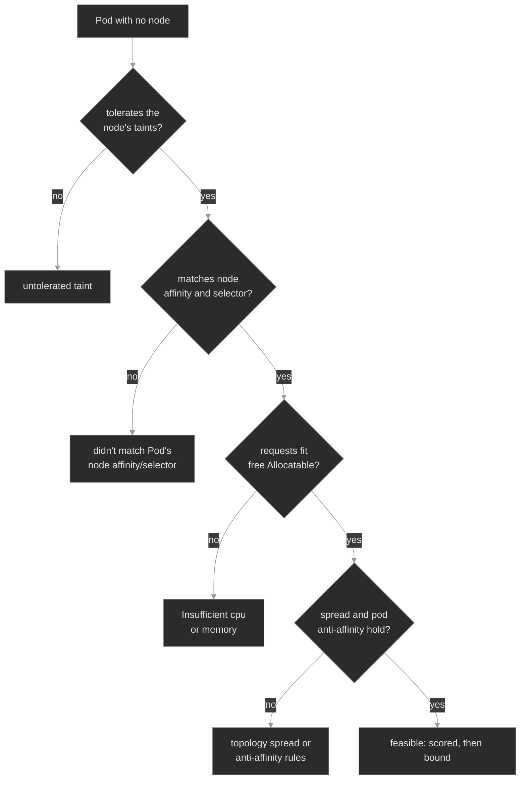

# M06 — Scheduling

> The scheduler decides which node runs each Pod. This module covers the fields it reads (requests, taints, affinity and spread), the limits the node enforces after placement, and the signature each one leaves when a Pod does not run.

## What you'll learn

- Describe the scheduler's three moves (filter, score, bind) and read the `FailedScheduling` event it writes when no node survives the filter
- Separate a **request**, which the scheduler fits against a node's Allocatable, from a **limit**, which the kernel enforces at runtime
- Derive a Pod's **QoS class** from its requests and limits, and state what that class does and does not decide under node pressure
- Use **taints and tolerations** to keep Pods off nodes, and recognize the `untolerated taint` that keeps them off by accident
- Steer placement with **`nodeSelector`** and **node affinity**, and spread replicas with **pod anti-affinity** and **topology spread constraints**
- Work the **`Pending` differential**: untolerated taint, unmatched node affinity, insufficient resources, or an unsatisfiable spread, one signature each, plus the runtime `OOMKilled` counterpart

## Why it matters

A Pod that does not schedule is a common page, and a commonly misread one. The Pod sits `Pending`, no container starts, and no log exists. The instincts that work on a crashing Pod return nothing. The answer is in one event, and that event names the reason each node refused the Pod.

Polyphone sees all four failures every week. A media node drains for a kernel patch. A new region comes online with tainted node pools before anybody writes the tolerations. A capacity review slips a memory request from `Mi` to `Gi`. A signaling service meant to survive a node failure runs every replica on one node. The scheduler makes or refuses each of these decisions by reading a few fields. Once you can read those fields, "why does this Pod not schedule?" is a two-minute lookup.

The same resource fields also fail after placement. A Pod can schedule cleanly and then die in a loop with `OOMKilled`. Its request fit the node, and its limit did not hold its workload. Telling a placement failure from a runtime failure is half the skill.

## Scope

**Covers:** what kube-scheduler does (filter, score, bind) and the order its filters run; resource requests and limits for CPU and memory; node Capacity and Allocatable; QoS classes and their real role in node-pressure eviction and the kernel OOM killer; taints and tolerations, including the three effects and the built-in taints; `nodeSelector` and node affinity; pod affinity, pod anti-affinity and topology spread constraints; and the `Pending` differential that ties them together.

**Doesn't cover:** the Horizontal Pod, Vertical Pod and Cluster autoscalers (M09); PriorityClass and preemption beyond a definition; PodDisruptionBudgets and drain mechanics (M09); CPU pinning, NUMA and the Topology Manager (M26); and storage-driven placement (M05).

**Assumes:** M00 (`get → describe → events → logs`), M01 (Pods, Deployments, ReplicaSets, labels and selectors), and a working idea of a Linux **cgroup** as the kernel mechanism that caps a process's CPU and memory. Labels are load-bearing again: affinity and spread are label queries.

## Vocabulary

| Term | Definition |
|------|------------|
| **kube-scheduler** | The control-plane component that "selects an optimal node to run newly created or not yet scheduled (unscheduled) pods." It filters, scores, then binds. |
| **feasible node** | A node that passes every filter for a Pod. No feasible node means `Pending`. |
| **request** | The CPU or memory a container asks for. The scheduler sums a Pod's requests and places it only on a node whose Allocatable still covers them. |
| **limit** | The runtime ceiling for a container. The kernel throttles CPU above the limit and OOM-kills a container above its memory limit. The scheduler ignores limits. |
| **Capacity / Allocatable** | Capacity is a node's total CPU and memory. Allocatable is the part left for Pods after the node reserves resources for the kubelet and the operating system. |
| **QoS class** | `Guaranteed`, `Burstable` or `BestEffort`. The API server derives it from requests and limits at creation and records it in `status.qosClass`. |
| **`OOMKilled`** | A container the kernel's out-of-memory killer terminated. Exit code 137 (128 + SIGKILL). |
| **node-pressure eviction** | The kubelet terminating Pods to reclaim memory or disk when its node runs low. |
| **taint** | A `key=value:effect` mark on a **node** that repels Pods. |
| **toleration** | A mark on a **Pod** that lets the scheduler place it on a node with a matching taint. |
| **node affinity** | A rule on a Pod that requires or prefers nodes with certain labels. `nodeSelector` is its simplest form. |
| **pod anti-affinity** | A rule that keeps a Pod away from other Pods that match a label selector, within a topology domain. |
| **`topologyKey`** | The node label that defines a domain: `kubernetes.io/hostname` for one node, `topology.kubernetes.io/zone` for one zone. |
| **topology spread constraint** | A rule that limits how unevenly a workload's Pods spread across domains (`maxSkew`), with a hard or a soft response. |

## Mental model

The scheduler works on Pods that have no node. For each one it runs every node through a chain of **filters**. The nodes that pass are the feasible nodes. The scheduler **scores** those nodes, picks the highest, and **binds** the Pod by writing its node name through the API server<sup><a href="https://kubernetes.io/docs/concepts/scheduling-eviction/kube-scheduler/">[1]</a></sup>. The kubelet on that node then starts the containers. If no node passes, the Pod stays `Pending` and the scheduler records a `FailedScheduling` event.

The default filters run in a fixed order, and a node stops at its first failure. The diagram shows the four filters behind nearly every `Pending` Pod, in the order the scheduler runs them.


```mermaid
%%{init: {'theme':'base', 'themeVariables': {
  'primaryColor':'#2b2b2b', 'primaryTextColor':'#e6e6e6',
  'primaryBorderColor':'#7a7a7a', 'lineColor':'#9a9a9a',
  'secondaryColor':'#3a3a3a', 'tertiaryColor':'#1f1f1f',
  'background':'#0f0f0f'
}}}%%
flowchart TD
    P[Pod with no node] --> F1{tolerates the<br/>node's taints?}
    F1 -->|no| R1[untolerated taint]
    F1 -->|yes| F2{matches node<br/>affinity and selector?}
    F2 -->|no| R2[didn't match Pod's<br/>node affinity/selector]
    F2 -->|yes| F3{requests fit<br/>free Allocatable?}
    F3 -->|no| R3[Insufficient cpu<br/>or memory]
    F3 -->|yes| F4{spread and pod<br/>anti-affinity hold?}
    F4 -->|no| R4[topology spread or<br/>anti-affinity rules]
    F4 -->|yes| S[feasible: scored, then bound]
```

The event counts the nodes behind each reason and joins the reasons into one line:

```text
0/2 nodes are available: 1 Insufficient memory, 1 node(s) had untolerated taint
{node-role.kubernetes.io/control-plane: }. preemption: 0/2 nodes are available:
1 No preemption victims found for incoming pod, 1 Preemption is not helpful for scheduling.
```

**That line is the diagnosis.** Each entry is one node's first failed filter. The scheduler sorts the entries as text, so their order says nothing about which node is which. The `preemption:` clause reports whether evicting a lower-priority Pod would help. Read the first sentence. Two facts make the model useful. First, **the scheduler fits requests, not limits**, so a huge request never schedules while a tiny limit schedules and fails later. Second, a kubeadm control-plane node carries a `NoSchedule` taint. On a small cluster, every message carries one entry for that node. The actionable cause is the entry for the nodes you expected the Pod to use.

## Concept walkthrough

### The resource contract: requests, limits, and QoS

Each container can declare two numbers per resource. The docs define the split by who reads each number: "When you specify the resource *request* for containers in a Pod, the kube-scheduler uses this information to decide which node to place the Pod on. When you specify a resource *limit* for a container, the kubelet enforces those limits"<sup><a href="https://kubernetes.io/docs/concepts/configuration/manage-resources-containers/">[2]</a></sup>.

A request is a reservation. The scheduler adds the new Pod's requests to the requests already on a node and compares the total with the node's **Allocatable**. Allocatable is Capacity minus what the node reserves for the kubelet, the operating system, and the eviction threshold<sup><a href="https://kubernetes.io/docs/tasks/administer-cluster/reserve-compute-resources/">[3]</a></sup>. The scheduler never reads live usage. A node at 5% CPU use can refuse a Pod, because its requests are already fully booked. `kubectl describe node` prints this ledger under `Allocated resources`.

A limit is a ceiling, and the two resources enforce it differently. CPU is compressible: "`cpu` limits are enforced by CPU throttling"<sup><a href="https://kubernetes.io/docs/concepts/configuration/manage-resources-containers/">[2]</a></sup>. The container gets fewer time slices and runs slower, but it keeps running. Memory is not compressible. "`memory` limits are enforced by the kernel with out of memory (OOM) kills," and the docs add that they "are enforced reactively"<sup><a href="https://kubernetes.io/docs/concepts/configuration/manage-resources-containers/">[2]</a></sup>. When the kernel reclaims memory, it kills a process over the limit, and the container reports `OOMKilled` with exit code 137.

**Requests are what you fit, and limits are what kill you.** A request that is too large is a scheduling failure: the Pod sits `Pending` with `Insufficient memory`. A memory limit that is too small is a runtime failure: the Pod schedules, starts, and falls into `CrashLoopBackOff` with `OOMKilled`. Same resource, opposite symptom, opposite fix. One default joins the two numbers. If you set a limit and no request, Kubernetes "copies the limit you specified and uses it as the requested value"<sup><a href="https://kubernetes.io/docs/concepts/configuration/manage-resources-containers/">[2]</a></sup>.

From the same numbers, Kubernetes derives the Pod's **QoS class**<sup><a href="https://kubernetes.io/docs/concepts/workloads/pods/pod-qos/">[4]</a></sup>.

| QoS class | Rule | Meaning |
|-----------|------|---------|
| `Guaranteed` | Every container sets CPU and memory requests and limits, and each limit equals its request. | The Pod reserves exactly what it may use. |
| `Burstable` | The Pod is not `Guaranteed`, and at least one container sets a CPU or memory request or limit. | The common case: requests below limits. |
| `BestEffort` | No container sets any CPU or memory request or limit. | The Pod reserves nothing. |

The class is fixed at creation. `kubectl describe pod` prints it on the `QoS Class:` line.

QoS does less than most engineers believe. Under **node-pressure eviction**, the kubelet ranks Pods by three factors: whether usage exceeds requests, then Pod priority, then usage relative to requests<sup><a href="https://kubernetes.io/docs/concepts/scheduling-eviction/node-pressure-eviction/">[5]</a></sup>. The docs say it plainly: "The kubelet does not use the pod's QoS class to determine the eviction order." QoS is only a good *estimate* of that order. A `BestEffort` Pod always exceeds its zero request, and a `Guaranteed` Pod never exceeds its own. The deciding fact is the request, not the label. A Pod that requests far less than it uses is the first candidate, whatever its class. That is why honest requests matter, and why "set no requests to stay flexible" makes a Pod the first casualty on a crowded node.

<details>
<summary>📖 Going deeper: OOMKill, eviction and preemption are three different killers<sup><a href="https://kubernetes.io/docs/concepts/scheduling-eviction/node-pressure-eviction/">[5]</a></sup></summary>

Three mechanisms end a running Pod, and each has a different owner. Conflating them sends you to the wrong fix.

- **OOMKill.** The **kernel** kills one container that exceeded its own memory limit. The Pod stays on its node, the container restarts according to its `restartPolicy`, and the restart count climbs. `kubectl describe pod` shows `Last State: Terminated` with `Reason: OOMKilled`. No Kubernetes event names it. The fix is the memory limit or the application's real usage.
- **Node-pressure eviction.** The **kubelet** acts when the whole node crosses a memory or disk threshold. It sets the chosen Pods' phase to `Failed` and terminates them, It ignores PodDisruptionBudgets, and on a hard threshold it gives no grace period. The Pod object stays listed with reason `Evicted`, and its controller creates a replacement elsewhere. The fix is node capacity, or requests that match real usage.
- **Preemption.** The **scheduler** deletes a lower-priority Pod so that a higher-priority `Pending` Pod fits<sup><a href="https://kubernetes.io/docs/concepts/scheduling-eviction/pod-priority-preemption/">[6]</a></sup>. PriorityClass drives it, and QoS plays no part. The victim receives a `Preempted` event.

QoS does act directly in one place: the kernel's own OOM killer. When a whole node runs out of memory before the kubelet can evict, the kernel picks a victim by `oom_score_adj`. The kubelet sets that value by class: -997 for `Guaranteed`, 1000 for `BestEffort`, and a value between for `Burstable` that falls as the memory request grows<sup><a href="https://kubernetes.io/docs/concepts/scheduling-eviction/node-pressure-eviction/">[5]</a></sup>. So a `BestEffort` container is the kernel's first choice.

One recent change softens the fix. In-place Pod resize is stable in v1.35: a patch to the Pod's `resize` subresource changes a running container's requests and limits without recreating the Pod, within its original QoS class<sup><a href="https://kubernetes.io/docs/tasks/configure-pod-container/resize-container-resources/">[7]</a></sup>.

</details>

### Taints and tolerations: nodes that push back

A taint is the node's side of placement. In the docs' words, "Taints are the opposite -- they allow a node to repel a set of pods"<sup><a href="https://kubernetes.io/docs/concepts/scheduling-eviction/taint-and-toleration/">[8]</a></sup>. A taint is a `key=value:effect` mark on a node. It repels every Pod without a matching **toleration**, and the docs define that side too: "Tolerations allow the scheduler to schedule pods with matching taints." The taint is the default, and the toleration is the exception.

| Effect | New Pods without a toleration | Running Pods without a toleration |
|--------|-------------------------------|-----------------------------------|
| `NoSchedule` | The scheduler does not place them. | Stay. |
| `PreferNoSchedule` | The scheduler avoids the node, but uses it rather than leave a Pod `Pending`. | Stay. |
| `NoExecute` | The scheduler does not place them. | Evicted. A toleration can set `tolerationSeconds` to delay the eviction. |

The `NoSchedule` row explains a common surprise. An engineer taints a live node `NoSchedule` and expects it to empty, but the running Pods stay. `NoSchedule` gates only new placement. The taint added now does not evict the Pods already there. A `NoExecute` taint would empty the node.

A toleration is permission, not attraction: "Tolerations allow scheduling but don't guarantee scheduling"<sup><a href="https://kubernetes.io/docs/concepts/scheduling-eviction/taint-and-toleration/">[8]</a></sup>. A Pod that tolerates a dedicated node can still land on any untainted node. To reserve a node pool for one workload, taint the pool so other Pods stay off, and give the workload a node affinity to that pool so it goes there.

Kubernetes applies taints of its own<sup><a href="https://kubernetes.io/docs/reference/labels-annotations-taints/">[9]</a></sup>. kubeadm taints each control-plane node `node-role.kubernetes.io/control-plane:NoSchedule`, which keeps ordinary workloads off it. A DaemonSet that must run there, such as `sbc-edge`, carries a toleration for that taint. The node controller adds `node.kubernetes.io/not-ready` and `node.kubernetes.io/unreachable` with effect `NoExecute` when a node fails, and those taints move Pods off the failed node. `kubectl cordon` adds `node.kubernetes.io/unschedulable:NoSchedule`. `kubectl describe node` prints every taint on its `Taints:` line.

### Steering and spreading: affinity, anti-affinity, topology spread

**`nodeSelector` and node affinity attract a Pod to labeled nodes.** The docs call `nodeSelector` "the simplest recommended form of node selection constraint"<sup><a href="https://kubernetes.io/docs/concepts/scheduling-eviction/assign-pod-node/">[10]</a></sup>. It is a map of labels, and Kubernetes schedules the Pod only onto nodes that carry each one. Node affinity is the expressive form. It adds operators (`In`, `NotIn`, `Exists`, `DoesNotExist`, `Gt`, `Lt`) and two strengths that recur in every affinity type. `requiredDuringSchedulingIgnoredDuringExecution` is a hard filter: no matching node, no placement. `preferredDuringSchedulingIgnoredDuringExecution` is a weighted preference, and the scheduler still places the Pod when no node matches. The suffix has a precise meaning: "`IgnoredDuringExecution` means that if the node labels change after Kubernetes schedules the Pod, the Pod continues to run"<sup><a href="https://kubernetes.io/docs/concepts/scheduling-eviction/assign-pod-node/">[10]</a></sup>. A required rule that names a label no node carries leaves the Pod `Pending` with `didn't match Pod's node affinity/selector`.

```yaml
spec:
  nodeSelector:
    disktype: ssd              # hard: only nodes labeled disktype=ssd
  affinity:
    nodeAffinity:
      preferredDuringSchedulingIgnoredDuringExecution:
        - weight: 50           # soft: favour a zone, never block on it
          preference:
            matchExpressions:
              - { key: topology.kubernetes.io/zone, operator: In, values: [us-east-1a] }
```

**Pod affinity and anti-affinity place a Pod relative to other Pods.** They "allow you to constrain which nodes your Pods can be scheduled on based on the labels of Pods already running on that node"<sup><a href="https://kubernetes.io/docs/concepts/scheduling-eviction/assign-pod-node/">[10]</a></sup>. Anti-affinity is the common one: "do not put two replicas of this service in the same place." The `topologyKey` defines "the same place." With `kubernetes.io/hostname`, each node is its own domain. With `topology.kubernetes.io/zone`, each zone is a domain. A **required** anti-affinity on hostname puts every replica on a different node. That is a strong guarantee, and it needs at least as many schedulable nodes as replicas. The surplus replicas sit `Pending` with `didn't match pod anti-affinity rules`.

**Topology spread constraints** do the same job with a dial instead of a switch<sup><a href="https://kubernetes.io/docs/concepts/scheduling-eviction/topology-spread-constraints/">[11]</a></sup>. `maxSkew` sets how uneven the spread may get. `topologyKey` sets the domain. `whenUnsatisfiable` sets the response: `DoNotSchedule` keeps the Pod `Pending`, and `ScheduleAnyway` places it while preferring the nodes that reduce the skew. Two defaults deserve attention. `whenUnsatisfiable` defaults to `DoNotSchedule`, the hard form. `nodeTaintsPolicy` defaults to the `Ignore` behavior, so the skew calculation counts nodes the Pod cannot even tolerate.

In their `required` or `DoNotSchedule` form, all of these keep a Pod `Pending` when the cluster cannot satisfy them. The gap between "highly available" and "stuck" is often one node's worth of room.

<details>
<summary>📖 Going deeper: hard placement rules during rollouts and drains<sup><a href="https://kubernetes.io/docs/concepts/scheduling-eviction/assign-pod-node/">[10]</a></sup></summary>

Required anti-affinity works in both directions. The scheduler checks the incoming Pod's rules against the Pods on a node. It also checks the rules of the Pods already on that node against the incoming Pod. If an existing Pod's required anti-affinity matches the newcomer's labels, the node refuses the newcomer with `node(s) didn't satisfy existing pods anti-affinity rules`.

This matters most during a rolling update. The new ReplicaSet's Pods carry the same `app` label as the old ones. So the old Pods' required rule repels their own replacements from every node the old Pods occupy. On a cluster with spare nodes, the new Pods land elsewhere and the rollout proceeds. On a cluster with no spare node, the new Pods sit `Pending`. With a small replica count, the rolling-update maths rounds `maxUnavailable` down to zero, so the Deployment controller never removes an old Pod either. The rollout stalls until an operator removes the old Pods, for example by scaling to zero and back. Softening the rule to `preferred` does not help until the old Pods are gone, because the old Pods still carry the hard version. The `matchLabelKeys` field (beta from v1.31, stable from v1.33) solves this at the source: with `pod-template-hash` in the list, each revision only repels Pods of its own revision.

Drains produce the same wedge. A drain removes one domain, and a hard rule that needed it leaves the evicted replicas `Pending` until the node returns. Alert on `Pending` Pods whose reason names anti-affinity or spread. Otherwise a routine drain quietly reduces redundancy.

The rules also cost scheduler time. The docs warn that inter-pod affinity "can slow down scheduling in large clusters significantly." They do not recommend it "in clusters larger than several hundred nodes."

</details>

## Hands-on

Five baseline steps and five break/fix scenarios run on the full Polyphone fleet, on a 2-node cluster: one tainted control-plane node and one worker. Each break/fix layers one small workload that fails for exactly one reason.

- **`baseline/`** — where the fleet landed and why. Read the control-plane taint, the fleet's resources and QoS, and its affinity and tolerations. Then place a Pod yourself, and learn the `Pending` triage.
- **`breakfix-01-insufficient-resources/`** — a Pod `Pending` with `Insufficient memory`, because a request slipped from `Mi` to `Gi`.
- **`breakfix-02-untolerated-taint/`** — a Pod `Pending` with `untolerated taint`, because a node was dedicated to one workload class and the new workload lacks the toleration.
- **`breakfix-03-antiaffinity-unschedulable/`** — two of three replicas `Pending` under a required one-per-node anti-affinity, and a fix that stalls until the old Pods leave.
- **`breakfix-04-oom-killed/`** — a Pod that schedules, then loops through `CrashLoopBackOff` with `OOMKilled`, because its memory limit sits below its working set.
- **`breakfix-05-node-affinity-mismatch/`** — a Pod `Pending` with `didn't match Pod's node affinity/selector`, because it asks for a node label that no node carries.

Check yourself against `ANSWER-KEY.md` after each.

## Common failure modes

| Symptom | Likely cause | Where to look |
|---------|--------------|---------------|
| `Pending`, `Insufficient cpu` or `Insufficient memory` | A request larger than any node's free Allocatable: a unit slip, or real capacity shortage | `describe pod` events; `describe node` under `Allocated resources`; the container's `resources.requests` |
| `Pending`, `had untolerated taint {…}` | The node is tainted, and the Pod lacks a matching toleration | `describe node`, `Taints:` line; the Pod's `tolerations` |
| `Pending`, `didn't match Pod's node affinity/selector` | A `nodeSelector` or required node affinity names a label no node carries | `get nodes -L <key>`; the Pod's `nodeSelector` or `nodeAffinity` |
| Some replicas `Pending`, `didn't match pod anti-affinity rules` or `topology spread constraints` | A hard spread rule needs more schedulable domains than exist | Count schedulable nodes or zones against replicas; the Pod's `affinity` and `topologySpreadConstraints` |
| Rollout stalls, new Pods `didn't satisfy existing pods anti-affinity rules` | Old Pods' required anti-affinity repels their replacements | `get rs`; remove the old Pods |
| Pod runs, then `CrashLoopBackOff`, `Last State: OOMKilled`, exit 137 | The memory limit is below the container's working set | `describe pod`, `Last State:`; `resources.limits.memory` against `kubectl top pod` |
| Pod `Failed` with reason `Evicted` | Node-pressure eviction; Pods using more than they request go first | Node conditions `MemoryPressure` and `DiskPressure`; the Pod's requests against its usage |
| Node refuses Pods while its CPU is nearly idle | Requests, not usage, fill Allocatable | `describe node`, `Allocated resources`; right-size inflated requests |

## Recap

- **The scheduler filters, scores, then binds.** A Pod that no node can take stays `Pending`, and its `FailedScheduling` event lists each node's first failed filter. That list is the differential, so read it before anything else.
- **Requests are what you fit, and limits are what kill you.** The scheduler sums requests against Allocatable and ignores limits and live usage. A request that is too large means `Pending`. A memory limit that is too small means `OOMKilled` at runtime.
- **QoS estimates who suffers first, and requests decide it.** The kubelet evicts Pods that use more than they request, then by priority. A `BestEffort` Pod requests nothing, so it always qualifies.
- **Taints repel, and a toleration is permission, not attraction.** `NoSchedule` blocks new Pods and leaves running ones. `NoExecute` evicts them. A dedicated pool needs a taint and a node affinity.
- **A hard placement rule is an availability guarantee and a trap.** `required` anti-affinity and `DoNotSchedule` spread leave replicas `Pending` when the domains run out, and required anti-affinity also repels a Deployment's own new Pods. Use the soft forms unless you need the guarantee and have the domains to back it.

## Production thinking

- A capacity review sets every service's memory request to its observed p99. A week later, a node drain cannot reschedule half its Pods. What did the tighter requests do to the cluster's room to absorb a lost node, and how much headroom would you keep?
- A signaling service uses a required per-hostname anti-affinity. It works in stage with 5 nodes and wedges in a small prod region with 3 nodes and 4 replicas during a node reboot. How do you keep the availability guarantee without the wedge, and what does the soft form give up?
- A team ships services with no resource requests "to keep them flexible." During a traffic spike, one busy node evicts their Pods first. Which fact about eviction ranking made them the first candidates, and which single field would have changed that?

## References

1. Kubernetes — Kubernetes Scheduler: https://kubernetes.io/docs/concepts/scheduling-eviction/kube-scheduler/
2. Kubernetes — Resource Management for Pods and Containers: https://kubernetes.io/docs/concepts/configuration/manage-resources-containers/
3. Kubernetes — Reserve Compute Resources for System Daemons: https://kubernetes.io/docs/tasks/administer-cluster/reserve-compute-resources/
4. Kubernetes — Pod Quality of Service Classes: https://kubernetes.io/docs/concepts/workloads/pods/pod-qos/
5. Kubernetes — Node-pressure Eviction: https://kubernetes.io/docs/concepts/scheduling-eviction/node-pressure-eviction/
6. Kubernetes — Pod Priority and Preemption: https://kubernetes.io/docs/concepts/scheduling-eviction/pod-priority-preemption/
7. Kubernetes — Resize CPU and Memory Resources assigned to Containers: https://kubernetes.io/docs/tasks/configure-pod-container/resize-container-resources/
8. Kubernetes — Taints and Tolerations: https://kubernetes.io/docs/concepts/scheduling-eviction/taint-and-toleration/
9. Kubernetes — Well-Known Labels, Annotations and Taints: https://kubernetes.io/docs/reference/labels-annotations-taints/
10. Kubernetes — Assigning Pods to Nodes: https://kubernetes.io/docs/concepts/scheduling-eviction/assign-pod-node/
11. Kubernetes — Pod Topology Spread Constraints: https://kubernetes.io/docs/concepts/scheduling-eviction/topology-spread-constraints/
