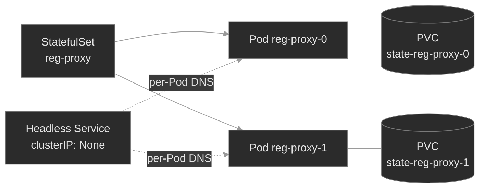

# M07 — Workloads II: StatefulSets & DaemonSets

> The two workload controllers a Deployment can't replace: one gives each Pod a durable name, its own disk, and a strict startup order; the other pins one Pod to every node. Both trade the Deployment's interchangeable-replica model for something more specific — and both fail in ways a Deployment never does.

## What you'll learn

- Explain why a **StatefulSet** exists: stable per-Pod identity (a fixed ordinal name), stable network identity (a per-Pod DNS record served by a headless Service), and stable storage (a PersistentVolumeClaim that stays bound to its ordinal) — the three guarantees a Deployment deliberately doesn't give
- Trace the **headless Service** that a StatefulSet depends on, and recognize the failure when it's missing: Pods run, but `pod-0.svc.ns` doesn't resolve and peers can't find each other
- Read a StatefulSet's **ordered lifecycle** (`OrderedReady`): Pods are created `0…N-1`, each waiting for its predecessor to go `Ready` — so one wedged Pod stalls the entire rollout, a failure mode a Deployment doesn't have
- Explain what a **DaemonSet** guarantees — one Pod per eligible node — and how node eligibility is decided by `nodeSelector`/affinity **and** taint tolerations
- Diagnose a DaemonSet that silently under-covers the cluster: `DESIRED` counts only the nodes the Pod can actually land on, so a missing toleration drops a node without an error
- Tell these two controllers apart from a Deployment on sight, and reach for the right one — most workloads are still Deployments; these are the specific exceptions

## Why it matters

A Deployment treats its Pods as interchangeable: any replica can serve any request, any Pod can be deleted and replaced by an identical one with a random name and no memory of what came before. That model is right for most services and wrong for two whole classes of workload — and both classes are load-bearing in a real-time platform.

At Polyphone the stateful tier is where identity matters. `media-engine`, `reg-proxy`, `presence`, and `pstn-gateway` are StatefulSets because a replicated store needs each member to keep the same name and the same disk across a restart: a peer that reconnects to `reg-proxy-0` must reach the *same* Pod with the *same* registration state, not a fresh replica. Get the governing Service wrong and the members can't find each other — the Pods are up, healthy, and mutually invisible. The DaemonSet tier is the node-local agents: `sbc-edge` runs one Pod on every node because a Session Border Controller has to be present wherever media terminates. Miss a toleration and the agent silently skips a node — no error, no `Pending` Pod, just a coverage gap you find during an incident on the one node it didn't reach. Both failures are quiet; neither shows up as a crash. You find them by knowing what these controllers guarantee and checking that the guarantee actually held.

## Scope

**Covers:** the **StatefulSet** — ordinal identity, the governing **headless Service** and per-Pod DNS, `volumeClaimTemplates` and sticky per-Pod PVCs, `OrderedReady` vs. `Parallel` pod management, and `RollingUpdate`/`OnDelete` update strategies with `partition`; the **DaemonSet** — one-Pod-per-node semantics, how node eligibility is computed from selectors/affinity and tolerations, `desiredNumberScheduled`, and its rolling update; and the diagnostic signatures each controller produces when its specific guarantee breaks.

**Doesn't cover:** Deployments, ReplicaSets, and the Pod lifecycle/probes they share → M01 (assumed here); Jobs and CronJobs, the *other* non-Deployment controllers → M01b; the mechanics of PersistentVolumes, StorageClasses, access modes, and dynamic provisioning that `volumeClaimTemplates` sit on top of → M05 (assumed); the scheduler filters — taints, affinity, topology spread — that decide *which* node a Pod lands on → M06 (assumed); Services, Endpoints, and cluster DNS internals → M04 (assumed); leader election and quorum protocols *inside* a stateful app → M24; autoscaling and PodDisruptionBudgets → M09.

**Assumes:** M01 (Pods, ReplicaSets, Deployments, labels/selectors, readiness probes, and that a controller — not you — creates the Pods), M04 (a Service is a selector over Pods; a headless Service has `clusterIP: None` and DNS returns Pod IPs directly; the `<name>.<ns>.svc.cluster.local` scheme), M05 (a PVC binds to a PV; `ReadWriteOnce` means one node at a time), and M06 (taints repel Pods, tolerations are the exception, and the control-plane node is tainted `NoSchedule`).

## Vocabulary

| Term | Definition |
|------|------------|
| **StatefulSet** | A controller for workloads that need stable identity. It creates Pods with fixed, ordinal names (`<name>-0`, `<name>-1`, …), each with its own persistent storage and a stable network identity, created and destroyed in a defined order. |
| **ordinal index** | The integer suffix on a StatefulSet Pod's name (`reg-proxy-0` has ordinal 0). It's stable: delete `reg-proxy-0` and its replacement is *also* named `reg-proxy-0`, with the same storage and DNS name. |
| **governing (headless) Service** | The Service named in a StatefulSet's `spec.serviceName`. It must be **headless** (`clusterIP: None`) and you must create it yourself — the controller does not. It's what publishes each Pod's stable DNS record. |
| **stable network identity** | Each StatefulSet Pod gets a DNS A record `<pod>.<serviceName>.<ns>.svc.cluster.local` (e.g. `reg-proxy-0.reg-proxy.signaling.svc.cluster.local`) that always resolves to that ordinal, so peers can address a specific member. |
| **`volumeClaimTemplate`** | A PVC template in a StatefulSet spec. The controller stamps one PVC per replica, named `<template>-<sts>-<ordinal>` (e.g. `state-reg-proxy-0`). That claim stays bound to its ordinal across restarts and reschedules. |
| **pod management policy** | `spec.podManagementPolicy`: `OrderedReady` (default) creates/deletes Pods one at a time in ordinal order, each waiting on its neighbor; `Parallel` brings them all up/down at once. Identity is stable under both. |
| **`OrderedReady`** | The default: Pod `N+1` is not created until Pod `N` is Running **and** Ready; on scale-down, Pods terminate in reverse ordinal order. A Pod that never goes Ready stalls every Pod after it. |
| **update strategy** | `spec.updateStrategy`: `RollingUpdate` (default) replaces Pods in reverse ordinal order when the template changes; `OnDelete` updates a Pod only when you delete it by hand. |
| **`partition`** | A `RollingUpdate` knob: only Pods with an ordinal `>=` the partition are updated. Used for staged/canary rollouts of a StatefulSet. |
| **DaemonSet** | A controller that runs exactly one Pod on every node that matches its constraints — and adds/removes that Pod as nodes join or leave. Used for node-local agents: log shippers, CNI/CSI plugins, node exporters, edge proxies. |
| **`desiredNumberScheduled`** | A DaemonSet's count of nodes that *should* run its Pod — computed from the nodes matching its `nodeSelector`/affinity **and** tolerating their taints. Nodes the Pod can't land on aren't counted, so this number is the coverage check. |
| **default DaemonSet tolerations** | Tolerations the controller adds to every DaemonSet Pod automatically — for `not-ready`, `unreachable`, and the node-pressure/`unschedulable` taints — so agents keep running on troubled nodes. The control-plane taint is **not** among them; you add that yourself. |

## Mental model

Both controllers are answers to "a Deployment's Pods are interchangeable, and mine aren't." They differ in *why*.

A **StatefulSet** says: my Pods are not interchangeable because each one *is* something — a specific cluster member, with a name others know, a disk holding its share of the data, and a place in a startup order. So the controller nails down three things a Deployment leaves loose. **Identity**: Pods are named by ordinal (`reg-proxy-0`, `reg-proxy-1`) instead of a random hash, stable across restarts. **Network**: a headless Service gives each ordinal a DNS record that follows it, so `reg-proxy-0` is addressable as a specific peer. **Storage**: a `volumeClaimTemplate` stamps one PVC per ordinal, and that PVC re-binds to the same ordinal every time — reschedule `reg-proxy-0` and it comes back with *its* data, not a blank volume.

Read that as an ownership chain with two attachments: the StatefulSet **creates** each Pod (solid arrows — delete a Pod and the controller remakes it with the same name), while the headless Service and the per-ordinal PVC **attach** identity to each Pod (DNS and storage that follow the ordinal, not the individual Pod instance). The controller also enforces *order*: under the default `OrderedReady` policy, `reg-proxy-1` isn't created until `reg-proxy-0` is Ready. That ordering is the point for systems that bootstrap a leader first — and the trap when Pod-0 never becomes Ready.

A **DaemonSet** says something simpler: this Pod belongs to the *node*, not to a replica count. One per node, everywhere the workload should run. You don't set `replicas`; the node set *is* the replica count. Add a node and a Pod appears on it; drain a node and its Pod goes with it. The only question a DaemonSet ever really asks is "which nodes count?" — every node that matches its selectors/affinity and tolerates its taints. A DaemonSet under-covers exactly when a node it should reach carries a taint the Pod doesn't tolerate.

The unifying idea: a Deployment guarantees *a number of Pods somewhere*; a StatefulSet guarantees *these specific Pods, in order, with their storage and names*; a DaemonSet guarantees *one Pod per node*. Each stronger guarantee has its own way to break.

## Concept walkthrough

### The StatefulSet's three guarantees

A Deployment's ReplicaSet creates Pods with random-suffix names (`session-broker-7d9f8-abc12`), interchangeable and stateless by intent — three replicas with no relationship to each other. That's ideal for a stateless service and useless for a database, a message broker, or a registrar cache, where a specific member owns specific data and others address it by name.

A **StatefulSet** replaces the random suffix with a stable ordinal and pins three things to it<a href="https://kubernetes.io/docs/concepts/workloads/controllers/statefulset/">[1]</a>:

**Ordinal identity.** Pods are `<name>-0` through `<name>-(N-1)`. The name is durable: kill `reg-proxy-0` and the controller recreates a Pod with the *same* name, not a new random one. Applications rely on this — `reg-proxy-0` might be the seed node others join, and that only works if "0" always means the same member.

**Stable network identity.** A StatefulSet names a **governing Service** in `spec.serviceName`, and that Service must be **headless** (`clusterIP: None`). A headless Service has no virtual IP; instead, cluster DNS publishes a per-Pod A record for each member: `<pod>.<serviceName>.<ns>.svc.cluster.local`<a href="https://kubernetes.io/docs/concepts/services-networking/dns-pod-service/">[2]</a>. So `reg-proxy-0.reg-proxy.signaling.svc.cluster.local` always resolves to whichever Pod currently holds ordinal 0. This is how stateful peers discover *each other specifically* rather than being load-balanced across a VIP. The sharp edge: **the StatefulSet controller does not create this Service — you do**<a href="https://kubernetes.io/docs/concepts/workloads/controllers/statefulset/#limitations">[1]</a>. Forget it, or give it a ClusterIP instead of `None`, and the Pods still start and run — but the per-Pod DNS records never appear, so every peer lookup returns NXDOMAIN and the cluster can't form. The Pods look healthy; the membership is broken.

**Stable storage.** A `volumeClaimTemplate` is a PVC template embedded in the StatefulSet. For each replica the controller stamps a distinct PVC named `<template>-<name>-<ordinal>` — `state-reg-proxy-0`, `state-reg-proxy-1` — and mounts it into that ordinal's Pod<a href="https://kubernetes.io/docs/concepts/workloads/controllers/statefulset/#stable-storage">[1]</a>. The binding is sticky: reschedule `reg-proxy-0` to another node and it re-mounts *its* PVC with *its* data. Scaling down does **not** delete these PVCs by default — the data outlives the Pod, so a scale-down-then-up doesn't silently discard state (see the deep-dive below).

📖 Going deeper: StatefulSet or Deployment + PVC — which do you actually need?<a href="https://kubernetes.io/docs/concepts/workloads/controllers/statefulset/">[1]</a>

Having a PVC does not mean you need a StatefulSet. The fleet's `directory` and `cdr-writer` are **Deployments** with a plain PVC — one replica, one volume, no per-Pod identity required. Reach for a StatefulSet only when the workload needs one of the three guarantees:

- **Stable name** — members address each other by identity (`node-0` is the seed), or an external system pins to a specific replica.
- **Per-replica storage that follows the replica** — each member owns a *distinct* shard/copy of the data, and replica `N` must always get volume `N`. A Deployment with N replicas sharing one `ReadWriteOnce` PVC can't even schedule past one Pod; giving each its own volume that tracks its identity is exactly `volumeClaimTemplates`.
- **Ordered, controlled rollout** — the app must bootstrap or upgrade one member at a time, in order.

If none of those hold — a stateless web tier, a worker pool, anything where "any replica will do" — a Deployment is simpler and rolls out faster (all replicas in parallel, random names, no ordering constraints). Most workloads are Deployments. StatefulSets are the deliberate exception, and every one you run is a small ongoing cost (slower rollouts, ordering foot-guns, storage you must reason about). Don't pay it unless the guarantee earns it.

### Ordered lifecycle: creation, scaling, and updates

A StatefulSet's second personality is *order*. Under the default `podManagementPolicy: OrderedReady`, the controller brings Pods up strictly in sequence: it creates `<name>-0`, waits until it is **Running and Ready**, then creates `<name>-1`, and so on<a href="https://kubernetes.io/docs/concepts/workloads/controllers/statefulset/#deployment-and-scaling-guarantees">[1]</a>. Scale-down runs in reverse — the highest ordinal terminates first, fully, before the next. This is deliberate: a clustered store often needs its seed member healthy before the rest join, and a controlled teardown before the leader.

It's also a failure mode a Deployment simply doesn't have. A Deployment asked for three replicas creates all three at once; if one is unhealthy, the other two still come up. A StatefulSet asked for three replicas where **Pod-0 never goes Ready** creates *only Pod-0* — Pods 1 and 2 are never created, because the gate before them never opens. The signature is unmistakable once you know it: `kubectl get statefulset` shows `READY 0/3`, and `kubectl get pods` shows a single Pod, `<name>-0`, Running but `0/1` ready. The instinct to look for three crashing Pods is wrong; there's one Pod and two absences. The fix is always to make Pod-0 Ready — usually a readiness probe pointed at the wrong port, a missing dependency, or a bad config — and the rest of the set unblocks itself the moment it does. (If your app doesn't need ordered startup, `podManagementPolicy: Parallel` removes this gate while keeping stable names and storage.)

Updates follow the same ordered discipline. The default `updateStrategy: RollingUpdate` replaces Pods in **reverse ordinal order** when the template changes, one at a time, waiting for each to go Ready before the next<a href="https://kubernetes.io/docs/concepts/workloads/controllers/statefulset/#update-strategies">[1]</a>. The `partition` field makes it a staged rollout: set `partition: 2` and only ordinals `>= 2` update, leaving `0` and `1` on the old revision — a canary you widen by lowering the partition. `OnDelete` opts out of automation: the controller applies the new template to a Pod only when you delete that Pod. The through-line: a StatefulSet does everything *in order* — a feature you exploit and a constraint you respect.

📖 Going deeper: what happens to the PVCs when you scale down or delete<a href="https://kubernetes.io/docs/concepts/workloads/controllers/statefulset/#persistentvolumeclaim-retention">[1]</a>

The PVCs a `volumeClaimTemplate` creates are, by default, **not** owned by the StatefulSet's lifecycle — they persist when you scale down and when you delete the StatefulSet itself. That default is a safety feature: scaling `reg-proxy` from 3 to 1 to ride out low traffic doesn't throw away `state-reg-proxy-1` and `-2`; scale back up and the returning ordinals re-bind their old data. It's also a surprise the first time you `kubectl delete statefulset` expecting the storage to go with it and find the PVCs (and their PVs) still there, still billing.

The `persistentVolumeClaimRetentionPolicy` field (stable since v1.32) lets you opt into deletion with two independent knobs: `whenScaled` (delete a PVC when its ordinal is scaled away) and `whenDeleted` (delete PVCs when the whole StatefulSet is deleted), each `Retain` (default) or `Delete`<a href="https://kubernetes.io/docs/concepts/workloads/controllers/statefulset/#persistentvolumeclaim-retention">[1]</a>. Leave it at the default for stores where the data is precious; set `whenScaled: Delete` for a scratch cache whose per-ordinal volume is worthless once the ordinal is gone. Either way, know which you've chosen — "I deleted the StatefulSet and the data's still there" and "I scaled down and lost the shard" are the same field set two different ways.

### DaemonSets: one Pod per node

A **DaemonSet** exists for workloads that are properties of a *node* rather than of a service: something that must run wherever there are packets to inspect, logs to ship, or hardware to expose<a href="https://kubernetes.io/docs/concepts/workloads/controllers/daemonset/">[3]</a>. You don't declare a replica count — the controller watches the node list and maintains exactly one Pod on each node that qualifies, adding one when a node joins and letting it die with its node when one leaves. `sbc-edge` is a DaemonSet because a Session Border Controller has to be present on every node that terminates media; a node without one is a node whose media has no edge.

"Every node that qualifies" is the entire subtlety. For each node, the controller decides whether the Pod *should* run there using the same placement rules the scheduler uses: the Pod's `nodeSelector` and node affinity must match the node's labels, **and** the Pod must tolerate the node's taints<a href="https://kubernetes.io/docs/concepts/scheduling-eviction/taint-and-toleration/">[4]</a>. A node the Pod can't tolerate is not a candidate, so it is **not** counted in `desiredNumberScheduled`. That's the field to read: `kubectl get daemonset` shows `DESIRED CURRENT READY UP-TO-DATE AVAILABLE`, and `DESIRED` is the number of *eligible* nodes, not the number of nodes in the cluster. When those two disagree, coverage is the story.

This is where DaemonSets fail quietly. There's no `Pending` Pod to trip over — an untolerated node simply isn't a candidate, so no Pod is ever created for it and nothing goes red. `sbc-edge` reaches both nodes of this cluster *only because* it carries an explicit toleration for the control-plane taint (`node-role.kubernetes.io/control-plane:NoSchedule`) that kubeadm applies to keep ordinary workloads off. The controller auto-adds tolerations for the transient node-condition taints (`not-ready`, `unreachable`, memory/disk/PID pressure, `unschedulable`) so agents keep running while a node is troubled<a href="https://kubernetes.io/docs/concepts/scheduling-eviction/taint-and-toleration/">[4]</a> — but **not** one for the control-plane taint. Drop that toleration and `sbc-edge` lands on the worker only: `DESIRED 1`, no error, a control-plane node with no edge agent. The reflex: when a DaemonSet's `DESIRED` is below your node count, compare the Pod's tolerations against the missing node's taints.

DaemonSet updates use the same `RollingUpdate`/`OnDelete` vocabulary as a StatefulSet: `RollingUpdate` (the default) replaces Pods node-by-node under a `maxUnavailable` budget, so you never take the agent off too many nodes at once<a href="https://kubernetes.io/docs/tasks/manage-daemon/update-daemon-set/">[5]</a>. The mental shift from a Deployment is complete: there's no "how many," only "which nodes, and is each one covered and current."

## Hands-on

Four baseline steps, three break/fix scenarios — all on the full Polyphone fleet on a 2-node cluster (one tainted control-plane, one worker). The baseline tours the controllers the fleet already runs; each break/fix layers one small purpose-built workload that breaks exactly one guarantee.

- **`baseline/`** — the fleet's StatefulSets and DaemonSet as healthy reference: `media-engine`/`reg-proxy` ordinal names, their headless Services and per-Pod DNS, the sticky `state-<sts>-<ordinal>` PVCs, and `sbc-edge` covering both nodes via its control-plane toleration. What each guarantee looks like when it holds.
- **`breakfix-01-headless-service-missing`** — a 3-replica StatefulSet whose Pods are all Running, but `session-store-0.session-store…` returns NXDOMAIN: the governing headless Service was never created. Tests knowing that stable network identity is the Service's job and the Service is *yours* to create.
- **`breakfix-02-ordered-rollout-stall`** — a StatefulSet stuck at `READY 0/3` with only Pod-0 present, Running but not Ready: a readiness probe on the wrong port, and `OrderedReady` refusing to create Pod-1 behind it. Tests reading the ordered lifecycle and seeing that one Pod's un-readiness is two Pods' absence.
- **`breakfix-03-daemonset-node-coverage`** — a node-local agent that should be everywhere but reports `DESIRED 1` on a 2-node cluster: a DaemonSet missing the control-plane toleration, silently skipping that node. Tests reading `desiredNumberScheduled` as a coverage check and matching tolerations to taints.

Work them in order; the baseline makes each broken guarantee stand out. Check yourself against `ANSWER-KEY.md` after each.

## Common failure modes

| Symptom | Likely cause | Where to look |
|---------|--------------|---------------|
| StatefulSet Pods Running, but `pod-0.svc.ns` won't resolve (NXDOMAIN) | Governing headless Service missing, misnamed, or not headless (`serviceName` points at nothing / a ClusterIP Service) | `kubectl get svc -n <ns>`; the StatefulSet's `spec.serviceName`; the Service's `clusterIP` (must be `None`) |
| StatefulSet stuck `READY 0/N`, only `<name>-0` exists and is `0/1` | `OrderedReady` blocked — Pod-0 never went Ready, so no later ordinal is created | `kubectl get pods`; `kubectl describe pod <name>-0` (readiness probe, events); the probe's port/path |
| StatefulSet won't scale up past an ordinal; a middle Pod is `Pending` | That ordinal's PVC can't bind, or the Pod can't schedule where its `RWO` volume attaches | `kubectl get pvc -n <ns>`; `describe pod` events (M05/M06) |
| Deleted a StatefulSet, storage still there (or scaled down, data gone) | `persistentVolumeClaimRetentionPolicy` — default `Retain`, or set to `Delete` | the StatefulSet's `persistentVolumeClaimRetentionPolicy`; `kubectl get pvc` |
| DaemonSet `DESIRED` lower than the node count; a node has no agent | Pod doesn't tolerate that node's taint (or doesn't match its `nodeSelector`/affinity) | `kubectl get ds`; `kubectl get pods -o wide`; the Pod's `tolerations` vs. `kubectl describe node <missing> \| grep Taints` |
| DaemonSet Pods on all nodes but one won't go Ready | Node-local dependency (host path, port, device) absent on that node — a Pod problem, not a coverage one | `kubectl describe pod` on that node's DaemonSet Pod; its logs |

## Recap

- **A StatefulSet nails down what a Deployment leaves loose:** ordinal names, a per-Pod DNS record, and a per-Pod PVC — all sticky to the ordinal across restarts. Use one only when the workload needs one of those three; otherwise a Deployment is simpler and faster.
- **Stable network identity is the headless Service's job, and the Service is yours to create.** Miss it and the Pods run fine while every per-Pod DNS name returns NXDOMAIN — a healthy-looking set that can't form a cluster.
- **`OrderedReady` means Pod-0 gates the whole set.** A StatefulSet stuck at `READY 0/N` with only Pod-0 present is one un-ready Pod blocking every ordinal behind it — fix Pod-0's readiness and the rest unblock. A Deployment never fails this way.
- **A DaemonSet guarantees one Pod per *eligible* node, and eligibility includes tolerating the node's taints.** `desiredNumberScheduled` counts only reachable nodes, so it's your coverage check — when it's below the node count, read tolerations against the missing node's taints.
- **These controllers fail quietly.** No crash, no `Pending` in the identity and coverage cases — the Pods are up. You catch the failure by verifying the guarantee (does the name resolve? are all ordinals present? is every node covered?), not by waiting for something to go red.

## Production thinking

- A stateful cache runs as a 5-replica StatefulSet. During an incident you scale it to 2 to shed load, then back to 5 an hour later — and two members come back with empty volumes and re-replicate from scratch, briefly halving capacity. Which retention setting produced that, what would the alternative have done to your storage bill during the scale-down, and how would you decide per-workload?
- You add a node-local security agent as a DaemonSet and it rolls out clean — `DESIRED` matches `CURRENT`, all Ready. Weeks later an audit finds the control-plane nodes were never covered. Nothing ever alerted. What single field explains the gap, and what check — on a metric or in CI — would have caught "DaemonSet covers fewer nodes than exist" before the audit did?
- A StatefulSet's rollout wedges: you pushed a new image, ordinal 4 updated and crash-loops on a bad config, and the rollout stops there with 0–3 on the old revision and 4 down. Explain why `RollingUpdate` halted instead of continuing, how `partition` could have made this a contained canary, and how you'd recover ordinal 4 without disturbing the members still serving.

## References

1. Kubernetes — StatefulSets: https://kubernetes.io/docs/concepts/workloads/controllers/statefulset/
2. Kubernetes — DNS for Services and Pods: https://kubernetes.io/docs/concepts/services-networking/dns-pod-service/
3. Kubernetes — DaemonSet: https://kubernetes.io/docs/concepts/workloads/controllers/daemonset/
4. Kubernetes — Taints and Tolerations: https://kubernetes.io/docs/concepts/scheduling-eviction/taint-and-toleration/
5. Kubernetes — Perform a Rolling Update on a DaemonSet: https://kubernetes.io/docs/tasks/manage-daemon/update-daemon-set/
