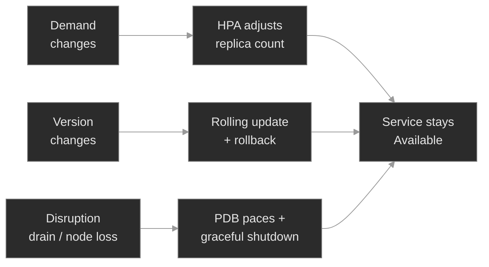

# M09 — Resilience & Autoscaling

> How Kubernetes keeps a service available while the world changes underneath it — demand rising and falling, versions shipping, nodes draining — and the handful of ways each of those controls quietly stops protecting you.

## What you'll learn

- See resilience as the response to three kinds of change — **demand**, **version**, and **disruption** — each with its own control, and diagnose each control when it fails
- Read a **HorizontalPodAutoscaler**: how it turns a metric into a replica count, why CPU utilization is measured *as a percentage of the request*, and why a missing request leaves it stuck at `<unknown>`
- Distinguish the four autoscalers — **HPA** (more replicas), **VPA** (bigger replicas), **Cluster Autoscaler / Karpenter** (more nodes), **KEDA** (event-driven) — and know which axis each one moves
- Drive a **rolling update**: `maxSurge`/`maxUnavailable`, the two-ReplicaSet handoff, `progressDeadlineSeconds`, and why a bad release *stalls* instead of taking the service down — then recover it with `rollout undo`
- Use a **PodDisruptionBudget** to pace voluntary disruption safely, compute its **allowed disruptions**, and recognize the budget that blocks a drain forever
- Trace the **graceful-shutdown** lifecycle — endpoint removal, `preStop`, `SIGTERM`, the grace period, `SIGKILL` — and see how rolling updates, PDBs, and graceful shutdown compose into lossless change

## Why it matters

Availability isn't a property a service has; it's a property Kubernetes actively maintains against a stream of changes that never stops. Traffic doubles at the top of the hour. A release ships every afternoon. A node gets drained for a CVE patch on someone else's schedule. Each of those is a chance to drop calls — and Kubernetes has a specific mechanism to absorb each one without a blip. The failures in this module are what happens when one of those mechanisms is misconfigured: the autoscaler that silently never scales, the release that wedges half-deployed, the disruption budget that turns a routine node patch into a stuck maintenance window.

At Polyphone these are the pages that arrive *between* incidents, when nothing is on fire yet. An HPA that reads `<unknown>` doesn't alarm — it just fails to add capacity when the surge comes, and the first symptom is latency, not an error. A `minAvailable` set one too high doesn't break anything today — it blocks the drain three weeks from now when a node needs patching, and the on-call engineer stares at a hung `kubectl drain` at 3am. These controls are quiet when healthy and quiet when broken; the skill is reading their state directly instead of waiting for the downstream symptom.

## Scope

**Covers:** the **HorizontalPodAutoscaler** (the control loop, the resource-metrics pipeline, utilization vs. request, min/max, and the missing-request failure); the wider autoscaler family — **Cluster Autoscaler/Karpenter**, **VPA**, **KEDA** — at the level of *which axis each scales and when to reach for it*; **Deployment rolling updates** (`RollingUpdate` strategy, `maxSurge`/`maxUnavailable`, the ReplicaSet handoff, `progressDeadlineSeconds`) and **rollback** (`rollout undo`, revisions); **PodDisruptionBudgets** (voluntary vs. involuntary disruption, `minAvailable`/`maxUnavailable`, allowed disruptions, the eviction API, node drain); and the **graceful-shutdown** lifecycle that makes each individual Pod termination lossless.

**Doesn't cover:** installing or operating the autoscalers themselves (metrics-server is pre-installed; CA/VPA/KEDA are described, not deployed — they need cloud or operator infrastructure a single lab cluster can't provide); **custom and external metrics** for the HPA (queue depth, RPS) beyond noting KEDA as the usual answer → M13 for the metrics stack; **PriorityClass and preemption** (a higher-priority Pod evicting a lower one) — the involuntary counterpart to PDBs, noted where it intersects but a distinct mechanism; the **probe and `preStop` mechanics** themselves, which were drilled in M01 (`prestop-truncation`) and are reused here as one stage of the disruption lifecycle rather than re-taught.

**Assumes:** M01 (Deployments, ReplicaSets, the reconciliation loop, readiness probes, and `terminationGracePeriodSeconds`/`preStop` from the lifecycle lesson), M06 (resource **requests** as the scheduler's reservation — the same number the HPA divides by), and M00 fluency (`get → describe → events`, reading a controller's `.status.conditions`). Requests from M06 are load-bearing again: here a request is also the autoscaler's definition of "100%."

## Vocabulary

| Term | Definition |
|------|------------|
| **HorizontalPodAutoscaler (HPA)** | A controller that adjusts a workload's **replica count** to keep an observed metric near a target. Runs a loop (~15s): read metric, compute desired replicas, clamp to `minReplicas`/`maxReplicas`. |
| **resource-metrics pipeline** | **metrics-server** scrapes each Pod's live CPU/memory and serves it on the metrics API; the HPA reads from there. No metrics-server → no resource metrics → HPA reads `<unknown>`. |
| **utilization (HPA)** | Current usage expressed as a percentage of the container's **request** (`usage ÷ request`). The request is the denominator; without one, CPU/memory utilization is undefined. |
| **Cluster Autoscaler / Karpenter** | Node-level autoscalers: they add/remove **nodes** when Pods can't schedule (or nodes sit idle). They scale the cluster, not the workload. |
| **Vertical Pod Autoscaler (VPA)** | Right-sizes a workload's **requests/limits** (bigger or smaller Pods) from observed usage, rather than changing the replica count. |
| **KEDA** | Event-driven autoscaling: scales on external signals (queue depth, stream lag, cron) and can scale **to zero**. Drives an HPA under the hood. |
| **rolling update** | The default Deployment update: replace Pods gradually, bounded by `maxSurge` (extra Pods allowed) and `maxUnavailable` (Pods allowed down), so the service keeps serving throughout. |
| **revision / rollback** | Each rollout is a numbered revision (a stored ReplicaSet template). `kubectl rollout undo` re-applies a prior revision — a rollback. |
| **progressDeadlineSeconds** | How long a rollout may go without progress before the Deployment reports `Progressing=False, ProgressDeadlineExceeded`. It flags a stuck rollout; it does **not** auto-roll-back. |
| **voluntary vs. involuntary disruption** | Voluntary: you cause it (drain, node upgrade, autoscaler scale-down). Involuntary: it happens to you (node crash, kernel OOM). PDBs constrain only *voluntary* disruptions. |
| **PodDisruptionBudget (PDB)** | A floor on how many replicas must stay up during voluntary disruption. `minAvailable` or `maxUnavailable`; the eviction API enforces it. |
| **allowed disruptions** | `currentHealthy − desiredHealthy`, floored at 0 — how many Pods the budget will let go *right now*. `0` means no eviction is permitted. |
| **eviction API** | The graceful Pod-removal path (`.../eviction`) that `kubectl drain` and the Cluster Autoscaler use. Unlike `kubectl delete pod`, it consults PDBs first. |
| **graceful shutdown** | The termination sequence: remove from Service Endpoints → run `preStop` → send `SIGTERM` → wait up to `terminationGracePeriodSeconds` → `SIGKILL`. Lets an app finish in-flight work. |

## Mental model

Resilience is Kubernetes absorbing change so the service doesn't feel it. Three kinds of change hit a running fleet, and each has one control that keeps availability flat while it happens:

Two facts make this model pay off. First, **each control has a signature failure that is silent until the change it guards actually arrives.** A broken HPA looks fine until the surge; a bad `minAvailable` looks fine until the drain; a stuck rollout looks fine (the old version serves) until you notice the new one never landed. So you read the control's *own* state — `kubectl get hpa`, `kubectl get pdb`, `kubectl rollout status` — rather than waiting for the downstream page.

Second, **these controls compose, and they share their inputs with the scheduler.** A rolling update terminates Pods; a PDB paces how many terminate at once during a drain; graceful shutdown makes each termination lossless. And the **request** you set for the scheduler in M06 is the same number the HPA treats as 100% — so one field, wrong, breaks placement *and* autoscaling. Resilience isn't a separate subsystem bolted on; it's the same primitives (replicas, requests, ReplicaSets, the reconciliation loop) driven by controllers that watch for change.

## Concept walkthrough

### Autoscaling: matching capacity to demand

The **HorizontalPodAutoscaler** is a control loop, and reading it as one demystifies every failure. About every 15 seconds it reads a metric for the target workload, computes `desiredReplicas = ceil(currentReplicas × currentMetricValue ÷ targetValue)`, and clamps the result between `minReplicas` and `maxReplicas`<a href="https://kubernetes.io/docs/tasks/run-application/horizontal-pod-autoscale/">[1]</a>. Then it sets the Deployment's replica count — which rolls out through the ordinary ReplicaSet machinery. The HPA doesn't create Pods; it moves the same replica dial you'd move by hand.

The subtlety that causes most HPA incidents is what "50% CPU" actually means. The HPA doesn't scale on raw CPU — it scales on **utilization**, defined as usage divided by the container's **request**<a href="https://kubernetes.io/docs/tasks/run-application/horizontal-pod-autoscale/">[1]</a>. The request is the denominator. metrics-server supplies the numerator (live usage, scraped per Pod), the HPA divides, and gets a percentage. Pull out the request and the arithmetic has no denominator: the HPA can't compute utilization, reports the metric as `<unknown>`, sets `ScalingActive=False`, and freezes at the current replica count. This is the single most common reason an HPA silently doesn't scale, and it's entirely on the *target* side — the metrics pipeline can be perfectly healthy. It's the same lesson as M06 from the other direction: the request is load-bearing twice over, once as the scheduler's reservation and once as the autoscaler's yardstick.

The HPA scales replicas, but that's only one of four axes you can autoscale, and confusing them wastes an incident.

📖 Going deeper: the four autoscalers and which axis each moves<a href="https://kubernetes.io/docs/concepts/cluster-administration/node-autoscaling/">[7]</a>

Four autoscalers, four different questions — reaching for the wrong one is a common misstep:

- **HPA — "more replicas."** Horizontal: keep a per-Pod metric near target by changing the *count*. The default for stateless request-serving workloads. Needs a request for resource metrics.
- **VPA — "bigger replicas."** Vertical: adjust the *requests and limits* of the Pods from observed usage, right-sizing rather than multiplying<a href="https://github.com/kubernetes/autoscaler/tree/master/vertical-pod-autoscaler">[8]</a>. Historically it recreated Pods to apply a change; recent versions can update some resources in place (leaning on the in-place resize from M06). **Don't run VPA and HPA on the same resource** (both on CPU) — they fight, one growing Pods while the other multiplies them. VPA suits workloads you can't shard: a single big consumer, a stateful process.
- **Cluster Autoscaler / Karpenter — "more nodes."** When Pods are `Pending` for lack of room, these add nodes; when nodes sit underused, they drain and remove them (via the eviction API, so PDBs apply)<a href="https://kubernetes.io/docs/concepts/cluster-administration/node-autoscaling/">[7]</a>. They scale the *cluster*, and pair with the HPA: HPA asks for more Pods, CA provides nodes to put them on.
- **KEDA — "scale on events, including to zero."** HPA's resource metrics can't see a queue backlog or a Kafka lag. KEDA scales on external/event signals and can scale a workload **to zero** when idle, spinning it back up on the first event<a href="https://keda.sh/docs/latest/concepts/">[9]</a>. Under the hood it manages an HPA. The right tool for queue consumers and bursty, event-driven work.

The axes are orthogonal: HPA × count, VPA × size, CA × nodes, KEDA × event-driven count. A real platform often runs HPA + CA together (and KEDA for the event-driven tier); VPA sits alongside for the workloads that can't scale horizontally.

### Rolling updates and rollback: changing versions without downtime

When you change a Deployment's Pod template, the default `RollingUpdate` strategy replaces Pods a few at a time, bounded by two knobs: **`maxSurge`** (how many *extra* Pods may exist during the update) and **`maxUnavailable`** (how many may be *down*), both defaulting to 25%<a href="https://kubernetes.io/docs/concepts/workloads/controllers/deployment/">[2]</a>. Mechanically it's a handoff between two ReplicaSets: the Deployment scales up a new ReplicaSet (the new version) while scaling down the old, respecting those bounds at every step, so most of the fleet is always serving. Each such update is a numbered **revision**, and Kubernetes keeps recent ones (`revisionHistoryLimit`) so you can rewind.

The load-bearing behavior for an SRE is what happens when the new version is broken. The rolling update is deliberately *careful*: it will not retire an old Pod until a new one is Ready. So a bad release — an image that won't pull, a container that crashes, a readiness probe that never passes — doesn't take the service down; it **stalls**. The old ReplicaSet keeps serving, the new one sits with unready Pods, and the rollout hangs partway. After `progressDeadlineSeconds` of no progress, the Deployment reports `Progressing=False` with reason `ProgressDeadlineExceeded`<a href="https://kubernetes.io/docs/concepts/workloads/controllers/deployment/">[2]</a> — but that is a *report*, not an action. **Kubernetes does not auto-roll-back.** The rollout stays wedged until a human or a pipeline intervenes.

Recovery is `kubectl rollout undo`, which re-applies the previous revision's template and rolls forward to it — a rollback is just a rolling update aimed at an older revision. `rollout status` is how you know a release landed (it blocks until Ready, then returns success); `rollout history` shows the revisions; `rollout undo --to-revision=N` targets a specific one. The instinct to build: a stuck rollout is diagnosed on the Deployment's conditions and the *new* ReplicaSet's Pods (why aren't they Ready?), and recovered with a rollback while you fix the release out of the hot path. (`Recreate` is the other strategy — kill all old Pods, then start new ones — which trades a downtime gap for a clean cutover; use it only when two versions can't run at once.)

### Disruption budgets and graceful shutdown: staying up while the platform changes

Nodes don't stay put. They get drained for kernel patches, removed by the Cluster Autoscaler, or simply die. Kubernetes splits these into **voluntary** disruptions (ones you initiate — a drain, an upgrade, a scale-down) and **involuntary** ones (a node crash, a kernel OOM)<a href="https://kubernetes.io/docs/concepts/workloads/pods/disruptions/">[3]</a>. A **PodDisruptionBudget** constrains the *voluntary* kind: it declares how many replicas of a workload must stay available, as `minAvailable` (at least N up) or `maxUnavailable` (at most N down)<a href="https://kubernetes.io/docs/tasks/run-application/configure-pdb/">[4]</a>.

The number that governs everything is **allowed disruptions**: `currentHealthy − desiredHealthy`, floored at 0. With 2 healthy replicas and `minAvailable: 1`, that's `1` — the budget will let one Pod go at a time. The enforcement point is the **eviction API**: `kubectl drain` doesn't delete Pods, it *evicts* them, and the eviction API checks every relevant PDB and refuses an eviction that would breach the budget<a href="https://kubernetes.io/docs/tasks/administer-cluster/safely-drain-node/">[5]</a>. That's what makes a rolling node drain safe: evict one replica, wait for the Deployment to bring a fresh one up elsewhere (restoring the budget), then evict the next. The trap is setting `minAvailable` equal to the replica count (or `maxUnavailable: 0`): allowed disruptions is then permanently `0`, no eviction is ever permitted, and a drain blocks *forever* — a budget that protects nothing because it protects everything.

Where the PDB paces *how many* Pods go down, **graceful shutdown** governs *how* each one goes. When a Pod is terminated, four things happen<a href="https://kubernetes.io/docs/concepts/workloads/pods/pod-lifecycle/">[6]</a>: it's removed from its Service's Endpoints (new traffic stops arriving); its `preStop` hook runs if it has one; the container gets **`SIGTERM`** (a well-behaved app stops taking new work and drains in-flight requests); and if it's still alive when `terminationGracePeriodSeconds` (default 30) elapses, it gets **`SIGKILL`**<a href="https://kubernetes.io/docs/concepts/containers/container-lifecycle-hooks/">[10]</a>. The grace period is the app's budget to finish cleanly; too short, or an app that ignores `SIGTERM`, and in-flight work is cut off mid-request. (M01's `prestop-truncation` is exactly this failure at the hook level.)

These three compose into lossless change: a rolling update terminates Pods a batch at a time, a PDB caps how many terminate at once during a drain, and graceful shutdown drains each terminating Pod. Get all three right and you patch nodes and ship releases without dropping a call. Get one wrong — a too-tight budget, a too-short grace period — and the same operation drops traffic.

📖 Going deeper: what a PodDisruptionBudget does and does not protect<a href="https://kubernetes.io/docs/concepts/workloads/pods/disruptions/">[3]</a>

A PDB is narrower than most people assume, and the gaps are where it bites:

- **It guards the eviction API only.** `kubectl drain` and the Cluster Autoscaler's scale-down evict, so they respect it. A plain `kubectl delete pod` does **not** go through eviction — it deletes regardless of budget. So a PDB will not stop a careless `delete`, only a well-behaved drain.
- **It does not touch rolling updates.** A Deployment rollout is bounded by `maxUnavailable`, *not* by the PDB — the two are separate systems. A PDB set for drains won't slow or block a rollout, and a rollout can briefly take more replicas down than the PDB would allow an eviction to. Conflating "PDB" with "how many Pods my rollout takes down" is a classic mistake.
- **It cannot help against involuntary disruption.** A node that crashes takes its Pods with it; there's no eviction to check the budget against. PDBs bound the disruptions you *cause*, not the ones that happen to you — for those you need enough replicas (and spread, M06) to survive the loss.
- **It can starve maintenance.** Because the eviction API strictly honors it, an over-tight PDB (allowed disruptions `0`) turns a routine drain into an indefinite hang. A blocked drain is more often a bad PDB than a bad node.

Rule of thumb: express the budget as `maxUnavailable` when an HPA moves the replica count (a fixed `minAvailable` silently drifts between "block everything" and "protect nothing" as replicas scale), and always leave room for at least one Pod to go.

## Hands-on

Four steps in the baseline, three break/fix scenarios — all on the full Polyphone fleet on a 2-node cluster (one tainted control-plane, one worker). The baseline tours the healthy machinery; each break/fix breaks exactly one piece of it.

- **`baseline/`** — the healthy controls end to end: a Deployment's rolling-update strategy, revision history, and `rollout undo`; a working HPA reading CPU utilization off metrics-server; a PDB with one disruption's worth of headroom; and the graceful-termination lifecycle. What "resilient" looks like before it breaks.
- **`breakfix-01-pdb-blocks-drain`** — a node drain that hangs: a PDB with `minAvailable` equal to the replica count, so `ALLOWED DISRUPTIONS` is `0` and the eviction API refuses every eviction. Tests reading a PDB's status and the allowed-disruptions math, and demonstrates the refusal against the real eviction API.
- **`breakfix-02-hpa-no-requests`** — an HPA stuck at `<unknown>/50%` that never scales: the target has no CPU request, so there's no denominator for utilization. Tests reading an HPA's `ScalingActive`/`FailedGetResourceMetric` condition and connecting it to the missing request.
- **`breakfix-03-rollout-stuck`** — a rolling update wedged half-done on a bad image: the new ReplicaSet's Pods `ImagePullBackOff`, the old version still serving, `ProgressDeadlineExceeded`. Tests diagnosing a stuck rollout on the Deployment's conditions and the new ReplicaSet, and recovering with `rollout undo`.

Each break/fix breaks one control from the baseline; check yourself against `ANSWER-KEY.md` after each.

## Common failure modes

| Symptom | Likely cause | Where to look |
|---------|--------------|---------------|
| HPA `TARGETS <unknown>/…`, never scales | Target container has no request for the metric's resource (usually CPU) | `kubectl describe hpa` Conditions (`ScalingActive False`, `FailedGetResourceMetric`); the target's `resources.requests` |
| HPA `<unknown>` but requests are set | metrics-server missing/unhealthy, or `kubectl top` also fails | `kubectl top pods`; metrics-server Deployment in `kube-system` |
| HPA scales but wildly over/under | Request far from real usage (wrong denominator), or a too-tight target | compare `requests.cpu` to `kubectl top pod`; the HPA's `averageUtilization` |
| `kubectl drain` hangs; eviction refused | PDB with allowed disruptions `0` (`minAvailable` == replicas, or `maxUnavailable: 0`) | `kubectl get pdb` ALLOWED DISRUPTIONS; the PDB's `minAvailable`/`maxUnavailable` vs. replica count |
| Rollout never finishes; `rollout status` hangs | New ReplicaSet's Pods not Ready (bad image, crash, failing readiness) | `kubectl get rs`; `kubectl describe pod` on the new Pods; Deployment `Progressing`/`ProgressDeadlineExceeded` |
| New version shows partial (`UP-TO-DATE` < replicas) | Stalled rolling update holding the old ReplicaSet up until the new is Ready | `kubectl rollout status`; `kubectl get rs` (old still at count, new not Ready) |
| Dropped connections on every deploy/drain | Grace period too short, or app ignores `SIGTERM` (no clean drain) | Pod `terminationGracePeriodSeconds`; whether the app handles `SIGTERM`/has a `preStop` (M01) |

## Recap

- **Resilience is the response to three kinds of change — demand, version, disruption — each with one control (HPA / rolling update + rollback / PDB + graceful shutdown), and each with a signature failure that is silent until that change arrives.** Read the control's own state, don't wait for the downstream page.
- **An HPA scales on utilization = usage ÷ request.** No request on the target, no denominator, no percentage — it reads `<unknown>` and freezes. The autoscaler family splits by axis: HPA (count), VPA (size), CA/Karpenter (nodes), KEDA (events).
- **A rolling update fails safe: a bad release stalls, it doesn't crash the service.** The old ReplicaSet serves until the new is Ready; `ProgressDeadlineExceeded` flags the stall but Kubernetes never auto-rolls-back. `rollout undo` is the recovery.
- **A PDB paces voluntary disruption via the eviction API; allowed disruptions = currentHealthy − desiredHealthy.** Set `minAvailable` at the replica count and it's `0` — the budget blocks maintenance instead of protecting the service. It does nothing for rollouts or involuntary loss.
- **Graceful shutdown makes each termination lossless — endpoints out, `preStop`, `SIGTERM`, grace, `SIGKILL`.** Rolling updates, PDBs, and graceful shutdown compose; one misconfigured piece turns routine change into dropped traffic.

## Production thinking

- A team fronts a bursty queue-consumer with a CPU-based HPA "to be safe," and it never scales during backlogs because CPU stays flat while the queue grows. What signal should actually drive that autoscaler, which tool provides it, and what does scaling that workload *to zero* between bursts buy you — and cost you?
- You set `minAvailable: 3` on a 3-replica service so it "never loses capacity." Months later a node needs an urgent security patch and the drain won't budge. Explain exactly why, what you'd change the budget to, and how expressing it as `maxUnavailable` would have behaved differently once an HPA started moving the replica count.
- A release goes out, the rollout wedges on a failing readiness probe, and the service stays perfectly healthy on the old version — but no alert fires and the bad deploy sits half-rolled for hours. What should have alerted (and on what signal), and what belongs in the pipeline so a rollout that exceeds its progress deadline rolls back on its own instead of waiting for a human?

## References

1. Kubernetes — Horizontal Pod Autoscaling: https://kubernetes.io/docs/tasks/run-application/horizontal-pod-autoscale/
2. Kubernetes — Deployments (rolling update, rollback, progress deadline): https://kubernetes.io/docs/concepts/workloads/controllers/deployment/
3. Kubernetes — Disruptions (voluntary/involuntary, PDB concepts): https://kubernetes.io/docs/concepts/workloads/pods/disruptions/
4. Kubernetes — Specifying a Disruption Budget for your Application: https://kubernetes.io/docs/tasks/run-application/configure-pdb/
5. Kubernetes — Safely Drain a Node: https://kubernetes.io/docs/tasks/administer-cluster/safely-drain-node/
6. Kubernetes — Pod Lifecycle (Pod termination): https://kubernetes.io/docs/concepts/workloads/pods/pod-lifecycle/
7. Kubernetes — Node Autoscaling (Cluster Autoscaler / Karpenter): https://kubernetes.io/docs/concepts/cluster-administration/node-autoscaling/
8. Kubernetes Autoscaler — Vertical Pod Autoscaler: https://github.com/kubernetes/autoscaler/tree/master/vertical-pod-autoscaler
9. KEDA — Concepts: https://keda.sh/docs/latest/concepts/
10. Kubernetes — Container Lifecycle Hooks (preStop): https://kubernetes.io/docs/concepts/containers/container-lifecycle-hooks/
