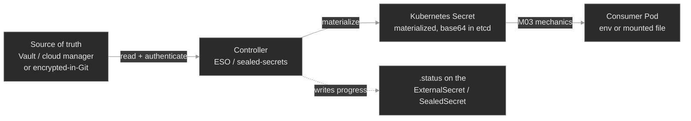

# M11 — Security II: Secrets at Scale

> Why a plaintext Secret can't live in Git, and the two patterns that fix it — sync a secret in from an external store, or commit it encrypted and decrypt it in-cluster. Both turn a Secret into something a controller *materializes*, which moves the failure surface out of the Pod and into the pipeline that feeds it.

## What you'll learn

- Explain why a Kubernetes Secret is unsafe to commit to Git — base64 is not encryption — and name the two patterns that make secret delivery GitOps-safe: **sync-from-store** and **encrypt-and-commit**
- Read the **materialization pipeline** — external source → controller → Kubernetes `Secret` → consumer Pod — and locate which link broke when a workload can't get its credential
- Map the **External Secrets Operator** model (`SecretStore`, `ExternalSecret`, provider, `remoteRef`) onto that pipeline, and read an `ExternalSecret`'s status the way you'd read a Pod's
- Recognize the **encrypt-and-commit** tools — Sealed Secrets and SOPS — and the coupling that breaks each: a `SealedSecret`'s namespace/name **scope**, a SOPS-encrypted file's decryption key
- Work the **secrets-at-scale differential**: no Secret because the *store* is unreachable, vs. no Secret because the *key* is missing, vs. a Secret that synced fine but the consumer runs on a **stale** value after rotation

## Why it matters

Everything in M03 assumed a human wrote the Secret and `kubectl apply`'d it. That doesn't survive contact with GitOps. Once a repository is the source of truth for the cluster, a Secret has to live *somewhere*, and the one place it can't live is a plaintext manifest in Git — because base64 is encoding, and a git history is forever. So at scale the Secret stops being a thing you write. It becomes a thing a controller **produces**: pulled from a secrets manager, or decrypted from an encrypted blob you *can* safely commit.

That shift is the whole module. It buys you rotation, audit, and a Git-safe workflow — and it adds a pipeline behind every credential. When `account-provisioner` at Polyphone can't reach its database, the Secret might be missing because a token in the external store expired, because the operator lost read access, because someone typo'd a key name, or because the value rotated an hour ago and the Pod is still holding the old one. None of those is a bug in the app. Each is a different broken link in the chain that feeds it, and the fix is to read the pipeline's own status — not the Pod's logs — to see which link went dark.

## Scope

**Covers:** why plaintext Secrets can't go in Git and what "GitOps-safe" means; the two delivery patterns and the tools that implement them — **sync-from-store** (External Secrets Operator, HashiCorp Vault, cloud secrets managers) and **encrypt-and-commit** (Sealed Secrets, SOPS); the ESO object model (`SecretStore`/`ClusterSecretStore`, `ExternalSecret`, `remoteRef`, refresh) as the worked example; reading an `ExternalSecret`'s sync status; **encryption at rest** for etcd; secret **rotation** and why it doesn't reach a running consumer on its own.

**Doesn't cover:** the Secret *mechanics* — how a Pod consumes a Secret as env or file, and `CreateContainerConfigError` vs `FailedMount` — that's M03, and it's assumed here. RBAC on who may read a Secret → M10 (used, not re-taught). PKI, cert issuance, and mTLS material (`cert-manager`, the `kubernetes.io/tls` type) → M12. The GitOps engines that drive these pipelines (Flux, Argo) and their SOPS integration → M18. This module is the *supply chain* for a Secret: how it gets made, and how that making fails.

**Assumes:** M03 (a Secret is base64 in etcd; a Pod reads it as env or file; env is frozen at container start), M10 (a controller runs as a ServiceAccount and can only do what RBAC grants it; `kubectl auth can-i --as=`), and M08 (a controller runs a level-triggered reconcile loop and reports progress in a resource's `.status`). Secrets at scale is those three ideas pointed at one problem.

## Vocabulary

| Term | Definition |
|------|------------|
| **GitOps-safe** | A manifest that can be committed to a Git repository without leaking a credential. A plaintext `Secret` is *not* GitOps-safe; an `ExternalSecret` or a `SealedSecret` is. |
| **sync-from-store** | The pattern where the real secret lives in an external manager (Vault, AWS/GCP secrets manager) and a controller pulls it into a Kubernetes `Secret`, keeping it refreshed. |
| **encrypt-and-commit** | The pattern where the secret is committed to Git *encrypted*, and a controller (or a decrypt step) turns the encrypted object into a `Secret` inside the cluster. |
| **External Secrets Operator (ESO)** | A controller that implements sync-from-store. It watches `ExternalSecret` objects and materializes each into a Kubernetes `Secret`. |
| **`SecretStore` / `ClusterSecretStore`** | An ESO object describing *where* secrets come from and *how to authenticate* — a provider (Vault, AWS, Kubernetes) plus credentials. Namespaced, or cluster-wide. |
| **`ExternalSecret`** | An ESO object declaring *which* remote keys to pull, from which store, into which target `Secret`. The GitOps-safe stand-in for the Secret — it names secrets, it doesn't contain them. |
| **`remoteRef`** | The pointer inside an `ExternalSecret` to a specific key in the store (`key`, optional `property`). A wrong `remoteRef` is a sync error, not a Kubernetes error. |
| **materialize** | For a controller to create/update the actual Kubernetes `Secret` from its declarative source (`ExternalSecret`/`SealedSecret`). The target Secret is a *derived* object. |
| **Sealed Secrets** | An encrypt-and-commit tool: `kubeseal` encrypts a Secret with the cluster controller's public key into a `SealedSecret`; only that controller's private key can decrypt it. |
| **scope (Sealed Secrets)** | What a `SealedSecret`'s ciphertext is bound to — by default **strict**: the exact namespace *and* name. Move or rename it and the controller refuses to decrypt. |
| **SOPS** | Secrets OPerationS: encrypts the *values* in a YAML/JSON file (leaving keys readable) using age, PGP, or a cloud KMS. Flux and others decrypt it at apply time. |
| **encryption at rest** | An `EncryptionConfiguration` on the API server that encrypts Secret values before they're written to etcd. Off by default — without it, an etcd backup is every credential in cleartext. |
| **rotation** | Replacing a secret's value with a new one. The store and the Kubernetes `Secret` update; a Pod that read the old value as an env var does **not**, until it restarts. |

## Mental model

In M03 a Secret was a leaf: you wrote it, a Pod read it, done. At scale a Secret is the *output* of a pipeline. The real secret lives outside the cluster (in a manager) or outside the cluster in plaintext terms (encrypted in Git), and a controller turns that source into the Kubernetes `Secret` a Pod actually consumes.



Two things follow. First, **the Secret is derived** — editing it by hand is pointless, because the controller reconciles it back to the source on the next pass. You change the source, not the Secret. Second, **the failure surface moved left.** A consumer Pod stuck in `CreateContainerConfigError` (M03) now has three new upstream causes before you even get to the Pod: the *source* was unreachable, the *reference* was wrong, or the controller wasn't *allowed* to read the source. The diagnostic reflex changes accordingly: when a materialized Secret is missing or wrong, you don't start at the Pod — you start at the object that was supposed to produce it and read *its* `.status`, exactly the M08 move of reading operator-managed state instead of trusting a Running process.

## Concept walkthrough

### Why plaintext Secrets break GitOps

A Kubernetes `Secret` stores its values base64-encoded, and base64 is reversible by anyone — `base64 -d` and it's plaintext (M03). Commit that manifest to Git and the credential is now in the repository's history permanently, readable by everyone with clone access and every CI system that ever checked it out. Rotating the leaked value doesn't help; the old one is still in the history, and often still valid somewhere. This is the wall every team hits the moment they adopt GitOps: the declarative model wants *everything* in Git, and a Secret is the one thing that can't go there in the clear<sup><a href="https://kubernetes.io/docs/concepts/security/secrets-good-practices/">[1]</a></sup>.

There are exactly two ways out, and every tool in this space is one or the other. **Sync-from-store:** don't put the secret in Git at all — keep it in a purpose-built manager and let a controller pull it into the cluster. **Encrypt-and-commit:** put the secret in Git, but *encrypted* with a key the repo doesn't hold, and decrypt it inside the cluster. The first keeps a single external source of truth; the second keeps Git as the source of truth but makes the committed form safe.

### Sync-from-store: the External Secrets Operator

The **External Secrets Operator** is the common way to do sync-from-store<sup><a href="https://external-secrets.io/latest/introduction/overview/">[2]</a></sup>. It splits the job into two objects. A **`SecretStore`** says *where* and *how to authenticate* — a provider (HashiCorp Vault, AWS/GCP/Azure managers, or the in-cluster Kubernetes provider) plus a credential. An **`ExternalSecret`** says *what* to pull and *where to put it*:

```yaml
apiVersion: external-secrets.io/v1
kind: ExternalSecret
metadata:
  name: db-credentials
  namespace: provisioning
spec:
  refreshInterval: 1h
  secretStoreRef: { name: polyphone-vault, kind: SecretStore }
  target:
    name: db-credentials            # the Kubernetes Secret ESO will create
  data:
    - secretKey: DB_PASSWORD         # the key in the target Secret
      remoteRef:
        key: prod/database           # the path/name in the store
        property: password           # the field within it
```

The `ExternalSecret` is the GitOps-safe artifact: it *names* `prod/database/password`, it doesn't contain it, so it's safe to commit. ESO reconciles it — authenticate to the store, read `prod/database`, take `password`, write a `Secret` named `db-credentials` with key `DB_PASSWORD` — then re-checks every `refreshInterval`. The consumer Pod references `db-credentials` like any Secret from M03 and never knows ESO exists.

Because ESO is a controller, it reports on the same channel M08 taught: the object's `.status`. An `ExternalSecret` carries a `Ready` condition — `SecretSynced` when the target exists and matches, an error reason like `SecretSyncedError` when it can't pull. That status is the first thing you read when a synced Secret goes wrong, and it names the failing step: store unreachable, key not found, transform failed. `kubectl get externalsecret` shows the state at a glance; `kubectl describe` shows the provider's actual error.

<details>
<summary>📖 Going deeper: the store's own identity, and why "SecretStore not ready" downs everything under it<sup><a href="https://external-secrets.io/latest/provider/kubernetes/">[3]</a></sup></summary>

A `SecretStore` doesn't authenticate as ESO — it authenticates as an identity *you* give it, and that identity has to be allowed to read the backend. With the in-cluster Kubernetes provider, the store names a ServiceAccount and ESO validates the store by asking the API server, on that ServiceAccount's behalf, whether it may read secrets in the remote namespace — the same `SelfSubjectRulesReview` that backs `kubectl auth can-i`<sup><a href="https://external-secrets.io/latest/provider/kubernetes/">[3]</a></sup>. If the RBAC isn't there, the store's own `Ready` condition goes `False` with a `ValidationFailed` reason, and — this is the part that bites — *every* `ExternalSecret` pointing at that store fails at once, because the shared dependency they all lean on is down. The blast radius of one missing RoleBinding is every secret synced through that store.

This is why the diagnostic order is store-first: a fan-out of `ExternalSecret` errors that all name the same store is a store problem, not twenty separate secret problems. Read `kubectl get secretstore` before you read any single `ExternalSecret`, and confirm the store identity with `kubectl auth can-i get secrets -n <backend-ns> --as=<the store's SA>` — the exact M10 reflex, now pointed at a controller's own credential.

</details>

### Encrypt-and-commit: Sealed Secrets and SOPS

The other pattern keeps Git as the source of truth. **Sealed Secrets** (the `kubeseal` tool plus an in-cluster controller) does it with asymmetric crypto<sup><a href="https://github.com/bitnami-labs/sealed-secrets">[4]</a></sup>. The controller holds a private key and publishes the matching public key. You run `kubeseal` on a normal Secret; it encrypts the values with the public key and emits a **`SealedSecret`** custom resource that only *this* cluster's controller can decrypt. That `SealedSecret` is safe to commit — no other party, not even someone with the YAML, can read it. The controller watches for `SealedSecret`s, decrypts each into a normal `Secret`, and from there it's ordinary M03.

The sharp edge is **scope**. By default a `SealedSecret` is sealed *strict*: the ciphertext is cryptographically bound to its exact namespace **and** name<sup><a href="https://github.com/bitnami-labs/sealed-secrets#scopes">[5]</a></sup>. This is deliberate — it stops someone who can create Pods in namespace `A` from copying your `SealedSecret` into `A` to have the controller decrypt it for them. But it means moving a `SealedSecret` to another namespace, or renaming it, silently breaks decryption: the controller computes the binding from the object's *current* namespace/name, finds it doesn't match what was sealed, and refuses. No `Secret` is produced, and the only signal is the controller's log and the `SealedSecret`'s own status — the derived Secret simply never appears.

**SOPS** takes a lighter approach — it encrypts the *values* in a YAML or JSON file while leaving the keys readable, using age, PGP, or a cloud KMS as the key backend<sup><a href="https://github.com/getsops/sops">[6]</a></sup>. The encrypted file is a readable diff (you can see *which* keys changed, never their values) and commits cleanly. A GitOps engine like Flux decrypts it at apply time with a key held in the cluster<sup><a href="https://fluxcd.io/flux/guides/mozilla-sops/">[7]</a></sup>. Its failure mode rhymes with Sealed Secrets': if the decryption key isn't present or isn't the one the file was encrypted to, the apply fails and no Secret lands — the coupling is the key, not the scope, but the shape is the same. Both patterns fail *closed*: a broken link produces no Secret, never a wrong-but-plausible one.

### The floor under all of it: encryption at rest

Every pattern above ends the same way — a Kubernetes `Secret`, base64 in etcd. That base64 is not encryption (M03), so a stolen etcd snapshot or a backup file is every credential in the cluster, in the clear. **Encryption at rest** closes that: an `EncryptionConfiguration` on the API server encrypts Secret values before they hit etcd, ideally with an external KMS holding the key<sup><a href="https://kubernetes.io/docs/tasks/administer-cluster/encrypt-data/">[8]</a></sup>. It's off in a vanilla cluster and it's orthogonal to the delivery pattern — you want it *regardless* of whether secrets arrive via ESO or Sealed Secrets, because it protects the materialized Secret at rest no matter how it got there. Managed control planes often enable it for you; on a self-managed cluster it's a deliberate step, and its absence is a finding, not a footnote.

### Rotation: the Secret updates, the Pod doesn't

The reason to run any of this is rotation — credentials should change on a schedule, and a leaked one must be replaceable in minutes. Sync-from-store makes rotation *look* automatic: change the value in the store, and within a refresh interval ESO updates the Kubernetes `Secret`. But updating the Secret is only half the delivery. A Pod that consumes that Secret as an **environment variable** read it once, at container start, and froze it (M03) — so the Secret now holds the new value while the running process still authenticates with the old one. Nothing crashed; `kubectl get externalsecret` is green; the Secret is correct; and the workload is quietly wrong until something restarts it. That gap — the materialization pipeline is healthy end to end but the *consumer* is stale — is the signature secrets-at-scale failure, and it's why "rotate the secret" and "roll the consumers" are two steps, not one. Mounted-file consumers pick up the change after the kubelet sync (M03); env consumers need a `rollout restart`, or a controller that watches the Secret's hash and rolls them for you.

## Hands-on

The lab runs a **secrets-sync operator** on the Polyphone fleet: a `SecretSync` custom resource that models an ESO `ExternalSecret`, and a reconcile loop that reads a backing store (`vault-backend` in `secrets-source`, standing in for Vault), validates its access the way ESO validates a `SecretStore`, and materializes a Kubernetes `Secret` for each consumer. It's a legible offline stand-in for ESO — same pipeline, same `.status`, same failure modes — so you practice reading the chain, not installing a controller. Two syncs feed two consumers: `db-credentials` → `billing-processor` (`provisioning`) and `partner-api` → `partner-connector` (`media`).

- **`baseline/`** — the healthy pipeline: the backing store, the `SecretSync` objects reporting `Ready`, the Secrets they materialized, and the consumers running on them. What "the supply chain is intact" looks like, so a broken link stands out.
- **`breakfix-01-source-key-missing`** — a `SecretSync` in `SyncError`: its `remoteRef` names a key the store doesn't have, so no target Secret is created and the consumer is stuck in `CreateContainerConfigError`. Tests reading the sync object's status instead of the Pod's logs.
- **`breakfix-02-store-access-denied`** — every sync `StoreNotReady` at once: the operator lost RBAC to read the backing store, so the whole pipeline is down. Tests store-first diagnosis and the `auth can-i --as=` reflex from M10.
- **`breakfix-03-rotation-not-propagated`** — a green pipeline and a stale consumer: the store value rotated, the Secret updated, but the env-consuming Pod still holds the old credential. Tests catching the failure the status *doesn't* show.

Check yourself against `ANSWER-KEY.md` after each.

## Common failure modes

| Symptom | Likely cause | Where to look |
|---------|--------------|---------------|
| Consumer `CreateContainerConfigError`, target Secret absent | The sync object is in error — bad `remoteRef` key/property, or a failed transform | `kubectl get externalsecret/secretsync -n <ns>`; its `.status` reason (`SecretSyncedError`); does the key exist in the store |
| Many sync objects fail at once, all naming one store | `SecretStore` not ready — the store's identity lost access to the backend | `kubectl get secretstore`; `kubectl auth can-i get secrets -n <backend> --as=<store SA>`; the store's RBAC |
| Synced Secret exists and is correct, consumer behaves on old value | Rotation reached the Secret but not the Pod — env is frozen at start | `kubectl exec … -- printenv`; compare to the Secret; did the consumers `rollout restart` after rotation |
| `SealedSecret` applied, no `Secret` appears | Scope mismatch — sealed for a different namespace/name than where it's deployed | controller logs; the `SealedSecret`'s namespace/name vs. how it was sealed; re-seal for the right scope |
| Hand-edited a materialized Secret, it reverted | It's a *derived* object — the controller reconciles it back to the source | Change the source (`ExternalSecret`/store), not the Secret; the sync object's `refreshInterval` |
| etcd backup contains readable credentials | No encryption at rest — base64 is not encryption | the API server's `--encryption-provider-config`; `EncryptionConfiguration`; whether a KMS is wired |

## Recap

- **Base64 is not encryption, so a plaintext Secret can't live in Git.** Secrets at scale are *materialized* by a controller, one of two ways: **sync-from-store** (ESO, Vault) or **encrypt-and-commit** (Sealed Secrets, SOPS). The committed artifact — an `ExternalSecret`, a `SealedSecret` — names or encrypts the secret; it never contains it in the clear.
- **The Secret becomes a derived object, and the failure surface moves upstream.** A missing or wrong Secret now has causes *before* the Pod: the source, the reference, the controller's access. Diagnose by reading the producing object's `.status`, not the consumer's logs — the M08 reflex, pointed at secrets.
- **A `SecretStore` is a shared dependency.** When its identity loses access, every `ExternalSecret` under it fails together. A fan-out of sync errors that all name one store is one problem; go store-first, and confirm the store's identity with `auth can-i --as=` (M10).
- **Encrypt-and-commit fails closed on a coupling:** Sealed Secrets on **scope** (namespace + name), SOPS on the **decryption key**. Move or rename a `SealedSecret` and it stops decrypting — no Secret, not a wrong one.
- **Rotation is two steps, not one.** The pipeline updating the Secret is not the consumer picking it up — an env-consumer stays frozen on the old value until it's rolled. A green sync status can sit above a workload authenticating with a stale credential.

## Production thinking

- A `SecretStore`'s credential expires overnight and by morning forty `ExternalSecret`s across a dozen namespaces are all failing to sync. Nothing has restarted yet, so no app is down — but the moment any of those Pods reschedules, it comes up with no Secret. How would you detect the store outage *before* the first Pod reschedules, and what's the difference between alerting on the store's `Ready` condition versus on each individual `ExternalSecret`?
- Your team standardizes on encrypt-and-commit with Sealed Secrets, and six months in you need to move a workload — and its `SealedSecret` — from the `staging` namespace to `prod`. The copied `SealedSecret` won't decrypt. Walk through *why* strict scope did exactly what it was designed to do, and what your options are (re-seal, a wider scope, a different tool) with the trade-off each makes between convenience and blast radius.
- You rotate a database password in the external store, confirm every `ExternalSecret` re-synced green, and consider the incident closed — then connections start failing an hour later as Pods slowly reschedule onto the new-but-not-yet-adopted value, half the fleet on each. What in your rollout process should have coupled "the Secret changed" to "the consumers restarted," and how would you have known which Pods were still running on the old credential?

## References

1. Kubernetes — Good practices for Kubernetes Secrets: https://kubernetes.io/docs/concepts/security/secrets-good-practices/
2. External Secrets Operator — Introduction: https://external-secrets.io/latest/introduction/overview/
3. External Secrets Operator — Kubernetes provider: https://external-secrets.io/latest/provider/kubernetes/
4. Sealed Secrets — Overview (Bitnami Labs): https://github.com/bitnami-labs/sealed-secrets
5. Sealed Secrets — Scopes: https://github.com/bitnami-labs/sealed-secrets#scopes
6. SOPS — Secrets OPerationS (getsops): https://github.com/getsops/sops
7. Flux — Manage Kubernetes secrets with SOPS: https://fluxcd.io/flux/guides/mozilla-sops/
8. Kubernetes — Encrypting Confidential Data at Rest: https://kubernetes.io/docs/tasks/administer-cluster/encrypt-data/
