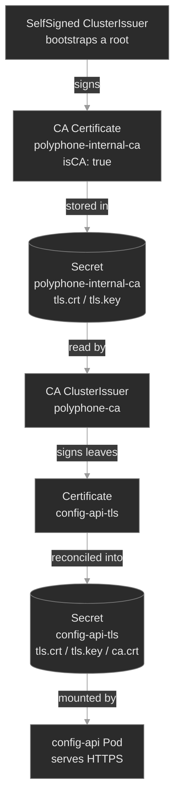

# M12 — PKI & TLS

> How workloads get a cryptographic identity and use it to talk securely. cert-manager turns a declarative `Certificate` into a signed key pair; an internal CA signs the fleet's certs; mutual TLS proves *both* ends. Every TLS failure is one of three questions — was the cert **issued**, does its **identity** match, is it **trusted** — and this module teaches you to tell them apart at a glance.

## What you'll learn

- Read the **cert-manager issuance chain** — `Issuer`/`ClusterIssuer` → `Certificate` → `CertificateRequest` → a `kubernetes.io/tls` Secret — and diagnose a `Certificate` that never goes `Ready`
- Stand up an **internal CA** in-cluster (a self-signed root that signs every workload's leaf cert) and explain why a private CA, not a public one, secures east-west traffic
- Read a leaf certificate's **identity** — its Subject Alternative Names (SANs) — and recognize the handshake failure when a client connects by a name the cert doesn't cover
- Explain **trust**: why a TLS client accepts or rejects a server based on which CA signed it, and how the CA's public cert (`ca.crt`) gets distributed to the workloads that need it
- Set up **mutual TLS (mTLS)** between two workloads — both present a cert, both verify the other — and read each of the three ways it breaks
- Place **ACME** (the Let's Encrypt protocol) in the picture: what the HTTP-01 / DNS-01 challenge proves, and why it's for *public* certs, not internal ones

## Why it matters

Every service-to-service call at Polyphone carrying a SIP credential, a call detail record, or tenant provisioning data should be encrypted and mutually authenticated — because a flat internal network is one compromised Pod away from an attacker reading everything east-west. TLS makes the wire unreadable and the peer verifiable; PKI — public key infrastructure — is the machinery that hands out and vouches for the identities TLS checks.

The reason this is a whole module and not a footnote is that TLS fails in ways that look identical from the outside — "the call didn't connect" — but have three different causes. The cert was never issued (nothing to serve). The cert exists but claims the wrong name (the client won't believe it's the right server). The cert is fine but the client doesn't trust the CA that signed it (it rejects a valid certificate). Reach for the wrong cause and you burn an hour rotating a key that was never the problem. An SRE who reads `kubectl get certificate`, `openssl`, and a one-line `curl` error and instantly says *issuance*, *identity*, or *trust* is worth a rotation of people who can't.

The other half is operational: certificates **expire**. A cert nobody renews is a self-inflicted outage with a timer on it — the classic 2 a.m. page is a service that worked yesterday and now throws `certificate has expired`. cert-manager makes issuance and renewal a control loop instead of a calendar reminder; this module is about reading that loop when it stalls.

## Scope

**Covers:** the **cert-manager** model — the `Issuer`/`ClusterIssuer`, `Certificate`, and `CertificateRequest` custom resources, the reconciliation from a declared `Certificate` to a real `kubernetes.io/tls` Secret, and the `Ready` condition; building an **internal CA** with the `SelfSigned` and `CA` issuer types; the **`kubernetes.io/tls` Secret contract** (`tls.crt` / `tls.key` / `ca.crt`) and how a workload mounts it; certificate **identity** (SANs vs the legacy Common Name) and **hostname verification**; the **chain of trust** and how `ca.crt` is distributed; **mutual TLS** between two workloads and its three failure modes; certificate **expiry and automatic renewal**; and **ACME** (HTTP-01 / DNS-01) as a concept.

**Doesn't cover:** running *public* ACME issuance end-to-end — Let's Encrypt needs a publicly reachable name and inbound network an offline lab can't provide, so ACME is a model, not deployed (the reason M13 kept the Prometheus stack concept-only). Also deferred: secret **distribution/rotation at fleet scale** (External Secrets, sealed-secrets, `sops`) → M11; **service-mesh-managed mTLS**, where a sidecar injects and rotates certs → M15; TLS **termination at the Ingress edge** (M14 introduced it); and the handshake's cryptographic internals (cipher suites, key exchange).

**Assumes:** M03 (Secrets — a TLS cert lives in one, and the double-base64 reflex from M03 applies here too), M08 (CRDs and the controller pattern — cert-manager *is* an operator: it installs CRDs and runs a reconcile loop, exactly the shape M08 taught), M10 (RBAC and ServiceAccounts — cert-manager's controller authenticates as a ServiceAccount with permission to write Secrets), and M04 (Service DNS — a cert's SANs are the DNS names from M04, and hostname verification checks the name you dialed).

## Vocabulary

| Term | Definition |
|------|------------|
| **TLS** | Transport Layer Security: encrypts a connection and authenticates the server (and, in mTLS, the client) using certificates. The `S` in HTTPS. |
| **PKI** | Public Key Infrastructure: the system of CAs, certificates, and trust relationships that lets one party verify another's identity without a shared secret. |
| **Certificate (X.509)** | A signed document binding a **public key** to an **identity** (a set of names), vouched for by a CA's signature. Public — safe to hand out. |
| **Private key** | The secret half of the key pair. Never leaves the workload; whoever holds it *is* the identity. Lives in `tls.key`. |
| **CA (Certificate Authority)** | An entity whose signature vouches for certificates. A **root CA** signs itself; everything else chains up to it. |
| **Leaf / end-entity certificate** | A certificate issued *to* a workload (not a CA). What `config-api` presents in the handshake. |
| **Chain of trust** | Leaf → (intermediate) → root. A verifier accepts a leaf if it can follow the signatures up to a root it already trusts. |
| **CSR (Certificate Signing Request)** | A request carrying a public key + desired names, sent to a CA to be signed. cert-manager creates these for you as `CertificateRequest` objects. |
| **SAN (Subject Alternative Name)** | The list of names (DNS names, IPs) a certificate is valid for. The **only** field modern TLS checks for identity. |
| **CN (Common Name)** | The legacy single-name field. Ignored for hostname verification by modern clients — SANs won. Still shown in `Subject:`. |
| **mTLS (mutual TLS)** | Both ends present and verify certificates. The server proves it's the right server *and* the client proves it's an allowed caller. |
| **cert-manager** | The de-facto Kubernetes operator for X.509 certs: CRDs (`Certificate`, `Issuer`, …) + a controller that issues and auto-renews them. |
| **Issuer / ClusterIssuer** | A cert-manager CRD naming *how* to sign certs (SelfSigned, CA, ACME, Vault). `Issuer` is namespaced; `ClusterIssuer` is cluster-wide. |
| **Certificate (the CRD)** | The cert-manager object where you *declare* a desired cert (names, issuer, duration). The controller reconciles it into a Secret. |
| **CertificateRequest** | The one-shot CSR object cert-manager creates per issuance; reading it is how you see *why* an issuance failed. |
| **`kubernetes.io/tls` Secret** | The Secret type holding a cert (`tls.crt`), its private key (`tls.key`), and often the issuing CA (`ca.crt`). What workloads mount. |
| **ACME** | The IETF protocol Let's Encrypt uses to issue *public* certs automatically, proving domain control via an HTTP-01 or DNS-01 challenge. cert-manager auto-renews at ⅔ of a cert's lifetime. |

## Mental model

A certificate answers one question — *who are you?* — and it does so with a signature you can check without asking anyone. Three separable properties make it work, and every TLS problem is a failure of exactly one of them:

- **Issuance** — does a signed cert *exist*? Someone with a CA key had to sign the workload's public key.
- **Identity** — does the cert claim the *right name*? A cert for `config-api` proves nothing about `session-broker`.
- **Trust** — does the verifier *believe the signer*? A cert is only as good as your trust in the CA that signed it.

cert-manager automates the first. It's an operator (M08's pattern exactly): you write a declarative `Certificate` object, its controller creates a `CertificateRequest`, an `Issuer` signs it, and the result lands in a `kubernetes.io/tls` Secret your workload mounts<sup><a href="https://cert-manager.io/docs/concepts/">[1]</a></sup>. The chain, for the internal CA this module builds:



The load-bearing insight: **the Secret is the deliverable, and the CA cert (`ca.crt`) is the trust anchor.** The server mounts the Secret to *serve* TLS; any client that wants to *verify* that server must independently hold the same `ca.crt`. Issuance produces the first; trust distribution produces the second. Keep those two jobs separate in your head and the whole module snaps into focus.

## Concept walkthrough

### cert-manager and the issuance chain

Before cert-manager, getting a cert into a Pod meant a human running `openssl`, submitting a CSR, and pasting the result into a Secret — every 90 days. cert-manager makes it a reconciliation loop: install it once (its CRDs plus a controller, a webhook, and a cainjector), and a certificate becomes just another declarative object<sup><a href="https://cert-manager.io/docs/concepts/">[1]</a></sup>.

Two kinds of object drive it. An **`Issuer`** (or its cluster-scoped twin, **`ClusterIssuer`**) declares *how* certs get signed — the signing backend. A **`Certificate`** declares *what* you want: the DNS names, the duration, the Secret to write, and which issuer to use<sup><a href="https://cert-manager.io/docs/configuration/">[3]</a></sup>. When you create a `Certificate`, the controller doesn't sign anything itself — it creates a short-lived **`CertificateRequest`** (a CSR wrapped as a Kubernetes object), the issuer processes that, and the signed cert plus its key are written into a `kubernetes.io/tls` Secret. That indirection is why diagnosis has a *ladder*: when a cert won't issue, the `Certificate` tells you it's not `Ready`, and the `CertificateRequest` beneath it tells you *why*.

```bash
kubectl get certificate -n media                       # READY column: True or False
kubectl describe certificate config-api-tls -n media   # conditions + the child request
kubectl get certificaterequest -n media                # the CSR object; describe it for the real error
```

The most common issuance failure is the dumbest and the most instructive: the `Certificate` names an issuer that doesn't exist, or references it with the wrong `kind`. cert-manager can't sign, the `Certificate` sits `Ready: False` forever, and — critically — **the Secret is never created**. Any Pod that mounts that Secret as a volume is then stuck `ContainerCreating` with a `FailedMount` event, because you can't mount a Secret that isn't there. Two symptoms, one root cause: read the `Certificate`, not the Pod.

<details>
<summary>📖 Going deeper: the four issuer types, and why we chained SelfSigned → CA<sup><a href="https://cert-manager.io/docs/configuration/">[3]</a></sup></summary>

An issuer's backend is one of several types<sup><a href="https://cert-manager.io/docs/configuration/">[3]</a></sup>:

- **SelfSigned** — the cert signs *itself*. No CA involved. Useful for exactly one thing: bootstrapping a root, because a root CA is by definition self-signed.
- **CA** — signs leaf certs using a CA key + cert that already live in a Secret<sup><a href="https://cert-manager.io/docs/configuration/ca/">[4]</a></sup>. This is your internal CA. It signs everything east-west and costs nothing.
- **ACME** — talks to Let's Encrypt (or any ACME server) to get *publicly trusted* certs, proving domain control via a challenge (covered below).
- **Vault / Venafi / external** — delegates signing to an enterprise PKI.

Building an internal CA is a two-step chain, which is why the diagram has two issuers. You can't ask a CA issuer to sign your CA cert — there's no CA yet. So a **SelfSigned** issuer mints the root (`isCA: true`), that root lands in a Secret, and a **CA** issuer is pointed at that Secret to sign every leaf. Bootstrap once, sign forever. (The CA issuer reads its signing Secret from the cluster resource namespace, `cert-manager` — which is why the CA `Certificate` is created there, not in `media`.)

</details>

### Certificate identity — SANs and hostname verification

A signed cert proves a public key belongs to *some* identity. Which identity is the **Subject Alternative Name** list — the set of DNS names (and sometimes IPs) the cert is valid for. When a client opens `https://config-api.media.svc.cluster.local`, TLS does two independent checks: is the cert **trusted** (signed by a CA I believe), and does the name I *dialed* appear in the cert's **SANs**? Both must pass. A cert can be freshly issued, perfectly trusted, and still rejected because it's valid for `config-api-legacy` and you asked for `config-api`<sup><a href="https://cert-manager.io/docs/usage/certificate/">[5]</a></sup>.

This trips people because the legacy **Common Name** field looks like "the name" and it isn't — modern clients ignore CN for hostname verification and check SANs only. A cert with `CN=config-api` and no matching SAN fails. The error is specific and worth memorizing on sight:

```text
curl: (60) SSL: no alternative certificate subject name matches target host name 'config-api.media.svc.cluster.local'
```

Read a cert's SANs directly — this is a muscle to build, not a tool to hide behind:

```bash
# from the Secret, decode the cert and read its SANs
kubectl get secret config-api-tls -n media -o jsonpath='{.data.tls\.crt}' | base64 -d \
  | openssl x509 -noout -text | grep -A1 'Subject Alternative Name'
```

The operational rule: **a service's cert must list every name any client uses to reach it.** In Kubernetes that's usually three forms of the same Service — `config-api`, `config-api.media.svc`, `config-api.media.svc.cluster.local` — because a same-namespace caller uses the short form and a cross-namespace caller uses the FQDN. Miss one and *some* callers fail while others succeed — an intermittent-looking bug that's actually deterministic.

### Trust — the chain, the CA, and distributing `ca.crt`

Issuance and identity are about the cert the *server* holds; trust is about what the *client* holds. A TLS client ships with a set of CAs it trusts — for the public web, the ~150 roots baked into your OS. An **internal** CA no OS has heard of is trusted by nobody by default, so verification fails with the other error you must know cold:

```text
curl: (60) SSL certificate problem: unable to get local issuer certificate
```

That is not "the cert is bad." It's "I don't recognize who signed it." The fix is never to weaken verification (`curl -k` / `insecureSkipVerify` is how internal TLS quietly rots into unauthenticated plaintext-equivalent); the fix is to **give the client the CA's public cert** so it can complete the chain. That public cert is `ca.crt`, and cert-manager conveniently writes it into every leaf Secret alongside `tls.crt`. Distributing it to the workloads that need it is a first-class job — this module does it by copying the CA cert into a small bundle Secret each client mounts and points its verifier at (`--cacert`). Mount the *wrong* CA and you get the exact error above, even though the server's cert is flawless.

<details>
<summary>📖 Going deeper: distributing trust at scale, and why <code>ca.crt</code> is safe to spread<sup><a href="https://kubernetes.io/docs/concepts/configuration/secret/#tls-secrets">[2]</a></sup></summary>

`ca.crt` is a **public** certificate — no private key. Handing it to every workload leaks nothing; the system's security rests entirely on the CA's *private* key (in the `polyphone-internal-ca` Secret, which only cert-manager reads). So trust distribution is a plumbing problem, not a secrets problem: get a public file to a lot of Pods.

Copying it by hand into a bundle Secret per namespace — what this module does for legibility — doesn't scale. The production answer is **trust-manager**, a cert-manager companion whose `Bundle` resource syncs a set of CA certs into a ConfigMap in every namespace, so a client mounts the same well-known bundle everywhere and you rotate the CA in one place. The mental model is unchanged; the CA cert just arrives by controller instead of copy-paste. This also solves the rotation trap: when you replace the CA, clients must trust the *new* CA before servers present certs signed by it, or every call fails at once — a bundle holding *both* CAs during the overlap is how you rotate a root without an outage.

</details>

### Mutual TLS — both ends prove identity

Ordinary server TLS authenticates one direction: the client checks the server, the server accepts anyone. **Mutual TLS** closes the loop — the server also demands a client certificate and verifies it against a CA. Now `config-api` knows the caller really is `config-client` (a holder of an internal-CA-signed cert), not just some Pod that reached its IP. In a zero-trust network that's the point: identity on both ends, enforced by cryptography, not network position.

Concretely, the server adds two settings — "require a client cert" and "trust clients signed by *this* CA" — and the client presents its own `tls.crt` / `tls.key` in addition to verifying the server:

```bash
# config-client calls config-api over mTLS: --cert/--key = its identity, --cacert = its trust anchor
curl --cert /etc/tls/id/tls.crt --key /etc/tls/id/tls.key \
     --cacert /etc/tls/trust/ca.crt \
     https://config-api.media.svc.cluster.local/
```

mTLS multiplies the failure surface — now *either* side's cert can be un-issued, mis-named, or untrusted — but it adds no new *kinds* of failure. It's still issuance, identity, trust, from two vantage points. That's why each breakfix isolates one layer: build the reflex once, and mTLS is the same reflex applied twice.

### ACME and public certificates (concept only)

Everything above uses a *private* CA, right for internal traffic because you control both ends. But the cert on `portal.polyphone.example` that a customer's browser hits must be signed by a CA the *browser* already trusts — a public one like Let's Encrypt. You can't just self-sign that; no browser would believe it. **ACME** is the IETF protocol that automates public issuance<sup><a href="https://letsencrypt.org/how-it-works/">[7]</a></sup>, and cert-manager speaks it via an ACME issuer<sup><a href="https://cert-manager.io/docs/configuration/acme/">[6]</a></sup>.

The core idea is a **challenge** that proves you control the domain before the CA signs for it. Two flavors: **HTTP-01** asks you to serve a random token at `http://your-domain/.well-known/acme-challenge/…`, proving you control the web server behind that name; **DNS-01** asks you to publish a `TXT` record, proving you control the domain's DNS (and can issue wildcards). cert-manager drives the whole dance — request, solve, retrieve, and renew before expiry<sup><a href="https://cert-manager.io/docs/usage/certificate/">[8]</a></sup> — through `Order` and `Challenge` objects you inspect when it stalls.

This module doesn't run ACME live: HTTP-01 needs an inbound path from Let's Encrypt to the cluster, and an offline lab has neither a public name nor inbound reachability, so it's taught as a model. The reflex: **internal traffic → private CA (instant, free, you own trust); public traffic → ACME (a real CA, but you must prove domain control).** An ACME issuer will never sign `config-api.media.svc.cluster.local` — you can't prove domain control over a name that only exists inside the cluster.

## Hands-on

Four steps in the baseline, three break/fix scenarios — all on the full Polyphone fleet on a 2-node cluster, with cert-manager installed and an internal CA already minted. The baseline tours a healthy mTLS setup; each break/fix breaks exactly one PKI layer so you practice one diagnosis at a time.

- **`baseline/`** — read the healthy chain end to end: cert-manager's components and the two `ClusterIssuer`s, the CA `Certificate` and the leaf `Certificate`s (`Ready: True`) with the `kubernetes.io/tls` Secrets they produced; decode a leaf cert and read its SANs; watch `config-client` call `config-api` over **mTLS** and succeed; and read a cert's expiry and cert-manager's automatic renewal.
- **`breakfix-01-certificate-not-ready`** — `config-api` is stuck `ContainerCreating` and its `Certificate` reads `Ready: False`: the `issuerRef` names an issuer that doesn't exist, so no Secret is ever written. Tests the issuance ladder — read the `Certificate` and its `CertificateRequest`, not the Pod.
- **`breakfix-02-san-mismatch`** — the cert issues fine and the Secret exists, but the mTLS call fails with `no alternative certificate subject name matches`: the server cert's SANs omit the name the client dials. Tests reading a cert's identity and fixing the `dnsNames`.
- **`breakfix-03-trust-mismatch`** — the server's cert is valid and correctly named, but the client fails with `unable to get local issuer certificate`: it's mounting the wrong CA bundle. Tests the trust half — the client's CA, not the server's cert.

Check yourself against `ANSWER-KEY.md` after each.

## Common failure modes

| Symptom | Likely cause | Where to look |
|---------|--------------|---------------|
| `Certificate` stuck `Ready: False`, no Secret created | Issuer missing / wrong `kind` / not `Ready`; CSR rejected | `kubectl describe certificate`, then `describe certificaterequest` |
| Pod stuck `ContainerCreating`, `FailedMount` on a `tls` volume | The `Certificate` that fills that Secret hasn't issued | the `Certificate` behind the Secret, not the Pod |
| `no alternative certificate subject name matches target host name` | Cert's SANs don't include the name the client dialed | `openssl x509 -text` on `tls.crt` → the SAN list vs. the URL |
| `unable to get local issuer certificate` / `unknown authority` | Client trusts the wrong CA (or none) — a *trust* failure, not a bad cert. In mTLS the server side fails the same way when its client-CA doesn't match the caller's issuer | the client's `--cacert` / CA bundle vs. the CA that signed the server |
| `certificate has expired` on a service that worked yesterday | Renewal didn't happen (cert-manager down, or a manually-managed cert) | `kubectl get certificate` `NOT AFTER`; cert-manager controller health |
| ACME `Certificate` never ready, `Order`/`Challenge` pending | Challenge can't be solved — no inbound path (HTTP-01) or DNS not updated (DNS-01) | `kubectl describe order` / `describe challenge` |

## Recap

- **Every TLS failure is one of three questions — issuance, identity, trust.** Was a cert *signed* (Secret exists)? Does it claim the *right name* (SANs)? Does the verifier *trust the signer* (the CA)? Name the layer and you've halved the fix.
- **cert-manager makes certs a reconciliation loop.** An `Issuer` says how to sign, a `Certificate` says what you want; the controller writes a `kubernetes.io/tls` Secret and renews it. When it stalls, climb the ladder: `Certificate` → `CertificateRequest` for the real reason.
- **A missing cert is a missing Secret is a stuck Pod.** A `Certificate` that won't issue never writes its Secret, and a workload mounting that Secret can't start. Diagnose the cert, not the Pod.
- **Identity is SANs, not CN.** Modern TLS checks the Subject Alternative Names against the name you dialed and ignores the Common Name; a service's cert must list every name its clients use.
- **Trust is the client's CA, distributed separately from the cert.** `ca.crt` is public and safe to spread; a client mounting the wrong one rejects a flawless server. Never fix a trust error by disabling verification.

## Production thinking

- A leaf cert renews automatically at ⅔ of its life — but only if cert-manager is healthy and the issuer still works. What's your alert for "within N days of expiry *and* not renewed," and why is expiry-based alerting on the cert itself more reliable than trusting the renewal loop to fire?
- You need to rotate the internal CA (new root key). What's the ordering — new CA into every client's trust bundle first, or new leaf certs first — and why does trust-manager holding *both* CAs during the overlap prevent a fleet-wide outage?
- A teammate "fixes" an `unable to get local issuer certificate` error by adding `--insecure` to the client, and the ticket closes. What did that turn off, what's the blast radius (MITM, unauthenticated peers), and what review rule keeps `insecureSkipVerify` out of the codebase?

## References

1. cert-manager — Concepts (Certificate, Issuer, CertificateRequest): https://cert-manager.io/docs/concepts/
2. Kubernetes — TLS Secrets (`kubernetes.io/tls`): https://kubernetes.io/docs/concepts/configuration/secret/#tls-secrets
3. cert-manager — Issuer configuration (SelfSigned / CA / ACME): https://cert-manager.io/docs/configuration/
4. cert-manager — CA Issuer: https://cert-manager.io/docs/configuration/ca/
5. cert-manager — Certificate dnsNames & SANs: https://cert-manager.io/docs/usage/certificate/
6. cert-manager — ACME issuer (HTTP-01 / DNS-01): https://cert-manager.io/docs/configuration/acme/
7. Let's Encrypt — How it works (ACME challenges): https://letsencrypt.org/how-it-works/
8. cert-manager — Certificate lifecycle & renewal: https://cert-manager.io/docs/usage/certificate/
