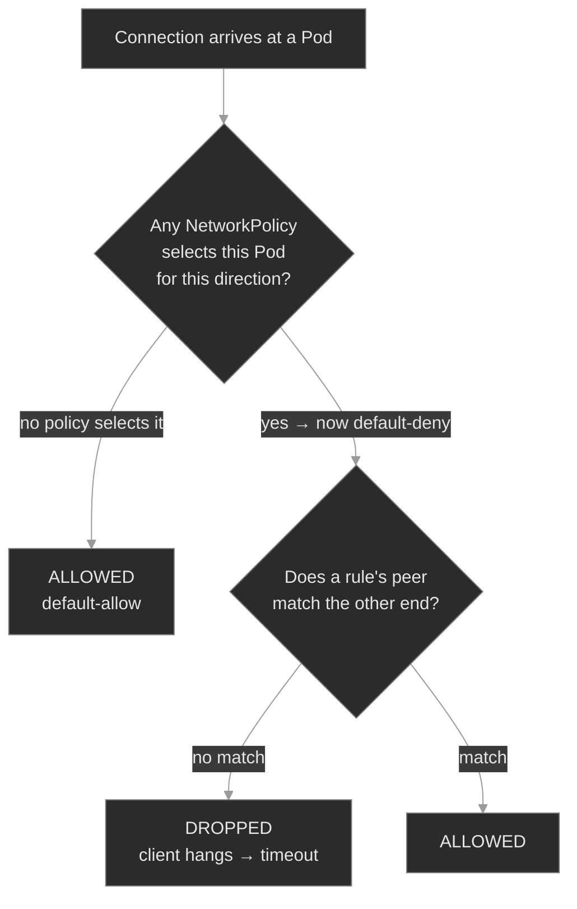

# M14 — Networking II: Policy & Ingress

> Two controls that shape traffic the Service layer leaves wide open: NetworkPolicy, which turns a flat, default-open pod network into segmented east-west lanes, and Ingress, the L7 front door for north-south HTTP — plus the failure signatures each one adds.

## What you'll learn

- Explain the NetworkPolicy model precisely: a pod is default-*allow* until a policy selects it, at which point it becomes default-*deny* for the covered direction — and every policy after that only *adds* permissions, never removes them
- Read a NetworkPolicy the way you read a Service: `podSelector` (who it governs), `policyTypes` (Ingress/Egress), and the `from`/`to` peers (`podSelector`, `namespaceSelector`, `ipBlock`) and `ports` that define what's allowed
- Get the peer-selector semantics right — `podSelector` alone is namespace-local, `namespaceSelector` reaches across namespaces, and the two combined in one list element is an **AND**, not an OR
- Recognize the policy-drop signature: a dropped packet *hangs to a timeout*, distinct from DNS `NXDOMAIN` and from `connection refused` — the fourth branch of M04's connectivity differential
- Explain what an Ingress is and what it is not: an L7 HTTP routing object that is inert data until an **Ingress controller** claims it via an `IngressClass` and forwards matched requests to a backend Service
- Work an Ingress failure top to bottom (no ADDRESS, `404`, or `503`): from controller present, to class matched, to the backend Service's port and endpoints

## Why it matters

M04 gave every workload a stable name and got traffic flowing. What it left in place is a flat network: by default, any pod can open a connection to any other pod, in any namespace. That's fine until it isn't — a compromised `sip-app` that reaches `cdr-storage` and `provisioning` directly, a noisy tenant hammering another's service, an auditor asking "prove only the billing plane can reach the billing database." **NetworkPolicy is the in-cluster segmentation control** that answers those. It is also the control most likely to cause a self-inflicted outage, because turning it on changes the default: the first policy you apply to a pod stops being additive and starts *denying everything you didn't explicitly allow*. That includes, famously, the pod's own DNS lookups, if you reach for egress.

Ingress is the other half. A ClusterIP Service is reachable only inside the cluster; something has to accept HTTP from the outside world and route it to the right Service by hostname and path. **Ingress is that L7 front door**, and its defining trap is that the object does nothing on its own — it is a routing spec that a separate controller has to pick up and act on. An Ingress that looks perfect in `kubectl get ingress` routes nothing if no controller claimed it, and returns `503` if the Service it names has no endpoints. Both controls fail quietly, in ways the top-line objects don't show, which is exactly why an SRE has to know where to look.

## Scope

**Covers:** the NetworkPolicy object end to end — `podSelector`, `policyTypes`, `ingress`/`egress` rules, the three peer kinds (`podSelector`, `namespaceSelector`, `ipBlock`) and the `ports` they gate; the default-allow → default-deny transition and the additive-allow model; that enforcement is the CNI's job, not the API server's (so a policy on a non-enforcing CNI is a silent no-op); cross-namespace and multi-tenant isolation patterns; the egress-breaks-DNS trap. On the north-south side: the Ingress object (`ingressClassName`, rules, `host`, `path`, `pathType`, backend Service + port), the Ingress controller and `IngressClass`, and the request path controller → Service → EndpointSlice → Pod. Throughout: the timeout / refused / `NXDOMAIN` / `404` / `503` differential.

**Doesn't cover:** the CNI's own L3 dataplane (the overlay, routing, and pod-to-pod plumbing *beneath* policy), assumed working here → M22; service mesh and L7 mTLS / traffic policy (Istio, Linkerd) → M15; the Gateway API in depth (named here as Ingress's successor); admission-time policy engines that validate or mutate objects rather than shape packets (Kyverno, OPA Gatekeeper) → M20–M21; and cloud LoadBalancer provisioning specifics (M04 covered the Service *types*).

**Assumes:** M04 is load-bearing — Services, selectors, the EndpointSlice, ClusterIP, cluster DNS, and the connectivity differential (`NXDOMAIN` / empty-endpoints / refused). This module adds two more failure branches to that same differential. M01 labels and selectors are the vocabulary NetworkPolicy peers are written in; M00 namespaces are the boundary both controls operate across.

## Vocabulary

| Term | Definition |
|------|------------|
| **NetworkPolicy** | A namespaced object listing which traffic is *allowed* to or from a set of pods. A whitelist: selecting a pod denies everything not listed. |
| **`podSelector`** (of the policy) | The label selector choosing which pods in the policy's namespace it governs. Empty `{}` matches **every** pod in the namespace. |
| **`policyTypes`** | The directions governed: `Ingress`, `Egress`, or both. A direction listed with no matching rules means "deny all in that direction." |
| **ingress / egress rule** | An allow rule. `ingress` lists sources (`from`) permitted to connect *to* the pods; `egress` lists destinations (`to`) they may connect *out to*. Each carries optional `ports`. |
| **peer** | An entry under `from`/`to`: `podSelector` (pods in *this* namespace), `namespaceSelector` (pods in matching namespaces), or `ipBlock` (a CIDR, for non-pod IPs). `podSelector` + `namespaceSelector` in one element is an **AND**. |
| **default-deny** | A policy that selects pods (often `podSelector: {}`) and names a direction with no allow rules — denying all traffic that way. The baseline before adding specific allows. |
| **additive-allow** | Multiple policies on the same pod are **unioned** — allowed if *any* policy allows it. Nothing *subtracts* an allow; there is no "deny rule." |
| **CNI enforcement** | Policy is enforced by the network plugin (Calico, Cilium, Weave, …), not the API server. On a plugin that doesn't implement it (e.g. plain Flannel), policies are stored but never enforced. |
| **Ingress** | A namespaced object of L7 (HTTP/HTTPS) routing rules — by `host` and `path` — to backend Services. A spec only; a controller does the routing. |
| **Ingress controller** | A running workload (e.g. ingress-nginx) that watches Ingress objects and proxies external HTTP to backends. Without one, Ingress objects do nothing. |
| **IngressClass** | Names a controller. An Ingress's `ingressClassName` selects which controller claims it; an unclassed Ingress no controller defaults to is claimed by nobody. |
| **`pathType` / backend** | `pathType` (`Prefix`, `Exact`, `ImplementationSpecific`) decides how a rule's `path` matches. The `backend.service` names the target Service and **port**. |

## Mental model

Hold the two controls as two axes of traffic. **East-west** is pod-to-pod, inside the cluster; NetworkPolicy shapes it at L3/L4 (IPs and ports). **North-south** is outside-to-inside HTTP; Ingress shapes it at L7 (hostnames and paths). They are independent — a request from the internet through the Ingress becomes east-west pod traffic the moment the controller forwards it, and a NetworkPolicy can block that second hop even when the Ingress is perfect.

For NetworkPolicy, the one idea that prevents most outages: **a policy is a whitelist that switches on the moment it selects a pod.** Before any policy selects a pod, everything is allowed. The instant one does (even a policy that allows a single source), that pod is default-deny for the covered direction, and *only* the listed peers get through. More policies only ever *add* to the allowed set.



The red leaf is the signature that matters: a NetworkPolicy drop is *silent*. The packet is discarded, no RST comes back, and the client waits until it times out. That's the fourth branch of the M04 differential — `NXDOMAIN` (name didn't resolve), `connection refused` (reached a pod, no listener), empty-endpoints (Service had no backends), and now **timeout with everything else healthy** (a policy is dropping it)<sup><a href="https://kubernetes.io/docs/tasks/debug/debug-application/debug-service/">[7]</a></sup>.

North-south, an Ingress request walks a fixed chain, and each link has its own failure code:

```text
client ──HTTP, Host: portal.polyphone.example──▶ Ingress controller (claims class "nginx")
                                                   │  no rule matches host/path?  → 404
                                                   │  rule matches → backend Service:port
                                                   ▼
                                           Service ───▶ EndpointSlice
                                                   │  no endpoints / wrong port?  → 503
                                                   ▼
                                             backend Pod  (:80)
```

`get ingress` shows an ADDRESS only once a controller has claimed the object; a `404` means the request reached the controller but no rule matched; a `503` means a rule matched but the backend Service had nothing to send to. The M04 reflex holds — the client's status code says it broke; the Ingress rules and the backend's endpoints say *where*.

## Concept walkthrough

### The NetworkPolicy model: default-allow until you say otherwise

A NetworkPolicy is a namespaced whitelist for pod traffic<sup><a href="https://kubernetes.io/docs/concepts/services-networking/network-policies/">[1]</a></sup>. It has three moving parts: a `podSelector` that chooses which pods it governs (empty `{}` = the whole namespace), a `policyTypes` list naming the directions it controls (`Ingress`, `Egress`), and the `ingress`/`egress` rules listing allowed peers. The behavior that trips everyone: **selecting a pod for a direction flips that pod's default for that direction from allow to deny.** A pod that no policy selects accepts traffic from anywhere; the first policy to select it accepts traffic only from the peers that policy (and any other policy selecting it) lists.

That gives the canonical baseline — a *default-deny* — as a policy with no rules at all<sup><a href="https://kubernetes.io/docs/tasks/administer-cluster/declare-network-policy/">[2]</a></sup>:

```yaml
apiVersion: networking.k8s.io/v1
kind: NetworkPolicy
metadata: { name: default-deny-ingress, namespace: media }
spec:
  podSelector: {}          # every pod in `media`
  policyTypes: [Ingress]   # governs ingress…
  # …with no `ingress:` rules → deny all ingress
```

Apply that and every pod in `media` stops accepting connections. You then *open* specific paths by adding more policies. Here is the second load-bearing fact: **policies are additive.** Multiple policies selecting the same pod are unioned; a connection is allowed if *any* of them allows it. There is no deny rule and no ordering: you cannot write "allow X but not Y," only "allow X" and "allow Z"<sup><a href="https://kubernetes.io/docs/concepts/services-networking/network-policies/">[1]</a></sup>. Isolation comes from the *absence* of an allow, never from a deny. So the default-deny above plus an "allow from the app plane" policy yields exactly: app-plane pods in, everything else dropped.

The direction distinction matters more than it looks. `policyTypes: [Ingress]` controls who may connect *to* these pods; it says nothing about what these pods may connect *out to*. Egress is a separate direction with its own trap, below. And one hard boundary: **enforcement is the CNI's job.** The API server accepts and stores a NetworkPolicy regardless of whether anything acts on it; the cluster's network plugin is what actually programs the drops<sup><a href="https://kubernetes.io/docs/concepts/services-networking/network-policies/">[1]</a></sup>. On a plugin that doesn't implement policy, your carefully-written default-deny is a stored object that changes nothing — a false sense of security that only a real connectivity test exposes. Confirm your CNI supports NetworkPolicy before you rely on one for isolation.

### Peers and selectors: the AND/OR trap, and the DNS landmine

An allow rule lists *peers* — the other end of connections it permits. There are three kinds, and mixing them up is the most common way a policy that "looks right" still drops traffic<sup><a href="https://kubernetes.io/docs/concepts/services-networking/network-policies/">[1]</a></sup>:

- **`podSelector`** — pods, *in the policy's own namespace*, matching these labels. It does not reach across namespaces. On its own it means "these pods, here."
- **`namespaceSelector`** — pods in any namespace whose labels match. Namespaces need labels for this to select them; every namespace automatically carries `kubernetes.io/metadata.name: <name>`, which is the reliable handle for "namespace X"<sup><a href="https://kubernetes.io/docs/concepts/services-networking/network-policies/">[1]</a></sup>.
- **`ipBlock`** — a CIDR range, for traffic whose source isn't a pod (external clients, node IPs, a VPN range).

The trap is the difference between one peer element and two. YAML list structure encodes AND vs OR:

```yaml
# AND — sip-app pods that are ALSO in the app-services namespace
from:
  - namespaceSelector: { matchLabels: { kubernetes.io/metadata.name: app-services } }
    podSelector:       { matchLabels: { app: sip-app } }

# OR — anything in app-services, PLUS any sip-app pod in THIS namespace
from:
  - namespaceSelector: { matchLabels: { kubernetes.io/metadata.name: app-services } }
  - podSelector:       { matchLabels: { app: sip-app } }
```

The first is a single `from` element with two selectors — both must match, so it means "`sip-app` pods in `app-services`." The second is two elements: a union. The failure mode this produces: someone wants to allow `sip-app` from another namespace, writes `from: [{ podSelector: { app: sip-app } }]`, and it silently allows nothing, because a bare `podSelector` never leaves the policy's namespace and there's no `sip-app` pod there. The fix is to add the `namespaceSelector` (as an AND) so the peer actually reaches across the boundary. Cross-namespace allow *always* needs a `namespaceSelector`; a `podSelector` alone is a namespace-local statement.

Egress carries the landmine. The moment you add `Egress` to a pod's `policyTypes` with restrictive rules, you have to remember that DNS is egress too. A pod resolving `session-broker.media` sends a UDP/TCP packet to the CoreDNS Service on port 53; if your egress policy doesn't allow that, every name lookup times out and the symptom looks like "DNS is broken" when it's your own policy. A policy that governs only ingress never hits this — it doesn't touch the pod's outbound path — but any real egress lockdown must allow `kube-dns` explicitly.

<details>
<summary>📖 Going deeper: the egress default-deny that breaks every lookup<sup><a href="https://kubernetes.io/docs/concepts/services-networking/network-policies/">[1]</a></sup></summary>

A default-deny that includes egress is the single most common self-inflicted NetworkPolicy outage. This selects all pods and denies all outbound traffic:

```yaml
spec:
  podSelector: {}
  policyTypes: [Ingress, Egress]   # note: Egress too
```

Every pod it covers can now reach *nothing* outbound — including CoreDNS. Applications don't report "egress policy blocked me"; they report timeouts and DNS failures, because their first outbound act (a name lookup) is dropped. You debug it as a DNS incident in `kube-system` before realizing the block is a policy in the app's own namespace. The companion allow every egress lockdown needs:

```yaml
egress:
  - to:
      - namespaceSelector: { matchLabels: { kubernetes.io/metadata.name: kube-system } }
    ports:
      - { protocol: UDP, port: 53 }
      - { protocol: TCP, port: 53 }
```

The lesson generalizes: **an egress policy is only as complete as its list of allowed dependencies**, and DNS is a dependency of nearly everything. Reach for ingress isolation first (lower blast radius); add egress only when you've enumerated what the workload actually calls, DNS included.

</details>

### Ingress: an L7 router that's inert without a controller

An Ingress object is a set of HTTP routing rules — "host `portal.polyphone.example`, path `/`, send to Service `portal-ui:80`"<sup><a href="https://kubernetes.io/docs/concepts/services-networking/ingress/">[3]</a></sup>. What makes it different from every object so far is that **it does nothing by itself.** A Service is acted on by kube-proxy, which every cluster runs; an Ingress is acted on by an **Ingress controller**, which is an ordinary workload someone has to install and which many clusters don't have<sup><a href="https://kubernetes.io/docs/concepts/services-networking/ingress-controllers/">[4]</a></sup>. The controller watches Ingress objects, and for each rule programs its proxy (nginx, in ingress-nginx's case) to accept the named host/path and forward to the backend Service.

The link between object and controller is the **IngressClass**. An Ingress sets `ingressClassName: nginx`; the controller claims Ingresses whose class names it. Set no class, and unless a controller is marked default, *nobody* claims the object — it sits there with no ADDRESS and routes nothing. That empty ADDRESS column is the first diagnostic: no ADDRESS means no controller took ownership (missing/unknown class, or no controller running at all).

Once a controller owns the Ingress, the request path is the M04 path with an L7 hop bolted on the front:

```yaml
apiVersion: networking.k8s.io/v1
kind: Ingress
metadata: { name: portal, namespace: admin-portal }
spec:
  ingressClassName: nginx
  rules:
    - host: portal.polyphone.example
      http:
        paths:
          - path: /
            pathType: Prefix
            backend:
              service:
                name: portal-ui      # a real Service in this namespace…
                port: { number: 80 } # …and a port the Service actually exposes
```

The controller resolves `backend.service` to that Service's EndpointSlice and load-balances across the Ready pods behind it, so an Ingress inherits every Service failure mode from M04. If the backend Service name is wrong, or the port doesn't match one the Service exposes, or the Service has no Ready endpoints, the controller has nowhere to forward the matched request and answers **`503`**. A **`404`** is different and earlier: the request reached the controller but no rule matched its host or path (wrong `host`, wrong `pathType`, a typo in `path`). Reading `503` vs `404` tells you which half to inspect: `503` is a backend problem (Service/port/endpoints), `404` is a routing-rule problem (host/path).

<details>
<summary>📖 Going deeper: `pathType`, and why Ingress is being succeeded by the Gateway API<sup><a href="https://kubernetes.io/docs/concepts/services-networking/gateway/">[5]</a></sup></summary>

`pathType` decides how `path` matches, and getting it wrong yields a `404` that looks like a backend outage. `Prefix` matches by path-segment prefix (`/api` matches `/api/v1`); `Exact` matches the whole path and nothing else (`/api` does *not* match `/api/`); `ImplementationSpecific` hands matching to the controller and varies between them. A rule with `pathType: Exact` and `path: /` matches only `/` — a request to `/login` gets no rule and a `404`.

Ingress has real limits: HTTP/HTTPS-centric, host/path routing only, everything else (rewrites, canaries, auth) pushed into controller-specific annotations that don't port between controllers. The **Gateway API** is the successor the project is steering toward — a role-split, extensible replacement (`GatewayClass` / `Gateway` / `HTTPRoute`) that models L4/L7 routing as first-class typed resources instead of annotation soup<sup><a href="https://kubernetes.io/docs/concepts/services-networking/gateway/">[5]</a></sup>. Ingress is still the most widely deployed north-south control and what you'll meet on existing clusters, so know it cold. But new designs should evaluate Gateway API, and note that the long-dominant reference controller, ingress-nginx, entered retirement in 2026<sup><a href="https://kubernetes.github.io/ingress-nginx/">[6]</a></sup>, which makes migration concrete rather than theoretical.

</details>

## Hands-on

Four steps in the baseline, three break/fix scenarios — all on the full Polyphone fleet. The baseline installs an Ingress controller (ingress-nginx) and applies a healthy policy set so you can see enforcement working before the differential breaks it; traffic is driven from throwaway in-cluster clients (`kubectl run --rm … busybox`), since the fleet's own pods don't originate calls.

- **`baseline/`** — the two controls healthy: a `default-deny` plus an allow in `media` (a call from an allowed source succeeds, a call from a denied one hangs, proving the CNI enforces), a cross-namespace allow written correctly, and an Ingress routing external HTTP to `portal-ui`. What "shaped, working traffic" looks like.
- **`breakfix-01-networkpolicy-default-deny/`** — a service that went dark after a lockdown. Tests the model: a `default-deny` selects the pods and *no* allow was added, so every caller times out. The fix adds the allow, without deleting the deny.
- **`breakfix-02-networkpolicy-cross-namespace/`** — an allow that allows nothing. Tests peer semantics: the policy permits `sip-app` with a bare `podSelector`, so the cross-namespace caller is silently denied. The fix adds the `namespaceSelector`.
- **`breakfix-03-ingress-misrouting/`** — an Ingress that returns `503` with a healthy backend. Tests the controller → Service → port chain: the rule forwards to a port the Service doesn't expose. The fix corrects the port.

The three scenarios add two branches to M04's differential (silent timeout = policy drop) and one L7 signature (`503` = Ingress backend). Check yourself against `ANSWER-KEY.md` after each.

## Common failure modes

| Symptom | Likely cause | Where to look |
|---------|--------------|---------------|
| Connection **times out**; endpoints populated, DNS resolves, pods Ready | A NetworkPolicy is dropping it (selects the pod, no allow matches the source) | `kubectl get netpol -n <ns>`; `describe` the policy; compare its `from` peers to the caller's labels/namespace |
| Worked same-namespace, blocked cross-namespace | Allow peer is a bare `podSelector` (namespace-local), or the source namespace isn't labeled | add/fix `namespaceSelector`; check `kubectl get ns --show-labels` |
| Whole namespace lost connectivity right after a policy landed | `default-deny` applied with missing or insufficient allows (often egress → DNS) | check for a `podSelector: {}` policy; confirm an egress allow to `kube-dns:53` if egress is governed |
| Policy applied, traffic unchanged (still wide open) | CNI doesn't enforce NetworkPolicy | `kubectl get pods -n kube-system` for the network plugin; confirm it supports policy |
| Ingress shows **no ADDRESS** | No controller claimed it — missing/unknown `ingressClassName`, or no controller running | `kubectl get pods -n ingress-nginx`; `kubectl get ingressclass`; the Ingress's `ingressClassName` |
| Ingress returns **503** | Backend Service is missing, has no endpoints, or the rule's port doesn't match the Service | `kubectl describe ingress`; `kubectl get endpoints <backend-svc>`; Service `ports` vs the rule's `backend.service.port` |
| Ingress returns **404** | No rule matched the request's host or path (wrong `host`, `path`, or `pathType`) | the rule's `host`/`path`/`pathType` vs the request; the controller's access log |

## Recap

- **A NetworkPolicy is a whitelist that switches on the instant it selects a pod.** No policy = default-allow; the first policy to select a pod (even one that allows a single source) makes that pod default-deny for the covered direction. Isolation comes from the absence of an allow, never from a deny — there are no deny rules.
- **Policies are additive and CNI-enforced.** Multiple policies on one pod are unioned (allowed if *any* allows it); nothing subtracts. And the network plugin does the enforcing — a policy on a non-enforcing CNI is a stored no-op, so verify support before trusting isolation.
- **Peer selectors are exact, and cross-namespace needs `namespaceSelector`.** A bare `podSelector` is namespace-local; combining `namespaceSelector` + `podSelector` in one `from` element is an AND. The classic silent bug is a cross-namespace allow written with `podSelector` only.
- **An Ingress is inert without a controller.** It's an L7 routing spec; a controller claims it by `IngressClass` and does the proxying. No ADDRESS = no controller claimed it; the rule is only as good as the backend Service and port it names.
- **The differential now has six branches.** `NXDOMAIN` (DNS) · empty-endpoints (Service has no backends) · `connection refused` (reached a pod, no listener) · **timeout** (a NetworkPolicy dropped it) · **`503`** (Ingress backend broken) · **`404`** (no Ingress rule matched). The client's error names the class; the policies, endpoints, and rules name the spot.

## Production thinking

- A security review asks you to lock a tenant's namespace to "only its own pods, plus DNS." You apply a `default-deny` for ingress and egress. Within a minute, half the namespace's workloads are erroring — but *not* the ones you'd expect. What did the egress half of the policy break first, and what's the minimum allow that restores the namespace to working-but-isolated?
- You inherit a cluster where every namespace has a tidy set of NetworkPolicies, and someone insists traffic is "properly segmented." Before you trust that claim, what one test would tell you whether the policies are actually *enforced* — and what property of the cluster would make every one of those policies a no-op?
- A team exposes a new service through the shared Ingress. It works from a curl on their laptop but `503`s for real users about 30 seconds after each deploy, then recovers. No Ingress or policy config changed. What's the interaction between rolling updates, readiness, and the Ingress backend's endpoints that produces a transient `503` — and which M04 mechanism makes it self-heal?

## References

1. Kubernetes — Network Policies: https://kubernetes.io/docs/concepts/services-networking/network-policies/
2. Kubernetes — Declare Network Policy (walkthrough): https://kubernetes.io/docs/tasks/administer-cluster/declare-network-policy/
3. Kubernetes — Ingress: https://kubernetes.io/docs/concepts/services-networking/ingress/
4. Kubernetes — Ingress Controllers: https://kubernetes.io/docs/concepts/services-networking/ingress-controllers/
5. Kubernetes — Gateway API: https://kubernetes.io/docs/concepts/services-networking/gateway/
6. Ingress-NGINX Controller documentation: https://kubernetes.github.io/ingress-nginx/
7. Kubernetes — Debug Services: https://kubernetes.io/docs/tasks/debug/debug-application/debug-service/
