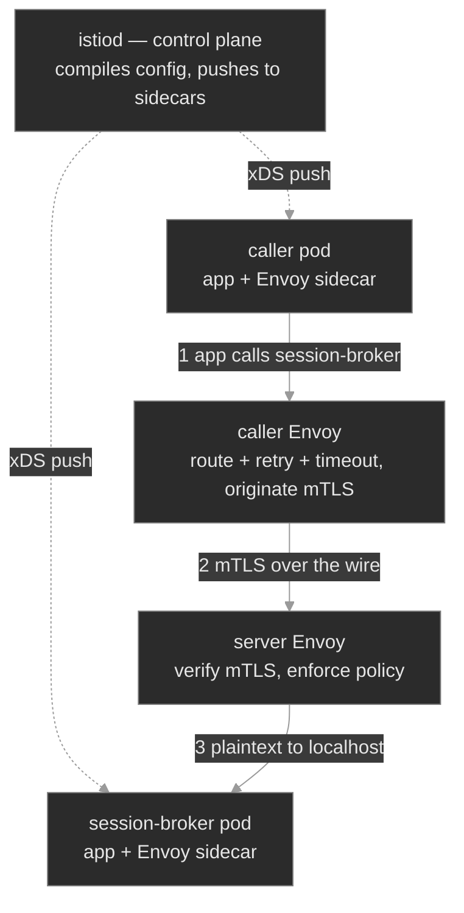

# M15 — Service Mesh

> A second dataplane, layered inside the pod network: a proxy beside every workload that carries its traffic, so routing, retries, timeouts, circuit breaking, and mutual TLS become platform config instead of application code — plus the new failure signatures that dataplane introduces, and the tool that reads them.

## What you'll learn

- Explain what a service mesh *is* structurally: a **control plane** (istiod) that compiles config and a **dataplane** of **Envoy sidecars** it injects next to each workload — and that a pod is "in the mesh" only if it actually carries a sidecar
- Read how sidecar injection happens: a mutating admission webhook fires for pods in a namespace labeled `istio-injection=enabled`, adds the `istio-proxy` container, and an init container programs the iptables redirect that routes the pod's traffic through it (so `2/2` vs `1/1` is the fastest membership check)
- Shape L7 traffic with the two core objects: a **VirtualService** (routing, timeout, retries) and a **DestinationRule** (subsets, connection pool, the outlier-detection **circuit breaker**) — and understand that both are enforced by the *caller's* sidecar
- Reason about **mesh-managed mTLS** as a two-sided contract: a **PeerAuthentication** sets what a *server* accepts; a DestinationRule's `tls` mode sets what a *client* sends; automatic mTLS negotiates it when you don't override
- Debug the dataplane with `istioctl`: `proxy-status` for config sync, and `proxy-config` to walk Envoy's **listener → route → cluster → endpoint** chain — because the objects you apply are intent, and the compiled Envoy config is what moves packets

## Why it matters

M14 shaped traffic with the controls Kubernetes ships: NetworkPolicy at L3/L4, Ingress at the edge. Both stop at the packet. Neither can retry a failed request, enforce a per-call timeout, trip a circuit breaker on a flapping backend, or encrypt and authenticate one pod to another. Historically each service wrote that logic itself, differently, in whatever language it was built in — and got it subtly wrong. A **service mesh** moves that whole layer out of the application and into a proxy that sits beside every workload and intercepts all of its traffic. Retries become a field in a VirtualService. mTLS becomes a one-line policy. The application keeps making a plain HTTP call to `session-broker.media` and never knows a proxy rewrote, secured, and load-balanced it.

That power has a cost an SRE pays directly: the mesh adds a second dataplane with its own failure modes, and they don't show up in the places you're trained to look. A pod can be `Running`, `Ready`, backed by a healthy Service with populated endpoints, and still return `503` to every caller — because it has no sidecar, or the route points at a subset with no pods, or the two ends disagree about mTLS. `kubectl get pods` says everything is fine; the truth is in the Envoy config the mesh compiled. Knowing a mesh means knowing that config exists, where each failure lands in it, and which `istioctl` command prints the link that broke. This module uses **Istio**, the most widely deployed mesh, whose dataplane is **Envoy** — so "debugging the mesh" is concretely "reading Envoy config."

## Scope

**Covers:** the mesh dataplane model — control plane (istiod) vs dataplane (Envoy sidecars); **sidecar injection** via the mutating webhook and the `istio-injection=enabled` namespace label, the injected `istio-proxy` container and the `istio-init` iptables redirect, and mesh membership as a per-pod property (`2/2`, and a line in `proxy-status`). **Traffic management**: the VirtualService (host/route matching, `timeout`, `retries`) and the DestinationRule (`subsets`, `connectionPool`, `outlierDetection` as the circuit breaker), both applied by the caller's sidecar. **Mesh-managed mTLS**: workload identity, PeerAuthentication modes (`STRICT`/`PERMISSIVE`/`DISABLE`) on the server side, DestinationRule `tls` modes (`ISTIO_MUTUAL`/`DISABLE`) on the client side, and automatic mTLS. Throughout: **debugging with `istioctl`** — `proxy-status` and `proxy-config` (clusters/endpoints/routes/listeners), and the `503` differential a mesh introduces.

**Doesn't cover:** the mesh's own installation and upgrade lifecycle, revisions, and canary control-plane upgrades (assumed installed here); north-south ingress *gateways* and the Gateway API binding (this module drives east-west traffic in-cluster) → touched in M14; multi-cluster and multi-primary mesh topologies; **sidecarless / ambient mesh** dataplane (named in a deep dive as the current direction); authorization policy beyond authentication (`AuthorizationPolicy` L7 RBAC) → M20's admission-policy neighbors; and mesh observability dashboards (Kiali, distributed tracing) → M13 covers the telemetry stack the mesh feeds.

**Assumes:** M04 is load-bearing — Services, ClusterIP, the EndpointSlice, cluster DNS, and the `503`/refused/`NXDOMAIN` differential the mesh extends. M14's request-path reflex (the client's error names the class of failure; the config names the spot) carries straight over. M10's ServiceAccount is the identity mesh mTLS is built on; M12's mTLS-between-workloads is the same guarantee, here delivered by the mesh instead of hand-rolled certs. M01 labels are the vocabulary subsets and selectors are written in.

## Vocabulary

| Term | Definition |
|------|------------|
| **Service mesh** | An infrastructure layer that puts a proxy beside every workload and routes the workload's traffic through it, so routing, resilience, and mTLS are handled by the platform, not the app. |
| **Control plane (istiod)** | The mesh's brain. Watches Kubernetes and mesh config, compiles it into Envoy configuration, and pushes it to every sidecar. In Istio it is a single component, `istiod`. |
| **Dataplane / sidecar** | The Envoy proxies that actually carry traffic. One is injected per pod as a second container (`istio-proxy`); it intercepts the pod's inbound and outbound connections. |
| **Sidecar injection** | Adding the sidecar to a pod at creation. A mutating admission webhook does it automatically for pods in a namespace labeled `istio-injection=enabled`; a pod annotation `sidecar.istio.io/inject: "false"` opts out. |
| **VirtualService** | A namespaced object of L7 routing rules for a host: which requests go where, plus per-route `timeout` and `retries`. Applied by the caller's sidecar. |
| **DestinationRule** | Policy for *how* to talk to a host after routing: named `subsets`, the `connectionPool` limits and `outlierDetection` circuit breaker, and the client-side `tls` mode. |
| **subset** | A named group of a host's pods, selected by labels (typically a version). A VirtualService routes to a subset; a subset that selects zero pods is a valid rule with an empty backend. |
| **PeerAuthentication** | Server-side mTLS policy. `STRICT` = accept only mutually-authenticated Istio mTLS; `PERMISSIVE` = accept mTLS or plaintext; `DISABLE` = plaintext only. |
| **mTLS / `ISTIO_MUTUAL`** | Mutual TLS between sidecars using mesh-issued identities. `ISTIO_MUTUAL` is the DestinationRule `tls` mode telling the *client* to originate it; **automatic mTLS** negotiates it with no DestinationRule at all. |
| **Envoy config: listener / route / cluster / endpoint** | Envoy's four resource types. A **listener** is a port it accepts on; a **route** maps a request to a **cluster** (an upstream); a cluster's **endpoints** are the real pod IPs. The mesh request path in four links. |
| **`istioctl proxy-status` / `proxy-config`** | The debugging lens. `proxy-status` shows whether each sidecar has istiod's latest config (`SYNCED`); `proxy-config` dumps the compiled listeners/routes/clusters/endpoints for one pod. |

## Mental model

A mesh is two planes. The **control plane** (`istiod`) never touches your traffic — it watches Kubernetes plus the mesh objects you write, compiles them into Envoy configuration, and pushes that to the sidecars. The **dataplane** is those sidecars: an Envoy next to each pod, carrying every byte in and out. You configure the control plane declaratively; the dataplane is what actually moves packets. Almost every mesh mystery resolves to one question: *does the dataplane's compiled config match what you meant?*



Two facts do most of the diagnostic work. First, **the caller's sidecar enforces routing and client-side policy** (which subset, the timeout, the retry budget, whether to send mTLS), and **the server's sidecar enforces admission** (does it require mTLS). A `503` therefore has a *side*: a routing or connect failure is usually the caller's config; a rejected connection is usually the server's policy. Second, **a pod that has no sidecar is not in the mesh at all** — none of this applies to it, which is its own failure class.

The mesh request path is four Envoy links, and each module failure is a broken link:

```text
app ──▶ caller Envoy ──[ LISTENER :80 ]──▶ [ ROUTE match host ]──▶ [ CLUSTER subset ]──▶ [ ENDPOINTS pod IPs ] ──mTLS──▶ server Envoy ──▶ app
                              │                     │                      │                        │                         │
              no sidecar? not in mesh        wrong host → 404      subset has 0 pods → 503    empty/unhealthy → 503     mTLS mismatch → 503
```

`istioctl proxy-config` prints exactly these links for a given pod. When the object you applied and the compiled config disagree, the config wins — so you read the config. The M14 reflex holds and sharpens: the client's status code names the class of failure; `proxy-config` names the link.

## Concept walkthrough

### The dataplane: sidecar injection

A workload joins the mesh by gaining a sidecar, and that happens at pod-creation time through a **mutating admission webhook**<sup><a href="https://istio.io/latest/docs/setup/additional-setup/sidecar-injection/">[1]</a></sup>. Label a namespace `istio-injection=enabled`, and every pod created in it afterward is intercepted by the webhook, which rewrites the pod spec to add two things: an `istio-proxy` container (the Envoy sidecar) and an `istio-init` init container. The init container runs first and installs iptables rules inside the pod's network namespace that redirect all inbound and outbound TCP through Envoy<sup><a href="https://istio.io/latest/docs/ops/deployment/architecture/">[2]</a></sup>. The application container is unchanged and unaware; it still binds `:80` and makes ordinary calls, but the kernel now routes those through the proxy. The visible tell is the container count: a meshed pod reports `2/2`, a bare pod `1/1`.

Two properties of injection cause most of its incidents. It is **admission-time**, so it applies only to pods created *after* the namespace is labeled — label an existing namespace and nothing changes until the workloads roll. And it is **per-pod overridable**: the annotation `sidecar.istio.io/inject: "false"` on a pod template opts that workload out even in an enabled namespace<sup><a href="https://istio.io/latest/docs/setup/additional-setup/sidecar-injection/">[1]</a></sup>. A workload that skipped injection is not "partly in the mesh" — it is entirely outside it. No traffic policy, retry, or mTLS applies to it, and it never registers with istiod, so `istioctl proxy-status` — which lists every sidecar and its config-sync state — simply doesn't show it<sup><a href="https://istio.io/latest/docs/ops/diagnostic-tools/proxy-cmd/">[3]</a></sup>. When a workload behaves as if mesh config is being ignored, the first check is always whether it has a sidecar at all.

<details>
<summary>📖 Going deeper: what the injector actually writes, and the sidecarless alternative<sup><a href="https://istio.io/latest/docs/overview/dataplane-modes/">[4]</a></sup></summary>

The webhook doesn't just append a container. It injects `istio-init` (or, in CNI-plugin installs, a node-level component) to program the iptables redirect; it sets the Envoy container to run as UID 1337 and excludes that UID from redirection, so Envoy's own traffic doesn't loop back through itself; and it wires in the pod's mesh identity. That identity is the crux of security: Envoy is issued a short-lived X.509 certificate whose SPIFFE name encodes the pod's ServiceAccount (`spiffe://<trust-domain>/ns/<namespace>/sa/<serviceaccount>`), which is what the other side authenticates.

The sidecar-per-pod model has a real cost — a proxy's memory and CPU on every workload, and pod startup ordering to manage. Istio's **ambient** mode is the response: a sidecarless dataplane that moves L4 into a per-node component and makes L7 proxies opt-in, so workloads join the mesh without a container injected into each pod<sup><a href="https://istio.io/latest/docs/overview/dataplane-modes/">[4]</a></sup>. The sidecar model remains the most widely deployed and is what you'll meet on existing clusters, so know it cold — `2/2` is still the membership test there — but new large deployments should evaluate ambient for the resource math.

</details>

### Traffic management: VirtualService and DestinationRule

Once a workload is in the mesh, two objects shape traffic to it, and the division between them is worth memorizing. A **VirtualService** answers *where does this request go* — it matches on host (and optionally path, headers) and routes to a destination, carrying per-route resilience: a `timeout` that caps how long the caller waits, and a `retries` block with an attempt count, per-try timeout, and the conditions to retry on<sup><a href="https://istio.io/latest/docs/concepts/traffic-management/">[5]</a></sup>. A **DestinationRule** answers *how do we talk to that destination once chosen* — it defines named `subsets` of the host's pods, the `connectionPool` limits, the `outlierDetection` circuit breaker, and the client-side `tls` mode<sup><a href="https://istio.io/latest/docs/reference/config/networking/destination-rule/">[6]</a></sup>. Both are enforced by the **caller's** sidecar, on the way out. This is the single most counter-intuitive fact about mesh traffic management: the rules for reaching `session-broker` live in and are applied by the proxy of whoever is *calling* it, not by `session-broker`'s own proxy.

A **subset** is a named label-selected group of a host's pods — usually a version — and it is where routing meets a sharp edge. The DestinationRule declares `subsets: [{ name: stable, labels: {...} }, { name: canary, labels: { version: canary } }]`, and the VirtualService routes to one by name. istiod compiles each subset into a separate Envoy **cluster**. If a subset's labels select zero pods — a canary defined before its build is deployed — the cluster is valid but has **no endpoints**, and a request routed to it has no healthy upstream, so Envoy returns `503`<sup><a href="https://istio.io/latest/docs/concepts/traffic-management/">[5]</a></sup>. Nothing is unhealthy; the route simply aims at an empty set. You see it only in the compiled config: `istioctl proxy-config routes <caller-pod>` shows the route targeting the subset's cluster, and `istioctl proxy-config endpoints <caller-pod>` shows that cluster with no addresses behind it<sup><a href="https://istio.io/latest/docs/ops/diagnostic-tools/proxy-cmd/">[3]</a></sup>.

The **circuit breaker** is `outlierDetection` in the DestinationRule: eject a backend endpoint from the load-balancing pool after it returns some number of consecutive `5xx`s (`consecutive5xxErrors`), for a `baseEjectionTime`, up to a `maxEjectionPercent` of the pool<sup><a href="https://istio.io/latest/docs/tasks/traffic-management/circuit-breaking/">[7]</a></sup>. Paired with `connectionPool` limits (caps on concurrent connections and pending requests), it stops one slow or failing replica from consuming the caller's resources and turning a partial outage into a total one. Like retries and timeouts, it is caller-side config that the application never sees — resilience the platform applies uniformly instead of each team reinventing it.

### Mesh-managed mTLS

The mesh can require that every pod-to-pod hop be mutually authenticated and encrypted, using the per-pod identities from injection — and it delivers this without the application handling a single certificate. The control is **PeerAuthentication**, and it is a **server-side** policy: it sets what a workload's sidecar will *accept*<sup><a href="https://istio.io/latest/docs/tasks/security/authentication/mtls-migration/">[8]</a></sup>. `STRICT` accepts only Istio mTLS and rejects plaintext; `PERMISSIVE` accepts either (the migration setting); `DISABLE` turns it off. Apply a namespace-wide `STRICT` PeerAuthentication and every meshed server in that namespace now demands mTLS on its inbound port.

The other half is the **client** side, and this is where mismatches hide. What a caller *sends* is governed by the DestinationRule `tls` mode: `ISTIO_MUTUAL` originates Istio mTLS, `DISABLE` sends plaintext<sup><a href="https://istio.io/latest/docs/reference/config/networking/destination-rule/">[6]</a></sup>. The two must agree. A `STRICT` server with a caller whose DestinationRule says `DISABLE` is a contradiction: the caller sends plaintext into a server that rejects everything but mTLS, the server's sidecar resets the connection, and the caller gets `503`. Both pods are healthy and in the mesh; the transport policies simply disagree, and you find it only by reading the PeerAuthentication and the DestinationRule *together*. The safe repair direction is to raise the client to mTLS, never to drop the server to `PERMISSIVE` — that would silently make the protected hop plaintext again.

<details>
<summary>📖 Going deeper: automatic mTLS, and why the mismatch is a self-inflicted wound<sup><a href="https://istio.io/latest/docs/tasks/security/authentication/authn-policy/">[9]</a></sup></summary>

You rarely need a DestinationRule `tls` block at all. Istio's **automatic mTLS** negotiates it: when no explicit client-side mode is set, the caller's sidecar detects whether the destination has a sidecar and uses mTLS when it does, plaintext when it doesn't<sup><a href="https://istio.io/latest/docs/tasks/security/authentication/authn-policy/">[9]</a></sup>. Under automatic mTLS a `STRICT` namespace "just works" for meshed callers, and the whole mismatch class disappears — which is why an explicit `tls: DISABLE` override against a `STRICT` server is a self-inflicted wound: someone reached past the automatic behavior to hard-code the wrong thing.

Automatic mTLS also explains a quieter danger from the injection section. If a *server* has no sidecar, automatic mTLS on the caller downgrades to plaintext (nothing on the far end can terminate mTLS) — so a missing sidecar can turn a `STRICT`-intended hop into an *unencrypted* one with no error at all. An explicit `ISTIO_MUTUAL` DestinationRule instead makes that same missing sidecar fail loudly with a `503`, because it forces mTLS regardless. This is the standard migration path in reverse: you roll `STRICT` out safely by first setting `PERMISSIVE` (accept both) while workloads gain sidecars, watch telemetry until all traffic is mTLS, then flip to `STRICT`<sup><a href="https://istio.io/latest/docs/tasks/security/authentication/mtls-migration/">[8]</a></sup>. Skipping the `PERMISSIVE` step is how a namespace-wide `STRICT` takes out every not-yet-meshed caller at once.

</details>

## Hands-on

Four steps in the baseline, three break/fix scenarios — all on the full Polyphone fleet with Istio installed and the `media` namespace enrolled in the mesh. Traffic is driven from a long-lived in-mesh `mesh-client` pod via `kubectl exec` (a throwaway `kubectl run` client would get a sidecar that never terminates, so a persistent one is baked in).

- **`baseline/`** — a healthy mesh: meshed pods at `2/2`, a VirtualService and DestinationRule shaping `session-broker` (timeout, retries, subsets, circuit breaker), `STRICT` mTLS proven by a plaintext caller getting rejected, and the `istioctl proxy-status` / `proxy-config` toolkit for reading the compiled Envoy config.
- **`breakfix-01-sidecar-not-injected/`** — a workload opted out of injection (`1/1`), so it's not in the mesh; with mTLS required upstream, callers `503`. The fix re-enrolls it (`2/2`), not touching mTLS.
- **`breakfix-02-virtualservice-subset/`** — a route pointed at a subset with no pods. The pod is healthy and in the mesh; the Envoy cluster is empty, so `503`. The fix routes back to a subset that exists, read straight from `proxy-config`.
- **`breakfix-03-mtls-mode-mismatch/`** — the DestinationRule tells callers to send plaintext while the PeerAuthentication requires mTLS. Everything is healthy; the two ends disagree, so `503`. The fix aligns the client to mTLS.

All three produce the same `503` from three different roots — no sidecar, empty subset, mTLS mismatch — and the diagnosis is which `istioctl` output localizes the break. Check yourself against `ANSWER-KEY.md` after each.

## Common failure modes

| Symptom | Likely cause | Where to look |
|---------|--------------|---------------|
| Workload ignores all mesh config (no mTLS, no routing, no metrics) | It has no sidecar — not in the mesh | `kubectl get pods` for `1/1` vs `2/2`; `istioctl proxy-status` (absent); pod annotations for `sidecar.istio.io/inject: "false"` |
| `503`, backend Pods `Running`/`Ready`, Service has endpoints, workload is `1/1` | No sidecar to terminate the callers' mTLS | container count; `istioctl proxy-status`; re-enroll and roll the Deployment |
| `503`, pods `2/2` and healthy, endpoints present | Route targets a subset/cluster with no endpoints | `istioctl proxy-config routes <caller>` (which cluster) then `proxy-config endpoints <caller>` (is it empty); the VirtualService `subset` and matching pod labels |
| `503`, pods `2/2`, route correct, endpoints present | Client and server disagree on mTLS | PeerAuthentication `mtls.mode` (server) vs DestinationRule `tls.mode` (client) — read both |
| Config change applied but behavior unchanged | The sidecar hasn't received the new config | `istioctl proxy-status` for `STALE`/`NOT SENT`; check istiod health |
| Meshed hop is plaintext when you expected `STRICT` | Server missing a sidecar + automatic mTLS downgraded the caller | server pod `1/1`; enforce with explicit `STRICT` + `ISTIO_MUTUAL`, and re-enroll the server |
| `404` (not `503`) through the mesh | No route matched the request's host/path | the VirtualService `hosts`/match rules vs the request; `istioctl proxy-config routes` |

## Recap

- **A pod is in the mesh only if it has a sidecar.** Injection is an admission-time webhook keyed on the `istio-injection=enabled` namespace label; `2/2` (and a line in `istioctl proxy-status`) means mesh policy applies, `1/1` means none of it does. Check the container count first.
- **The control plane is intent; the dataplane is truth.** istiod compiles your VirtualService / DestinationRule / PeerAuthentication into Envoy config and pushes it to the sidecars. When behavior and config disagree, read the compiled config with `istioctl proxy-config` — listener → route → cluster → endpoint.
- **Traffic management is caller-side, and subsets can be empty.** The VirtualService (routing, timeout, retries) and DestinationRule (subsets, connection pool, circuit breaker) are applied by the *caller's* sidecar. A route to a subset that selects zero pods is a valid rule with no backend — a `503` with everything healthy.
- **mTLS is a two-sided contract.** PeerAuthentication sets what the *server* accepts (`STRICT`/`PERMISSIVE`/`DISABLE`); the DestinationRule `tls` mode sets what the *client* sends. They must agree — and automatic mTLS makes them agree for free, so an explicit override that mismatches is self-inflicted. Repair upward (client to mTLS), never downward.
- **The mesh adds `503` branches to the M04 differential.** No sidecar, empty subset, mTLS mismatch — same client-visible `503`, three different links in the Envoy path. The client's code names the class; `istioctl` names the link.

## Production thinking

- A team enables `istio-injection=enabled` on their namespace and reports "the mesh isn't doing anything — no mTLS, no metrics." Every pod predates the label. What one operation makes injection take effect, and why did labeling the namespace alone change nothing? What's the risk of doing that operation to every Deployment at once during business hours?
- You're asked to turn on `STRICT` mTLS across a namespace that currently has a mix of meshed and not-yet-meshed workloads. Applying `STRICT` directly would `503` every plaintext caller instantly. What's the staged migration that gets you to `STRICT` with zero downtime, and which telemetry tells you it's safe to flip the final switch?
- A canary rollout shifts 10% of `session-broker` traffic to `subset: canary`, and 10% of requests immediately start returning `503` while the other 90% are fine. The canary Deployment shows `0/0` ready. Walk the Envoy path that produces exactly a *fractional* `503`, and explain why the VirtualService applying cleanly told you nothing about whether the subset had pods.

## References

1. Istio — Sidecar injection: https://istio.io/latest/docs/setup/additional-setup/sidecar-injection/
2. Istio — Architecture (istiod and the Envoy dataplane): https://istio.io/latest/docs/ops/deployment/architecture/
3. Istio — Debugging Envoy with istioctl proxy-config / proxy-status: https://istio.io/latest/docs/ops/diagnostic-tools/proxy-cmd/
4. Istio — Dataplane modes (sidecar and ambient): https://istio.io/latest/docs/overview/dataplane-modes/
5. Istio — Traffic management concepts (VirtualService, subsets, timeouts, retries): https://istio.io/latest/docs/concepts/traffic-management/
6. Istio — DestinationRule reference: https://istio.io/latest/docs/reference/config/networking/destination-rule/
7. Istio — Circuit breaking (outlier detection): https://istio.io/latest/docs/tasks/traffic-management/circuit-breaking/
8. Istio — Mutual TLS migration (PeerAuthentication, PERMISSIVE → STRICT): https://istio.io/latest/docs/tasks/security/authentication/mtls-migration/
9. Istio — Authentication policy and automatic mutual TLS: https://istio.io/latest/docs/tasks/security/authentication/authn-policy/
