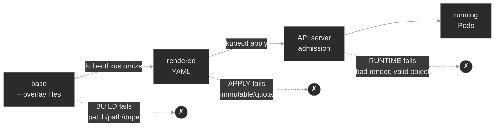

# M16 — Kustomize Bases & Overlays

> One base, many environments, no templating language. How Kustomize composes and transforms plain YAML — and the three distinct layers where it fails.

## What you'll learn

- Compose an environment from a shared **base** plus environment-specific **overlays**, and read any `kustomization.yaml`
- Render a kustomization locally with `kubectl kustomize` and apply it with `kubectl apply -k` — and know why rendering first is the whole discipline
- Patch resources two ways (strategic-merge and JSON 6902) and understand how a patch finds the resource it targets
- Generate ConfigMaps and Secrets, and reason about the **name-suffix hash** and the reference rewriting it drives
- Apply transformers (`namespace`, `labels`, `images`, `namePrefix`) without walking into the immutable-selector trap
- Reuse cross-cutting slices with **components**
- Locate any Kustomize failure to the right layer — **build**, **apply**, or **runtime** — because each has a different first command

## Why it matters

Every Polyphone environment runs the same workloads with different settings: prod wants more replicas and a pinned image, lab wants verbose logging, each region wants its own node placement. The naive answer — a folder of complete manifests per environment — rots immediately. A security fix to a Pod spec now has to be copied into a dozen files, and the day someone misses one is the day lab and prod quietly diverge.

Kustomize<sup><a href="https://kubernetes.io/docs/tasks/manage-kubernetes-objects/kustomization/">[1]</a></sup> removes the copies. You keep one base — the single source of truth for what's common — and describe each environment as a small, reviewable *diff* against it. There is no templating language and no string interpolation; it is YAML transformed by more YAML, which is why every GitOps repository you'll operate is built on it (or on Helm, M17) and why Flux renders it for you in M18.

The catch is that Kustomize's failure surface is unlike anything in the earlier modules. A broken Deployment shows up in `kubectl describe`. A broken *kustomization* might fail before any object exists, or produce a perfectly valid render that the API server rejects, or apply cleanly and only misbehave at runtime. Knowing which of those three you're looking at is most of the job.

## Scope

**Covers:** the base/overlay composition model; `kubectl kustomize` (render) vs `kubectl apply -k` (render + apply); patches (strategic-merge and JSON 6902) and how targets are selected; generators (`configMapGenerator`/`secretGenerator`), the content-hash suffix, and reference rewriting; transformers (`namespace`, `labels`/`commonLabels`, `images`, `namePrefix`/`nameSuffix`); components; and the build → apply → runtime failure model.

**Doesn't cover:** Helm's templating approach and the Kustomize-vs-Helm decision (M17); Flux, GitOps reconciliation, and drift detection (M18); multi-cluster promotion, per-region overlays, and cluster variables (M19); secrets encryption for git (M11 — `secretGenerator` base64-encodes, it does not encrypt); and the resource types themselves, which earlier modules already taught.

**Assumes:** you can read a Deployment, Service, and ConfigMap (M01, M03, M04); you know labels and selectors and that a Deployment's selector is immutable (M00, M04); you understand namespaces (M00) and `kubectl apply`'s declarative model (M00).

## Vocabulary

| Term | Definition |
|------|------------|
| **kustomization** | A directory containing a `kustomization.yaml`. The unit Kustomize builds. |
| **Base** | A kustomization meant to be built on. It renders on its own and captures what's common across environments. |
| **Overlay** | A kustomization whose `resources:` points at one or more bases, then layers changes on top. One overlay per environment is the usual shape. |
| **Transformer** | A field that rewrites every resource in the build: `namespace`, `labels`, `commonLabels`, `namePrefix`/`nameSuffix`, `images`. |
| **Patch** | A targeted change to specific resources. Two dialects: **strategic-merge** (a YAML fragment merged in) and **JSON 6902** (an explicit op list: add/replace/remove). |
| **Strategic-merge patch** | A partial resource; Kustomize merges it onto the matching resource by `apiVersion`/`kind`/`name`, understanding list-merge semantics for known fields. |
| **JSON 6902 patch** | An RFC 6902 operation list against explicit paths (`/spec/replicas`), applied to a `target:` you name. |
| **Generator** | `configMapGenerator` / `secretGenerator` — builds a ConfigMap/Secret from literals, files, or env files, and *owns* the resulting object. |
| **Name-suffix hash** | A hash of a generated object's contents, appended to its name (`edge-relay-config-4f9dk2`). Different content → different name. |
| **Reference rewriting** | Kustomize updating references (a Deployment's `configMapRef`, a volume's `configMap.name`) to a generated object's hashed name — done by matching the reference's name to the generator's declared name. |
| **Component** | `kind: Component` — a reusable slice (patches + resources + generators) an overlay opts into via `components:`. Unlike a base, it can carry patches. |
| **`behavior`** | On a generator in an overlay: `create` (new), `merge` (add/override onto a base generator of the same name), or `replace`. |
| **`kubectl kustomize <dir>`** | Build a kustomization and print the result. Touches no cluster. |
| **`kubectl apply -k <dir>`** | Build, then apply the result — `kubectl kustomize` piped into `apply -f -`. |

## Mental model

Kustomize is a **renderer, not a runtime**. `kubectl kustomize <dir>` is a pure function: directory of YAML in, single stream of YAML out, no cluster involved. `kubectl apply -k <dir>` is that same function with an `apply` stapled to the end. The cluster never sees the kustomization — only the rendered objects, which look exactly like hand-written manifests. Nothing in the cluster knows Kustomize exists.

That single fact organizes every failure you'll debug. A Kustomize problem lands in exactly one of three layers, and the layer decides your first command:



- **Build** — `kustomize build` errors; nothing reaches the cluster. First command: `kubectl kustomize <dir>` and *read the error*. `describe` has nothing to show because nothing was created.
- **Apply** — the render is valid YAML, but the API server rejects an object (an immutable field, a quota, a bad reference). First command: re-run `apply -k` and read the API error; diff the render against what's live.
- **Runtime** — build and apply both succeed, but the rendered result is *wrong*, and it only bites when a Pod runs. First command: your normal `get → describe → events → logs` loop, then compare it to the render.

Hold this picture. The rest of the module is one worked failure per layer.

## Concept walkthrough

### Composition: bases and overlays

A **base** lists raw resources and the transformations common to every environment:

```yaml
# base/kustomization.yaml
resources:
  - deployment.yaml
  - service.yaml
namespace: edge
configMapGenerator:
  - name: edge-relay-config
    literals: [LOG_LEVEL=info, MAX_SESSIONS=500]
```

An **overlay** points its `resources:` at that base and layers on the environment's departures:

```yaml
# overlays/prod/kustomization.yaml
resources:
  - ../../base
images:
  - {name: nginx, newTag: "1.27"}
patches:
  - path: replicas-patch.yaml
```

`resources:` is doing double duty — it accepts raw manifest files *and* other kustomization directories, and it's how composition happens. Overlays can stack on overlays (a regional overlay on top of a prod overlay), though two levels is plenty for most fleets. The base renders on its own; each overlay renders to the base *plus* its diff. A fix to the base reaches every environment on the next build — that's the entire value proposition. When `resources:` names a path that doesn't exist, the build fails at accumulation (`accumulating resources ... no such file or directory`) — a broken relative path is the most common composition error, usually from a directory that moved.

### Patches: how a change finds its target

A **transformer** touches every resource; a **patch** touches specific ones. That makes targeting the crux of patching: a patch has to identify *which* resource it modifies, and if it can't, Kustomize fails the build rather than silently doing nothing<sup><a href="https://kubectl.docs.kubernetes.io/references/kustomize/kustomization/patches/">[2]</a></sup>.

A **strategic-merge patch** is a partial resource. Kustomize matches it to a resource in the build by `apiVersion`/`kind`/`metadata.name`, then merges:

```yaml
# replicas-patch.yaml — targets Deployment/edge-relay by its own identity
apiVersion: apps/v1
kind: Deployment
metadata: {name: edge-relay}
spec: {replicas: 3}
```

If that `metadata.name` matches no resource, the build errors with `no matches for Id ...; failed to find unique target for patch`. The fix is always to reconcile the two names — either the patch is wrong, or the base got renamed and the patch wasn't updated.

A **JSON Patch**<sup><a href="https://kubernetes.io/docs/tasks/manage-kubernetes-objects/update-api-object-kustomize/">[3]</a></sup> (the RFC 6902 operation-list dialect, also written `patchesJson6902`) instead names an explicit `target:` and a list of operations against exact paths:

```yaml
patches:
  - target: {kind: Deployment, name: edge-relay}
    patch: |
      - {op: replace, path: /spec/replicas, value: 3}
```

<details>
<summary>📖 Going deeper: strategic-merge vs JSON Patch — when to reach for which<sup><a href="https://kubernetes.io/docs/tasks/manage-kubernetes-objects/update-api-object-kustomize/">[3]</a></sup></summary>

Both are first-class `patches:` entries; the difference is how they treat structure, especially lists.

- **Strategic-merge** understands Kubernetes' merge keys. Patch one container in a Pod by giving a list with just that container's `name`, and Kustomize merges by the `name` key rather than replacing the whole list. It reads naturally — it looks like the resource — and is the default choice for "change these fields."
- **JSON 6902** operates on positional paths and has no merge-key knowledge: `/spec/template/spec/containers/0/image` addresses the *first* container by index. It's the tool when you need to `remove` a field, `add` to a specific list position, or when there's no natural merge key. It's precise and brittle — reorder the list and the index is wrong.

Rule of thumb: strategic-merge for shaping fields; JSON 6902 for surgical `add`/`remove`/`replace` where merge semantics get in your way. A `patches:` entry auto-detects which dialect you wrote.

</details>

### Generators and the name-suffix hash

You could write a ConfigMap by hand and list it in `resources:`. A **generator** builds it for you instead — and, critically, changes its name based on its contents<sup><a href="https://kubectl.docs.kubernetes.io/references/kustomize/kustomization/configmapgenerator/">[4]</a></sup>:

```yaml
configMapGenerator:
  - name: edge-relay-config
    literals: [LOG_LEVEL=info, MAX_SESSIONS=500]
```

The rendered object isn't named `edge-relay-config` — it's `edge-relay-config-` plus a hash of its data. This is the single most surprising thing about Kustomize, and it exists to make config changes *safe*. A hand-written ConfigMap has a fixed name; edit its data and running Pods keep their loaded values, because nothing changed in any Pod template to trigger a rollout. A generator ties the name to the content, so any edit produces a new name → which changes every reference to it → which is a Pod-template change → which rolls the Deployment. Config change becomes rollout, automatically.

For that to work, Kustomize has to rewrite the references. It does — but only where the reference's **name matches the generator's declared name**. A Deployment whose `envFrom` names `edge-relay-config` gets rewritten to `edge-relay-config-<hash>`; a Deployment that names `edge-relay-conf` does not, because Kustomize never recognizes it as a reference to *this* generator. The render then contains a hashed ConfigMap and a Deployment pointing at a plain name that doesn't exist — valid YAML, valid apply, and a Pod that can't start. The name match is the load-bearing detail.

Two consequences worth internalizing. First, `behavior: merge` lets an overlay add or override values on a base generator of the same name (prod overriding `MAX_SESSIONS` while inheriting the rest) — the names must match for the merge to bind. Second, because each content change produces a *new* object, `apply -k` leaves the old generated ConfigMap behind; it only creates and updates, never deletes. Stale generated objects accumulate unless you `apply -k --prune` with a label selector or let a GitOps controller garbage-collect them. That leftover is the price of automatic rollouts. (`disableNameSuffixHash: true` turns the hash off and gets you a stable name — at the cost of losing the automatic rollout. `secretGenerator` works identically but base64-encodes; base64 is not encryption, which is the whole subject of M11.)

### Transformers and the immutable-selector trap

Transformers rewrite fields across the whole build. `namespace` stamps a namespace; `images` re-points image names and tags without editing the Deployment YAML<sup><a href="https://kubectl.docs.kubernetes.io/references/kustomize/kustomization/images/">[5]</a></sup>; `namePrefix`/`nameSuffix` rename resources (and update references to them). The label transformers are where people get hurt.

There are two<sup><a href="https://kubectl.docs.kubernetes.io/references/kustomize/kustomization/labels/">[6]</a></sup>. The legacy `commonLabels` writes its labels onto metadata, Pod templates, **and every selector** — including a Deployment's `spec.selector`. The modern `labels:` transformer defaults to leaving selectors alone unless you set `includeSelectors: true`. That difference is the trap, because a Deployment's selector is **immutable after creation**<sup><a href="https://kubernetes.io/docs/concepts/workloads/controllers/deployment/#selector">[7]</a></sup>: it's the identity link between the Deployment and the ReplicaSets/Pods it owns, and changing it would orphan them.

On a fresh namespace, `commonLabels` is harmless — the selector is being set for the first time. Promote that same overlay over an *already-running* Deployment and the API server rejects the apply: `spec.selector: ... field is immutable`. The build was fine; the render was valid; the object already in the cluster is what made it illegal. The fix is to keep the label off the selector — use `labels:` with `includeSelectors: false` — so the promotion is an ordinary field update, not a selector change. Reserve selector-touching labels for greenfield resources.

### Components

A base can't carry patches; a **component** can<sup><a href="https://kubectl.docs.kubernetes.io/guides/config_management/components/">[8]</a></sup>. A component (`apiVersion: kustomize.config.k8s.io/v1alpha1`, `kind: Component`) is a reusable slice — patches, resources, generators — that an overlay opts into via `components:`. Where a base is "the thing everyone builds on," a component is "an optional capability some environments turn on": a regional-affinity pin, a debug sidecar, a monitoring annotation set. Prod might enable it and lab skip it, from the same definition. Reach for a component when the same *change* recurs across overlays; reach for a base when the same *resources* do.

## Hands-on

Four Killercoda scenarios, each on the full Polyphone fleet plus one Kustomize-managed workload, `edge-relay`, whose tree lives at `/root/edge-relay`.

- **`baseline/`** — the healthy machine: render the base, diff the lab and prod overlays, apply prod, and watch a generator's hash turn a config edit into a clean rollout. No fix; the point is to see patches, generators, transformers, and a component all working.
- **`breakfix-01-patch-target-mismatch`** — the **build** layer. A patch targets a name no resource carries; `kustomize build` errors and nothing reaches the cluster. Read the build error, not the (empty) cluster.
- **`breakfix-02-generator-name-mismatch`** — the **runtime** layer. A Deployment's config reference drifted from the generator name, so the hash was never rewritten in; build and apply succeed, the Pod lands in `CreateContainerConfigError`.
- **`breakfix-03-commonlabels-immutable-selector`** — the **apply** layer. `commonLabels` injects a label into the immutable Deployment selector; the render is valid and the API server rejects the promotion.

Work them in order and check each against `ANSWER-KEY.md`. The three form one differential: same tool, three layers, three different first moves.

## Common failure modes

| Symptom | Likely cause | Where to look |
|---------|--------------|---------------|
| `no matches for Id ...; failed to find unique target for patch` | A patch's target name/kind matches no resource | The patch's `metadata.name`/`target:` vs the base's real names |
| `accumulating resources ... no such file or directory` | A `resources:`/`components:` path is wrong | The relative paths in `kustomization.yaml` |
| Pod `CreateContainerConfigError`, generated ConfigMap "not found" | A reference name ≠ the generator's name, so the hash wasn't rewritten in | `kubectl kustomize` — compare the generated name to the reference |
| Apply rejected: `spec.selector ... field is immutable` | `commonLabels` / `labels` with `includeSelectors:true` wrote into the selector | Diff the live selector against the render; the transformer list |
| Overlay change didn't take effect | Applied the wrong overlay, or didn't re-render before applying | `kubectl kustomize <overlay>` and read what it actually produced |
| `may not add resource with an already registered id` | The same resource is pulled in twice (base + explicit file) | The `resources:` list for duplicates |
| Stale `*-<hash>` ConfigMaps piling up | Generators create new objects; `apply` never deletes | `apply -k --prune` with a selector, or a GitOps controller's GC |

## Recap

- **Kustomize renders; it never runs.** `kubectl kustomize` is a pure function; `apply -k` is that plus an apply. The cluster only ever sees plain rendered objects.
- **One base is the source of truth; overlays are reviewable diffs.** No templating language — YAML transformed by YAML. Render before you apply, every time.
- **A generator ties a ConfigMap's name to its contents and rewrites references by name match.** That match is what makes config changes roll the workload; break the match and you get a valid apply that can't start.
- **Failures live in three layers — build, apply, runtime — and each has a different first command.** An empty cluster after `apply -k` means read the build; an immutable-field rejection means diff live-vs-render; a broken Pod means the normal loop.
- **Transformers that reach into selectors collide with immutability.** Keep labels off the selector (`includeSelectors: false`) for anything already running.

## Production thinking

- A build-layer failure (bad patch target, missing path, duplicate id) fails a deploy with an error no `kubectl describe` can explain. What would you add to the pipeline so those never reach a human waiting on a rollout? (What command renders every overlay?)
- Generators create a new hashed object on every config change, and `apply` never deletes the old one. Six months in, how do you keep stale `*-<hash>` ConfigMaps from accumulating into an audit problem — and is that the pipeline's job or a GitOps controller's?
- A teammate wants to store a database password with `secretGenerator` and commit it. What do you tell them actually lands in git, and where does *encrypting* secrets for git belong instead? (You'll answer this properly in M11.)
- A render is clean on your laptop and subtly different in CI. Which piece of the toolchain would you pin — and across which machines — so a build is reproducible everywhere it runs?
- The same three-line patch is now copy-pasted across five overlays. When does that cross the line into a component, and what's the cost of extracting it too early? When you're differentiating dozens of clusters, what makes the base/overlay/component layout itself the hard design problem (M19)?

## References

1. Kubernetes — Declarative Management of Kubernetes Objects Using Kustomize: https://kubernetes.io/docs/tasks/manage-kubernetes-objects/kustomization/
2. Kustomize — `patches` field reference: https://kubectl.docs.kubernetes.io/references/kustomize/kustomization/patches/
3. Kubernetes — Update an API Object In Place Using kubectl (strategic-merge and JSON-patch dialects): https://kubernetes.io/docs/tasks/manage-kubernetes-objects/update-api-object-kustomize/
4. Kustomize — `configMapGenerator` field reference: https://kubectl.docs.kubernetes.io/references/kustomize/kustomization/configmapgenerator/
5. Kustomize — `images` field reference: https://kubectl.docs.kubernetes.io/references/kustomize/kustomization/images/
6. Kustomize — `labels` / `commonLabels` field reference: https://kubectl.docs.kubernetes.io/references/kustomize/kustomization/labels/
7. Kubernetes — Deployment selector (label selector updates): https://kubernetes.io/docs/concepts/workloads/controllers/deployment/#selector
8. Kustomize — Components guide: https://kubectl.docs.kubernetes.io/guides/config_management/components/
