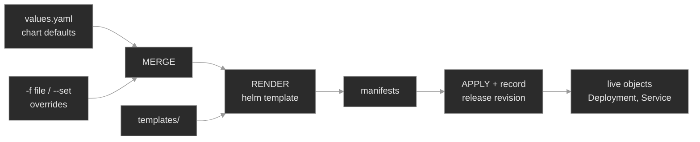

# M17 — Helm Fundamentals

> The Kubernetes package manager. How a chart plus values renders into manifests, what a release actually is, and how to debug the three ways Helm bites you: a value that doesn't take, an upgrade that "succeeds" but breaks, and a render that fails before anything deploys.

## What you'll learn

- Explain the Helm pipeline — chart + values → rendered manifests → applied release — and where each step can fail
- Read a chart on disk: `Chart.yaml`, `values.yaml`, and templates, and know which value keys the templates actually consume
- Trace a value from your `--set`/`-f` input through the render to the live object with `helm template` and `helm get manifest`
- Reason about values precedence and why Helm silently keeps override keys it never reads
- Use the release model — revisions, `helm history`, `helm status`, `helm rollback` — to recover from a bad upgrade
- Decide when Helm is the right tool and when Kustomize fits better

## Why it matters

Most of the Kubernetes you operate at Polyphone did not arrive as hand-written YAML you can `kubectl edit`. It arrived as Helm releases — the ingress controller, cert-manager, the metrics stack, and a growing share of the fleet's own services. When one of those breaks, the object in the cluster is the *output* of a render you didn't watch happen, driven by values spread across a chart default, a base values file, an environment overlay, and a `--set` on some CI runner. Debugging it means working backwards through that pipeline.

Three failures recur, and all three look nothing like a normal Kubernetes problem. A value you know you set has no effect, because it sat at a key the chart doesn't read and Helm never warned you. An upgrade reports `deployed` and the pipeline goes green, but the workload is wedged, because Helm grades itself on "manifest applied," not "pods healthy." An install fails outright with a Go-template error and nothing reaches the cluster, so there's no Pod to `describe`. This module builds the instinct to read Helm's own state — values, manifest, history — instead of only the cluster's.

## Scope

**Covers:** the chart structure (`Chart.yaml` / `values.yaml` / `templates/`), the render pipeline and `helm template`, values precedence and override key paths, the `required` template function, the release/revision model (`helm history`, `helm status`, `helm get`, `helm rollback`), where Helm stores release state, and the decision between Helm and Kustomize.

**Doesn't cover:** authoring complex charts (named templates, `range`/`with`, subcharts and dependencies beyond a mention → deferred to advanced Helm), chart repositories and OCI registries in depth → M18, running Helm *through* a GitOps controller (Flux `HelmRelease`, Argo CD) → M18, and Kustomize itself as a build tool → M16. This module uses one small local chart throughout so the mechanics stay in view.

**Assumes:** M00–M04 — you can read a Deployment and a Service, run the `get → describe → events → logs` loop, and recognize `ImagePullBackOff`. Helm sits on top of those primitives; it doesn't replace them.

## Vocabulary

| Term | Definition |
|------|------------|
| **Helm** | The Kubernetes package manager. A client-side CLI that renders charts into manifests, applies them, and tracks the result as a release<sup><a href="https://helm.sh/docs/topics/charts/">[1]</a></sup>. Since Helm 3 there is no server-side component. |
| **Chart** | A directory (or packaged `.tgz`) describing a set of Kubernetes resources: `Chart.yaml` (metadata), `values.yaml` (default inputs), and `templates/` (manifests with placeholders)<sup><a href="https://helm.sh/docs/topics/charts/">[1]</a></sup>. |
| **Template** | A manifest file in `templates/` containing Go template actions (`{{ .Values.replicaCount }}`) that are filled in at render time<sup><a href="https://helm.sh/docs/chart_template_guide/builtin_objects/">[4]</a></sup>. |
| **Values** | The inputs to a render. Chart defaults from `values.yaml`, overridden by `-f file` and `--set` at install/upgrade time. Exposed to templates as `.Values`. |
| **Render** | The step where Helm merges values and evaluates templates into plain YAML manifests. Happens before anything is applied; reproducible offline with `helm template`. |
| **Release** | One installed instance of a chart in a cluster, identified by name + namespace. Helm records it as state in the cluster<sup><a href="https://helm.sh/docs/intro/using_helm/">[3]</a></sup>. |
| **Revision** | A numbered version of a release. Every `install`, `upgrade`, and `rollback` increments it by one and keeps the prior revision for history<sup><a href="https://helm.sh/docs/intro/using_helm/">[3]</a></sup>. |
| **`required`** | A template function that aborts the render with a message if the given value is empty or missing — the chart author's way of forcing an input<sup><a href="https://helm.sh/docs/chart_template_guide/functions_and_pipelines/">[5]</a></sup>. |
| **`--set` / `-f`** | The two override mechanisms. `-f`/`--values` supplies a YAML file; `--set key=value` sets one path on the command line. `--set` has higher precedence<sup><a href="https://helm.sh/docs/chart_template_guide/values_files/">[2]</a></sup>. |
| **`--reuse-values`** | On upgrade, reuse the previous release's values as the base and merge new overrides on top — so you only state what changes. |
| **Repository** | A source of charts: a classic HTTP index (`helm repo add`) or an OCI registry. Deferred to M18; this module installs from a local chart directory. |
| **Kustomize** | A template-free alternative that layers patches (overlays) onto base manifests, built into `kubectl` (`kubectl apply -k`)<sup><a href="https://kubernetes.io/docs/tasks/manage-kubernetes-objects/kustomization/">[9]</a></sup>. |

## Mental model

Helm is a rendering-and-bookkeeping layer over ordinary `kubectl apply`. It does two jobs the API server doesn't: it turns one parameterized chart into per-environment manifests, and it remembers what it applied so it can upgrade and roll back as a unit.

The pipeline has three stages, and each failure this module covers lives in one of them:



Read it left to right and the failures fall out. A wrong-key override enters at "overrides" but never reaches a template that reads it, so the value is carried but inert. A `required` value missing at "merge" aborts "render", so nothing is applied and no release is recorded. A bad value that renders a valid-but-wrong manifest sails through "apply", so Helm records the revision as `deployed` while the live object misbehaves.

The load-bearing insight: **what runs in the cluster is the render's output, and Helm keeps its own record of that output.** So Helm gives you three views the plain cluster can't. `helm get values` shows the inputs. `helm get manifest` shows the rendered output that was applied. `helm history` shows the timeline of revisions. When a Helm-managed thing is wrong, you compare those three against the live objects, and the discrepancy names the stage that failed.

## Concept walkthrough

### Charts and the render pipeline

A chart is inputs and templates. `values.yaml` holds the defaults; `templates/` holds manifests with holes. `helm install` merges your overrides over the defaults, evaluates the templates, and applies the result<sup><a href="https://helm.sh/docs/topics/charts/">[1]</a></sup>. A one-line Deployment template makes it concrete:

```yaml
spec:
  replicas: {{ .Values.replicaCount }}
  # ...
    image: "{{ .Values.image.repository }}:{{ .Values.image.tag }}"
```

At render, `{{ .Values.replicaCount }}` becomes whatever the merged values say `replicaCount` is. The template reads *specific key paths*. It has no idea what other keys exist in your values; it pulls the ones it names and ignores the rest. That single fact is behind the most common Helm confusion, addressed below.

`helm template` runs merge + render locally and prints the manifests without touching the cluster. It is the most useful command in the toolkit: it answers "what would these values produce?" before you apply anything, and it reproduces render errors offline. `helm get manifest <release>` is its live counterpart — the manifests Helm actually applied for the current revision, read back from stored release state. When you need to know whether the cluster is running what you think, `helm get manifest` is the authoritative answer, not the chart on disk (which may have changed since the release was installed).

The `required` function deserves a mention because it changes *where* a failure surfaces. `{{ required "message" .Values.config.sipRealm }}` aborts the render if `sipRealm` is empty<sup><a href="https://helm.sh/docs/chart_template_guide/functions_and_pipelines/">[5]</a></sup>. That failure happens client-side, before the cluster is touched — so there is no Pod, no event, nothing for the normal diagnostic loop to find. The error text and `helm template` are the entire diagnosis.

<details>
<summary>📖 Going deeper: the render is Go templating, so values have types<sup><a href="https://helm.sh/docs/chart_template_guide/functions_and_pipelines/">[5]</a></sup></summary>

Templates are Go's `text/template` with the Sprig function library added. Two consequences bite people:

- **String-vs-bool with `--set-string`.** Plain `--set enabled=false` coerces to a real boolean, so `{{ if .Values.enabled }}` behaves. But `--set-string enabled=false` — or a value that's inherently a string — passes the *string* `"false"`, and in Go templating every non-empty string is truthy, so the block fires when you meant to disable it. Keep booleans as `--set`/YAML values; reserve `--set-string` for things that must stay strings (a numeric-looking tag, a leading-zero code).
- **Missing map keys render as `<no value>`, not an error.** Only `required` (or `--debug`) turns a missing value into a visible failure. Without it, a typo'd key path renders empty and produces a subtly wrong manifest that applies cleanly — the quietest class of Helm bug.

This is why `helm template` and `helm get manifest` matter more than reading the chart: you have to see the *rendered* text, because the type coercion and empty-value rules make "what the template does with your value" non-obvious.

</details>

### Values and precedence

Values merge in a fixed order, lowest to highest precedence<sup><a href="https://helm.sh/docs/chart_template_guide/values_files/">[2]</a></sup>:

```text
chart values.yaml   <   -f valuesA.yaml   <   -f valuesB.yaml   <   --set key=value
   (defaults)            (earlier -f)         (rightmost -f wins)     (highest)
```

Repeated `-f` files layer left to right — the rightmost wins a conflict. `--set` beats every file. This is a deep merge, not a replace: a `-f` file that sets `image.tag` leaves `image.repository` at the chart default. The mental checklist when a value "isn't working" is precedence first (is something higher overriding me?), key path second (am I setting the key the template reads?).

The key-path half is the sharper edge, because **Helm does not validate your overrides against the chart.** If you `--set relicaCount=3` (typo) or set `replicas: 3` when the chart reads `replicaCount`, Helm keeps your key in the release's values and renders the chart default anyway. No warning. `helm get values <release>` will cheerfully show you the key you set — which is why it's misleading on its own. `helm get values <release> -a` (all/computed) shows the *effective* merged values including defaults, so a wrong-key override appears alongside the real key it failed to override, and the mismatch is visible. Newer charts increasingly ship a `values.schema.json` to reject unknown or mistyped keys at install time; when a chart has one, this whole class of bug becomes a validation error instead of a silent no-op.

### Releases, revisions, and rollback

A release is Helm's record of an installed chart. Every `install`, `upgrade`, and `rollback` writes a new revision and keeps the old ones<sup><a href="https://helm.sh/docs/intro/using_helm/">[3]</a></sup>. That history is stored *in the cluster* — by default as a Secret per revision in the release's namespace, named `sh.helm.release.v1.<release>.v<n>`<sup><a href="https://helm.sh/docs/topics/advanced/#storage-backends">[7]</a></sup>. Because the source of truth is the cluster, any operator with access sees the same history; Helm holds no local state.

Two commands read this: `helm status <release>` is the current snapshot (which revision is live, deployed vs failed), and `helm history <release>` is the timeline. The timeline is what makes recovery cheap — a bad upgrade always has a prior good revision to return to.

The trap is that **`helm status: deployed` does not mean the workload is healthy.** By default `helm upgrade` applies the manifests and returns as soon as the apply succeeds; it does not wait for Pods to become ready<sup><a href="https://helm.sh/docs/intro/using_helm/">[3]</a></sup>. So an upgrade that sets an unpullable image tag renders a valid Deployment, applies it, records the revision as `deployed`, and exits 0 — while the rollout wedges on `ImagePullBackOff`. Helm graded the manifest, not the Pods. Reading past a green `helm status` to `kubectl get pods` / `kubectl rollout status` is the reflex that separates "Helm succeeded" from "the workload is up."

`helm rollback <release> <revision>` recovers by re-applying an old revision's manifests as a *new* revision<sup><a href="https://helm.sh/docs/helm/helm_rollback/">[6]</a></sup>. It rolls forward, not back — revision 2 stays in the history; the rollback becomes revision 3. Recover *through Helm*, not with `kubectl rollout undo`: undoing at the Deployment level fixes the live object but leaves Helm's stored release pointing at the broken revision, so the next `helm upgrade` or GitOps reconcile re-applies the break. The release record and the live objects must stay in agreement.

<details>
<summary>📖 Going deeper: <code>--wait</code>, <code>--atomic</code>, and stuck releases<sup><a href="https://helm.sh/docs/intro/using_helm/">[3]</a></sup></summary>

The defaults are fail-open; production Helm usually turns that off:

- **`--wait`** makes `helm upgrade` block until the resources report ready (Deployments hit their ready replica count, etc.) before declaring success. With it, a bad-image upgrade fails visibly instead of reporting `deployed`.
- **`--atomic`** implies `--wait` and, on failure, automatically rolls back to the prior revision. A CI pipeline that runs `helm upgrade --atomic` never leaves a half-applied release behind.
- **`--timeout`** bounds the wait (default 5m).

The cost: `--wait` in Helm 4 uses a watch-based status checker that needs `watch` permission on the release's resources, not just `list`. And an interrupted `--wait` upgrade can leave a release in `pending-upgrade`; a subsequent upgrade then refuses with "another operation in progress." The recovery is `helm rollback` to the last good revision (or, on modern Helm, `--force`), not deleting Secrets by hand.

</details>

### Helm vs Kustomize

Both solve "one config, many environments," and Polyphone uses each where it fits. Kustomize is template-free: you write real manifests as a base and layer *patches* (overlays) that add or override fields, and `kubectl apply -k` builds the result<sup><a href="https://kubernetes.io/docs/tasks/manage-kubernetes-objects/kustomization/">[9]</a></sup>. Helm is templated and packaged: you write manifests with `{{ }}` holes, parameterize with values, and get versioning, dependencies, and rollback as a unit.

| | Helm | Kustomize |
|---|---|---|
| Mechanism | Go templates + values | Strategic-merge / JSON patches over a base |
| Packaging & sharing | Charts, repos, versioned dependencies | None built in (plain files in git) |
| Release tracking | Revisions, `history`, `rollback` | None — the cluster is the state |
| Failure mode to know | Wrong key silently ignored; green status ≠ healthy | Patch targets nothing; base drifts from overlay |
| Fits | Third-party apps, anything you install-and-forget, workloads that benefit from rollback | Your own manifests, small per-env deltas, teams that dislike templating |

The honest summary: reach for Helm when you're consuming someone else's packaged app or you want release/rollback semantics; reach for Kustomize when you own the manifests and the per-environment difference is a handful of patches. They also compose — Kustomize can post-process Helm output, and GitOps controllers run both — which is the M18 story.

## Hands-on

Four scenarios, each a Killercoda environment with the full Polyphone fleet plus one Helm-managed `voicemail` release. Work them in order.

- **`baseline/`** — Tour a healthy release end to end: read the chart, render it with `helm template`, compare to `helm get manifest`, change a value with `helm upgrade`, walk `helm history`, and roll back. Builds the muscle memory for the three views (values / manifest / history).
- **`breakfix-01-values-key-ignored/`** — A values file sets `replicas: 3` but the release runs one pod. Tests the gap between `helm get values` (what you asked for) and `helm get manifest` (what rendered), and the wrong-key-path diagnosis.
- **`breakfix-02-bad-upgrade-rollback/`** — An upgrade reports `deployed` but the rollout is stuck on an unpullable image. Tests reading past a green status and recovering with `helm rollback` instead of fighting the release with `kubectl`.
- **`breakfix-03-render-required-value/`** — An install fails and nothing deploys. Tests reading a Go-template render error, reproducing it offline with `helm template`, and supplying the `required` value.

Check yourself against `ANSWER-KEY.md` after each — it names the instinct under test and contrasts the `--set` triage fix with the values-in-git durable fix.

## Common failure modes

| Symptom | Likely cause | Where to look |
|---------|--------------|---------------|
| Value set but no effect on the workload | Wrong key path, or a higher-precedence source overriding it | `helm get values <r> -a`; compare to `helm get manifest`; check the chart's real keys with `helm show values` |
| `helm status: deployed` but Pods unhealthy | Helm graded the apply, not readiness (no `--wait`) | `kubectl get pods` / `kubectl rollout status`; then `helm history` for the good revision |
| `helm install` errors, nothing deployed | Render failure — `required` value missing or a template error | The error names the template + value; reproduce with `helm template` |
| `Error: ... another operation in progress` | A prior `--wait` upgrade was interrupted, release stuck `pending-*` | `helm history`; `helm rollback` to the last deployed revision |
| Live object keeps reverting your `kubectl edit` | You edited a Helm-managed object; the release still holds the old manifest | Change values and `helm upgrade`, not `kubectl edit` |
| `--set-string enabled=false` doesn't disable anything | The string `"false"` is truthy in Go templates | Pass booleans via `--set` or a `-f` file, not `--set-string` |

## Recap

- Helm is render + bookkeeping over `kubectl apply`: chart + values → manifests → an applied, versioned release. Every failure lives in one of those stages.
- Templates read specific key paths and ignore everything else, and Helm doesn't validate your overrides — so a wrong-key value is kept but inert. `helm get values -a` versus `helm get manifest` exposes it.
- A release is a numbered revision history stored in the cluster. `helm status` is now; `helm history` is the timeline; `helm rollback` rolls *forward* to an old revision.
- `helm status: deployed` means "manifest applied," not "workload healthy." Read past it to the Pods. Use `--wait`/`--atomic` to make Helm grade readiness.
- Recover Helm-managed workloads through Helm. `kubectl edit`/`rollout undo` fixes the object but drifts it from the release record, and the next reconcile undoes your fix.

## Production thinking

- Every `--set` in this module is triage; the durable source of truth is a committed values file CI applies. When you patch a live release with `--set` mid-incident, what's your discipline for getting that change back into git before the next reconcile silently reverts it?
- Default `helm upgrade` returns `deployed` the moment the manifest applies; `--atomic --wait --timeout` makes it wait for readiness and self-roll-back. What are you trading — deploy latency, the `watch` RBAC surface `--wait` needs, blast radius — by turning that on, or by leaving it off?
- A `values.schema.json` turns "wrong key silently ignored" into an install-time error. If you run two hundred releases of a chart you *don't* own, how do you catch that class of bug without a schema you control?
- Helm 4 is GA (2026) but most fleets still run v3; the chart/values/release model is identical, though v4 shifts the server-side-apply default and the `--wait` semantics/RBAC<sup><a href="https://helm.sh/docs/overview/">[8]</a></sup>. How would you sequence a binary cutover across environments so a `--wait`-using release doesn't break on the new `watch` requirement mid-rollout?
- A Helm release, an operator, and a hand-run `kubectl apply` fighting over one object is a real incident. Before you `kubectl edit` something in production, how do you find out whether Helm — or a GitOps controller (M18) — will just undo you on the next pass?

## References

1. Helm — Charts — https://helm.sh/docs/topics/charts/
2. Helm — Values Files — https://helm.sh/docs/chart_template_guide/values_files/
3. Helm — Using Helm (install / upgrade / rollback / get) — https://helm.sh/docs/intro/using_helm/
4. Helm — Built-in Objects — https://helm.sh/docs/chart_template_guide/builtin_objects/
5. Helm — Functions and Pipelines (`required`) — https://helm.sh/docs/chart_template_guide/functions_and_pipelines/
6. Helm — `helm rollback` — https://helm.sh/docs/helm/helm_rollback/
7. Helm — Storage backends (release state) — https://helm.sh/docs/topics/advanced/#storage-backends
8. Helm — Overview (Helm 4) — https://helm.sh/docs/overview/
9. Kubernetes — Declarative Management with Kustomize — https://kubernetes.io/docs/tasks/manage-kubernetes-objects/kustomization/
