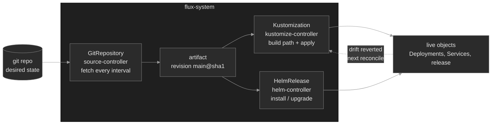

# M18 — Flux (GitOps Delivery)

> Git is the desired state; a controller in the cluster makes it true and keeps it true. How Flux fetches a source, reconciles it, corrects drift, and orders dependent releases — and the three places the pipeline stalls without touching your workload.

## What you'll learn

- Explain GitOps — declarative state in git, continuously reconciled by an in-cluster agent — and how Flux implements it as a set of controllers and CRDs
- Separate a **source** (`GitRepository`) from a **consumer** (`Kustomization`, `HelmRelease`), and read each object's `Ready` condition top-down to locate a stall
- Trace the reconcile loop: source artifact → server-side apply → live objects, running on an interval you can force with `flux reconcile`
- Reason about **drift correction** — why a manual `kubectl edit` on a Flux-managed object is reverted — and when `suspend` deliberately turns that off
- Order releases with `dependsOn`, and read why a dependent is stuck waiting
- Drive the fleet with the `flux` CLI: `get sources`, `get kustomizations`, `get helmreleases`, `reconcile`, `suspend`/`resume`, `logs`, `events`

## Why it matters

By the time Polyphone's platform outgrew hand-run `kubectl apply`, nobody could answer the question that matters during an incident: *what is supposed to be running right now?* The cluster held the answer, but the cluster is also where the drift lives — the emergency `kubectl scale` from last Tuesday that nobody reverted, the `kubectl edit` that fixed a symptom and became permanent. GitOps closes that gap by making git the single declared source of truth and putting an agent in the cluster whose only job is to make the cluster match git, forever<sup><a href="https://opengitops.dev/">[1]</a></sup>.

Flux is that agent<sup><a href="https://fluxcd.io/flux/concepts/">[2]</a></sup>. It turns the earlier modules into a delivery system: the Kustomize overlays from M16 and the Helm charts from M17 stop being things you render and apply by hand and become things Flux renders and applies for you, on a loop, from a commit. That changes what "broken" looks like. A Flux failure usually isn't a crashing Pod — it's a *reconcile* that stalled. The source can't fetch, so the cluster quietly runs last week's manifests. A Kustomization is suspended, so your merged fix never lands. A release is blocked on a dependency that will never be ready. In every case the workload looks fine or looks stale, and the real signal is in Flux's own objects. This module builds the reflex to read those objects — source first, then consumer, then the thing it manages — instead of staring at a Deployment that Flux isn't even touching.

## Scope

**Covers:** the GitOps model and Flux's controller architecture (source, kustomize, helm, notification); `GitRepository` as a source and its artifact/interval; `Kustomization` (the Flux CRD, not the `kustomization.yaml` file from M16) as a consumer with `path`, `prune`, and health; the reconcile loop, drift correction, and `suspend`/`resume`; `HelmRelease` driven by helm-controller with its chart sourced from a `GitRepository`; ordering with `dependsOn`; and reading `Ready` conditions with the `flux` CLI.

**Doesn't cover:** `flux bootstrap` and wiring Flux to a real hosted git provider with a token → this module runs `flux install` against an in-cluster repo to keep the mechanics in view; multi-tenancy, RBAC service-account impersonation, and cross-namespace source access → deferred; secrets decryption in the pipeline (SOPS/`kustomize-controller` with age) → M11; multi-cluster promotion and per-environment cluster variables → M19; and Argo CD, the other major GitOps controller → mentioned for contrast only.

**Assumes:** you can read a Deployment and Service and run the `get → describe → events` loop (M00–M04); you know what a Kustomize base/overlay is and that `kubectl apply -k` renders it (M16); and you know a Helm chart is templates plus values that render into a release (M17). Flux orchestrates both; it doesn't replace them.

## Vocabulary

| Term | Definition |
|------|------------|
| **GitOps** | An operating model: the desired state of the system is declared in git, and an automated agent continuously pulls that state and reconciles the cluster to match it<sup><a href="https://opengitops.dev/">[1]</a></sup>. |
| **Flux** | A set of Kubernetes controllers (the GitOps Toolkit) that implement GitOps as custom resources<sup><a href="https://fluxcd.io/flux/concepts/">[2]</a></sup>. Installed into the `flux-system` namespace. |
| **Reconciliation** | The loop each controller runs: fetch desired state, compare to the cluster, apply the difference, repeat every `interval`. The core of GitOps. |
| **Source** | An object that fetches artifacts and makes them available to consumers. `GitRepository`, `HelmRepository`, `OCIRepository`, and `Bucket` are sources, managed by source-controller<sup><a href="https://fluxcd.io/flux/components/source/">[3]</a></sup>. |
| **`GitRepository`** | A source that clones a git URL at a ref (branch/tag/commit) on an interval and exposes the result as an internal **artifact** other objects consume<sup><a href="https://fluxcd.io/flux/components/source/gitrepositories/">[4]</a></sup>. |
| **Artifact / revision** | The packaged, versioned snapshot a source produces from a fetch, identified by a **revision** (e.g. `main@sha1:abcd…`). Consumers reconcile *from the artifact*, not by cloning git themselves. |
| **`Kustomization`** | The Flux CRD (kustomize-controller) that builds a `path` from a source and applies the result, with pruning and health checks<sup><a href="https://fluxcd.io/flux/components/kustomize/kustomizations/">[5]</a></sup>. Distinct from the `kustomization.yaml` file it may build (M16). |
| **`HelmRelease`** | The Flux CRD (helm-controller) that installs and upgrades a Helm release from a chart source, driven declaratively instead of by `helm` on a laptop<sup><a href="https://fluxcd.io/flux/components/helm/helmreleases/">[6]</a></sup>. |
| **Drift** | Any difference between the live cluster and the declared state. Flux corrects it by re-applying the desired state each interval, so out-of-band edits are reverted. |
| **Prune** | Garbage collection: with `prune: true`, a resource removed from git is deleted from the cluster on the next reconcile<sup><a href="https://fluxcd.io/flux/components/kustomize/kustomizations/">[5]</a></sup>. |
| **`suspend` / `resume`** | A per-object switch (`spec.suspend`, or `flux suspend`/`resume`) that stops reconciliation for that object. Suspended means frozen: no drift correction, no new applies. |
| **`dependsOn`** | An ordering field that references objects of the **same kind** — a `Kustomization` waits on other `Kustomization`s, a `HelmRelease` on other `HelmRelease`s — holding the dependent until every listed object is `Ready` before it reconciles<sup><a href="https://fluxcd.io/flux/components/kustomize/kustomizations/">[5]</a> <a href="https://fluxcd.io/flux/components/helm/helmreleases/">[6]</a></sup>. |
| **`Ready` condition** | The status every Flux object carries: `True` when its last reconcile succeeded, `False` with a reason/message when it didn't. The first thing you read. |

## Mental model

Flux is a control loop wearing several hats. source-controller fetches and packages *sources*; kustomize-controller and helm-controller *consume* a source and apply the result; every controller re-runs on its interval. The single most useful idea is the split between a source and its consumers, because it tells you where to look when something stalls.



Read it top-down and the failures fall out. If the `GitRepository` can't fetch — wrong branch, unreachable URL — its artifact goes stale, and every `Kustomization` and `HelmRelease` downstream keeps serving the *last good* revision while reporting they're blocked on the source. Nothing in the cluster changes; nothing crashes. If the source is healthy but a `Kustomization` is suspended, the loop for that object simply doesn't run: drift isn't corrected and new commits aren't applied. If both are healthy but a `HelmRelease` lists a `dependsOn` that isn't `Ready`, the release waits — correctly, on purpose — and never installs.

The load-bearing insight: **Flux's objects carry the diagnosis, not the workload.** A stale Deployment isn't the bug; the `GitRepository` that stopped feeding it is. So the diagnostic order is fixed — `flux get sources git`, then `flux get kustomizations` / `flux get helmreleases`, then the managed object — and each layer's `Ready` condition either clears it or names the failure.

## Concept walkthrough

### GitOps and the reconcile loop

GitOps has four principles: the desired state is **declarative**, **versioned and immutable** (git history), **pulled automatically** by an agent, and **continuously reconciled**<sup><a href="https://opengitops.dev/">[1]</a></sup>. The last two are what separate it from a CI pipeline that runs `kubectl apply`. A pipeline *pushes* once, when it happens to run; if someone edits the cluster afterward, the pipeline neither knows nor cares until the next push. A GitOps agent *pulls* the declared state on a loop and re-asserts it every interval, so the cluster is continuously dragged back toward git. Drift has a bounded lifetime — one reconcile interval — instead of living until the next deploy.

Flux implements this as controllers, each owning one CRD family<sup><a href="https://fluxcd.io/flux/concepts/">[2]</a></sup>. source-controller turns external state (a git repo, a Helm repo, an OCI artifact) into an internal, content-addressed **artifact**. kustomize-controller and helm-controller consume an artifact and reconcile the cluster to it. notification-controller reports outcomes and receives webhooks. They coordinate only through the Kubernetes API — each writes status on its own objects — which is why the whole system is debuggable with `kubectl get` and `flux get`, and why there's no central "Flux daemon" to restart.

`flux install` lays these controllers into the `flux-system` namespace<sup><a href="https://fluxcd.io/flux/installation/">[7]</a></sup>. In production you'd usually `flux bootstrap` instead — it commits Flux's own manifests into a git repo and points Flux at that repo, so Flux manages Flux. That closes the loop (upgrading Flux is a commit) but needs a hosted provider and a token, which is beyond this module's self-contained cluster.

### Sources: `GitRepository` and the artifact

A `GitRepository` names a URL and a ref, and fetches on an interval<sup><a href="https://fluxcd.io/flux/components/source/gitrepositories/">[4]</a></sup>:

```yaml
apiVersion: source.toolkit.fluxcd.io/v1
kind: GitRepository
metadata:
  name: polyphone-config
  namespace: flux-system
spec:
  interval: 1m
  url: http://gitea.flux-system.svc.cluster.local:3000/flux/polyphone-config.git
  ref:
    branch: main
```

Every interval, source-controller clones that ref, packages the tree as an artifact, and stamps it with a revision like `main@sha1:9c4f…`. It does *not* apply anything — a source only fetches. Consumers read the artifact. This separation is the whole design: one fetch feeds many `Kustomization`s and `HelmRelease`s, and a fetch failure is isolated to one place. When the ref is wrong or the server is unreachable, the `GitRepository` goes `Ready: False` with the git error verbatim, its artifact freezes at the last good revision, and every consumer keeps reconciling *that stale revision* — reporting they're waiting on the source rather than failing outright. That is why the source is always the first object you read: a green consumer on a red source means the cluster is running yesterday's truth.

<details>
<summary>📖 Going deeper: sources are shared, cached, and content-addressed<sup><a href="https://fluxcd.io/flux/components/source/">[3]</a></sup></summary>

The artifact indirection buys three things beyond isolation. Sharing: ten `Kustomization`s pointing at one `GitRepository` cause one clone per interval, not ten — source-controller fetches once and serves the cached artifact over an in-cluster URL. Verifiability: the revision is a content digest, so a consumer can prove it reconciled *exactly* commit `abcd`, and `spec.verify` can require a valid signature on tags before the artifact is served. Efficiency: source-controller only re-packages when the remote revision actually changed, so a 1-minute interval on an unchanged repo is nearly free. The trade-off is one more layer to reason about — "the source has revision X but the consumer applied revision W" is a real state, visible in the two objects' `status`, and it's exactly what a stalled reconcile looks like.

</details>

### `Kustomization`: build, apply, prune, and drift

The Flux `Kustomization` is a consumer. It points at a source, builds a `path` within that source's artifact (running the same Kustomize engine as `kubectl apply -k` from M16), and applies the result with server-side apply<sup><a href="https://fluxcd.io/flux/components/kustomize/kustomizations/">[5]</a></sup>:

```yaml
apiVersion: kustomize.toolkit.fluxcd.io/v1
kind: Kustomization
metadata:
  name: apps
  namespace: flux-system
spec:
  interval: 5m
  sourceRef:
    kind: GitRepository
    name: polyphone-config
  path: ./apps
  prune: true
  wait: true
```

Two behaviors define it. **Drift correction:** because it re-applies the desired manifests every interval, any out-of-band change is reverted. Scale a managed Deployment with `kubectl scale` and within one interval Flux sets it back to the replica count in git — the cluster cannot durably disagree with the declared state. This is the property that makes GitOps trustworthy and also the one that surprises operators mid-incident: your `kubectl edit` fix will vanish, because Flux owns that field. The correct move is to fix it in git (or `suspend` first — below), not to fight the controller. **Pruning:** with `prune: true`, deleting a manifest from git deletes the object from the cluster; Flux tracks an inventory of what it applied and garbage-collects what's no longer declared. Without pruning, removed resources linger as orphans that no longer appear in git — quiet, and a real source of "why is this old thing still here."

The `path` is the field that bites. It's a directory inside the artifact; if it doesn't exist or doesn't contain a buildable kustomization, the build fails and the `Kustomization` goes `Ready: False` with a build error — before anything is applied, so the cluster is untouched and there's no Pod to inspect. `flux get kustomizations` shows the failure; `flux build kustomization` and `flux diff kustomization` reproduce and preview it. `wait: true` makes Flux block until the applied objects report healthy (like Helm's `--wait`), so a `Kustomization` only reports `Ready` when its workloads actually came up.

### Suspend and resume

`suspend` freezes an object's reconciliation<sup><a href="https://fluxcd.io/flux/components/kustomize/kustomizations/">[5]</a></sup>. Set `spec.suspend: true` (or run `flux suspend kustomization apps`) and kustomize-controller stops touching it: no drift correction, no new commits applied, no pruning. `flux resume` turns it back on and triggers an immediate reconcile.

Suspend is a real operational tool — you suspend a `Kustomization` before a manual intervention so Flux won't fight you, or to freeze a subsystem during an incident while you work upstream. The hazard is the second half: **a suspended object is invisible unless you look for it.** It reports its last state, which was `Ready: True`, so `get` output looks healthy at a glance; only the explicit suspended marker distinguishes it. The classic outage is a change merged to git, CI green, dashboards green — and nothing happens in the cluster, because someone suspended that `Kustomization` during last week's incident and never resumed it. The reflex: when a commit "doesn't take" and the source is healthy, check whether the consumer is suspended before you look anywhere else.

### `HelmRelease` and dependencies

helm-controller runs Helm — the same install/upgrade/rollback model from M17 — but driven by a `HelmRelease` object instead of a `helm` command on someone's laptop<sup><a href="https://fluxcd.io/flux/components/helm/helmreleases/">[6]</a></sup>. The chart comes from a source: a `HelmRepository`, an `OCIRepository`, or — usefully for a self-contained repo — a chart directory inside a `GitRepository`. Values live in the object's `spec.values` (or a referenced ConfigMap/Secret), so the entire release is declared in git and reconciled like everything else:

```yaml
apiVersion: helm.toolkit.fluxcd.io/v2
kind: HelmRelease
metadata:
  name: voicemail
  namespace: flux-system
spec:
  interval: 5m
  targetNamespace: app-services      # where the release installs
  chart:
    spec:
      chart: ./charts/voicemail       # a chart directory inside the GitRepository
      sourceRef:
        kind: GitRepository
        name: polyphone-config
  dependsOn:
    - name: message-store            # another HelmRelease, made ready first
  values:
    replicaCount: 2
```

`dependsOn` is the ordering primitive, and it references objects of the **same kind**: a `HelmRelease`'s `dependsOn` lists other `HelmRelease`s<sup><a href="https://fluxcd.io/flux/components/helm/helmreleases/">[6]</a></sup>, a `Kustomization`'s lists other `Kustomization`s<sup><a href="https://fluxcd.io/flux/components/kustomize/kustomizations/">[5]</a></sup>. The dependent holds until every listed object is `Ready` before it reconciles — so an app release ordered behind the datastore release it needs (here `voicemail` waits for `message-store`), or an `apps` `Kustomization` ordered behind an `infra` `Kustomization` that installs the CRDs and namespaces its manifests reference, won't apply until that dependency lands. When the named object isn't `Ready` — because it's failing, suspended, or *because the name is wrong and points at nothing* — the dependent stalls with a `dependency ... is not ready` message and never proceeds. That's working as designed: Flux would rather wait than install into a half-built world. The sharp edge is a typo or a stale rename that leaves the dependent pointing at a name (or the wrong kind) that will never be ready, which reads identically to a genuinely-blocked release. You confirm by checking the named dependency actually exists — as the right kind — and is `Ready`.

helm-controller also owns remediation. `spec.install.remediation` and `spec.upgrade.remediation` let a failed release retry or auto-rollback, so the "green status hides a stuck rollout" trap from M17 can be closed declaratively — the `HelmRelease` reports `Ready: False` when the release genuinely didn't come up, not just when the manifest applied.

<details>
<summary>📖 Going deeper: Flux vs Argo CD<sup><a href="https://fluxcd.io/flux/concepts/">[2]</a></sup></summary>

The two CNCF-graduated GitOps controllers make different bets. Flux is a toolkit of composable controllers with no built-in UI; you drive it with `kubectl`/`flux` and observe it through your existing metrics and logging stack, and it leans on Kubernetes-native primitives (CRDs, server-side apply, RBAC). Argo CD ships an opinionated `Application` abstraction with a web UI and a visual diff/sync view, which teams value for at-a-glance status and manual sync gates. Mechanically they converge — both pull from git, both reconcile continuously, both correct drift — so the choice is usually about operating model: Flux fits fleets that want GitOps as plumbing under their own tooling; Argo CD fits teams that want the dashboard and the app-centric view. The concepts in this module — source vs consumer, reconcile interval, drift correction, dependency ordering — transfer to either.

</details>

## Hands-on

Four Killercoda scenarios on the full Polyphone fleet, with Flux installed (`flux install`) and reconciling from an in-cluster git server whose repo is mirrored at `/root/polyphone-config`. Work them in order.

- **`baseline/`** — the healthy loop: read the `GitRepository` and its artifact, watch a `Kustomization` apply the repo's `apps` path, scale a managed Deployment and watch Flux revert the drift, then read a `HelmRelease` ordered behind another release by `dependsOn`. See sources, consumers, drift correction, and ordering all working.
- **`breakfix-01-source-ref-not-found`** — the **source** layer. A `GitRepository` points at a branch that doesn't exist; the artifact is stale and every consumer runs last-known-good. Read the source's `Ready` condition first.
- **`breakfix-02-kustomization-suspended`** — the **reconcile** layer. A `Kustomization` is suspended, so drift isn't corrected and a fix never lands, while `get` output looks healthy. Find the suspended marker and `flux resume`.
- **`breakfix-03-helmrelease-dependency`** — the **ordering** layer. A `HelmRelease` is stuck `not ready` on a `dependsOn` that names another `HelmRelease` that doesn't exist. Read the dependency message and correct the reference.

Check yourself against `ANSWER-KEY.md` after each — it names the instinct under test and contrasts the `flux`-CLI triage with the fix-in-git durable action.

## Common failure modes

| Symptom | Likely cause | Where to look |
|---------|--------------|---------------|
| Merged commit has no effect on the cluster | The consuming `Kustomization`/`HelmRelease` is suspended, or the source isn't fetching the new ref | `flux get kustomizations` (Suspended column); `flux get sources git` (revision vs git HEAD) |
| Cluster runs stale manifests, nothing crashing | `GitRepository` can't fetch (bad ref/URL/auth); artifact frozen at last good revision | `flux get sources git` → `Ready: False` message; `flux reconcile source git <name>` |
| Your `kubectl edit`/`scale` keeps reverting | The object is Flux-managed; drift correction re-applies git each interval | Change it in git, or `flux suspend` before intervening; `flux diff kustomization` |
| `Kustomization` `Ready: False`, no objects created | Build failed — `path` missing or not a valid kustomization | `flux get kustomizations` message; `flux build kustomization <name>` |
| `HelmRelease` stuck `not ready`, never installs | `dependsOn` target missing/not ready, or chart source failing | `flux get helmreleases`; check the named dependency exists and is `Ready` |
| Old resource still in the cluster after removal from git | `prune: false` (or was), so no garbage collection | Set `prune: true`; `flux get kustomizations` inventory; `flux tree kustomization <name>` |
| Everything `Ready` but you're unsure it's current | Reconcile hasn't run since the last commit | Compare source revision to git HEAD; `flux reconcile kustomization <name> --with-source` |

## Recap

- GitOps is continuous reconciliation, not a one-shot deploy: git is the declared truth and Flux re-asserts it every interval, so drift has a lifetime of one interval instead of living until the next push.
- Flux splits **sources** (fetch an artifact) from **consumers** (apply it). A fetch failure freezes the artifact and stalls every consumer on the last good revision — which is why you read the source's `Ready` condition first, then the consumer, then the managed object.
- Drift correction is the guarantee and the surprise: a Flux-managed field cannot durably hold an out-of-band edit. Fix in git, or `suspend` before you intervene — don't fight the controller.
- `suspend` freezes reconciliation and hides in plain sight: a suspended object reports its last-healthy state. When a commit doesn't take and the source is fine, check for a suspended consumer.
- `dependsOn` orders releases by waiting for `Ready` dependencies. A dependent stuck "not ready" is often pointing at a dependency that is failing, suspended, or misnamed — verify the named object exists and is `Ready`.

## Production thinking

- Drift correction assumes git is always right. During a real incident you may need to change the cluster *now*, ahead of a reviewed commit. What's your discipline — `suspend` the `Kustomization`, patch, then reconcile the fix back into git before you `resume` — so the emergency change doesn't get reverted mid-incident *and* doesn't silently outlive the incident?
- A stalled source runs last-known-good indefinitely and nothing crashes, so it's invisible to Pod-level alerting. What do you alert on to catch it — `Ready: False` on Flux objects, source revision lagging git HEAD, reconcile age — and how do you page on "GitOps stopped delivering" without drowning in reconcile noise?
- `flux bootstrap` makes Flux manage its own manifests from git, so a Flux upgrade is a commit and the controllers self-heal. What do you trade by bootstrapping — the git provider coupling, the token's blast radius, the bootstrap repo becoming a single point of control — versus running `flux install` and upgrading out of band?
- `dependsOn` encodes ordering but not liveness: it waits for `Ready`, not for "still healthy later." If a dependency degrades *after* its dependents installed, Flux won't re-block them. Where does that matter in your fleet, and what actually guarantees a hard ordering constraint (init containers, readiness gates) versus a soft one?
- Two GitOps controllers, a Helm release, and a hand-run `kubectl apply` can all claim one object. Before you touch a live resource, how do you find out whether Flux — via a `Kustomization` or `HelmRelease` — already owns that field and will reconcile you away on the next pass?

## References

1. OpenGitOps — Principles (CNCF) — https://opengitops.dev/
2. Flux — Core Concepts — https://fluxcd.io/flux/concepts/
3. Flux — Source Controller — https://fluxcd.io/flux/components/source/
4. Flux — GitRepository API — https://fluxcd.io/flux/components/source/gitrepositories/
5. Flux — Kustomization API (path, prune, suspend, dependsOn) — https://fluxcd.io/flux/components/kustomize/kustomizations/
6. Flux — HelmRelease API — https://fluxcd.io/flux/components/helm/helmreleases/
7. Flux — Installation — https://fluxcd.io/flux/installation/
