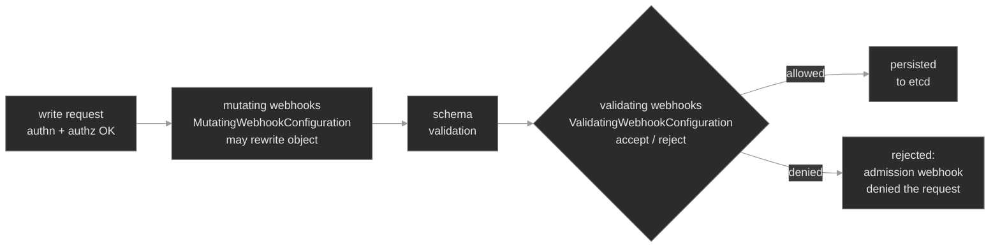

# M21 — Admission Control: Validating & Mutating Webhooks

> The mechanism beneath every policy engine: two configuration objects that splice your own HTTPS callbacks into the API server's write path — one that rewrites objects, one that accepts or rejects them — plus the handful of ways a webhook wedges deploys, silently stops enforcing, or reaches into a namespace it was never meant to touch.

## What you'll learn

- Place a webhook in the request pipeline: it registers as a **`MutatingWebhookConfiguration`** or **`ValidatingWebhookConfiguration`**, and the API server calls it during admission — after RBAC, before the object is stored
- Read a webhook configuration the way you read a Role: its `clientConfig` (where to call), its `rules` (which operations and resources), its `namespaceSelector`/`objectSelector` (which objects), and its `failurePolicy` (what happens when the call fails)
- Internalize the ordering — **all mutating webhooks run first**, the API server re-validates the schema, **then all validating webhooks run** — and why a validating check can depend on a mutation having already fired
- Reason about `failurePolicy` as a blast-radius decision: **`Fail`** rejects when the webhook is unreachable (fails *closed*), **`Ignore`** admits (fails *open*) — and why an unreachable webhook can take down every deploy in its scope
- Recognize the **TLS contract**: a webhook is an HTTPS endpoint, so its `caBundle` must match the server's serving cert and the cert's SAN must match the Service name, or every call fails before any policy logic runs
- Scope a webhook so it intercepts exactly what it should — the difference between a tight selector and a `{}` that matches every namespace in the cluster
- Tell a raw webhook from **ValidatingAdmissionPolicy**, the in-tree CEL alternative that needs no server, no TLS, and can't fail closed on an unreachable backend

## Why it matters

M20 gave you a policy engine — Kyverno — as a working front door: you wrote `ClusterPolicy` objects and it enforced them. What it hid is *how* it plugged into the API server. It registered admission webhooks. So does cert-manager's CA injector, so does a service-mesh sidecar injector, so does every custom controller a platform team writes to default a field or block a bad object. Admission webhooks are the extension point, and when one misbehaves you are debugging the webhook layer itself, not the tool sitting on top of it.

That layer has a failure mode nothing else in Kubernetes has. A webhook is code *you* injected into the synchronous path of every matching write. Register one that intercepts Pods cluster-wide, set it to fail closed, and let its backend go unready during a node drain — now **every Pod create in the cluster is rejected**, including the ones that would restart your webhook. Teams have wedged whole clusters this way. Even scoped tightly, the softer failures are constant: a deploy that hangs because a webhook's serving cert rotated and its `caBundle` didn't; a defaulting webhook that silently stopped firing because its `rules` named the wrong operation; a workload in an unrelated namespace rejected by a webhook that had no business touching it. An SRE who can read a `ValidatingWebhookConfiguration` and a `failed calling webhook` error tells these apart in seconds; one who can't rotates a key that was never the problem.

## Scope

**Covers:** the two dynamic-admission configuration objects (`MutatingWebhookConfiguration`, `ValidatingWebhookConfiguration`, both `admissionregistration.k8s.io/v1`)<sup><a href="https://kubernetes.io/docs/reference/access-authn-authz/extensible-admission-controllers/">[1]</a></sup>; the admission chain and its ordering (built-in controllers, then mutating webhooks, then schema validation, then validating webhooks); `clientConfig` (a `Service` or a `url`) and the **`caBundle`/TLS contract**; `rules` (`operations` × `apiGroups` × `apiVersions` × `resources` × `scope`) and `namespaceSelector`/`objectSelector` as the intercept scope; **`failurePolicy`** (`Fail`/`Ignore`), `timeoutSeconds`, and blast radius; `reinvocationPolicy`, `matchPolicy`, `sideEffects`, and `admissionReviewVersions` named where they bite; the **`AdmissionReview`** request/response the webhook speaks; and **ValidatingAdmissionPolicy** as the in-tree CEL alternative.

**Doesn't cover:** writing a production webhook server (this module runs a deliberately minimal one so the machinery is real and readable, not to teach server code); the individual built-in admission controllers and the full `--enable-admission-plugins` list — named, not toured<sup><a href="https://kubernetes.io/docs/reference/access-authn-authz/admission-controllers/">[2]</a></sup>; the built-in **PodSecurity** admission controller → M10; a **policy engine's** high-level language (Kyverno's `ClusterPolicy`) → M20, which is the layer *above* this one; issuing the webhook's serving cert with cert-manager → M12 (its TLS mechanics apply directly here).

**Assumes:** M10 is load-bearing — the three gates (authentication → authorization → admission), that admission is the write-only gate that inspects the object, and that an admission rejection of a controller-created Pod surfaces on the ReplicaSet (a Deployment stuck `0/N` with no Pods). M20 (a policy engine registers webhooks — this module makes that registration explicit). M12 (a serving cert, its SAN, and a CA a client must trust — a webhook's `caBundle` is exactly that CA). M04 (Service DNS — the webhook cert's SAN is the Service's `<name>.<ns>.svc` name). M01 (Deployment → ReplicaSet → Pod).

## Vocabulary

| Term | Definition |
|------|------------|
| **admission** | The write-only gate after authentication and authorization where controllers inspect an object and may modify or reject it before it is persisted. |
| **admission controller** | Code that runs at admission. Some are **compiled into** the API server (e.g. `NamespaceLifecycle`, `ResourceQuota`); two — `MutatingAdmissionWebhook` and `ValidatingAdmissionWebhook` — call *out* to your webhooks<sup><a href="https://kubernetes.io/docs/reference/access-authn-authz/admission-controllers/">[2]</a></sup>. |
| **admission webhook** | An external HTTPS endpoint the API server POSTs an `AdmissionReview` to during admission, expecting an allow/deny (and, for mutating, a patch) in reply<sup><a href="https://kubernetes.io/docs/reference/access-authn-authz/extensible-admission-controllers/">[1]</a></sup>. |
| **MutatingWebhookConfiguration** | The object that registers one or more **mutating** webhooks. Runs in the mutating phase; the webhook may return a JSON patch that rewrites the object. |
| **ValidatingWebhookConfiguration** | The object that registers one or more **validating** webhooks. Runs after mutation; the webhook may only accept or reject, never modify. |
| **clientConfig** | Where and how to call the webhook: a `service` (`name`/`namespace`/`path`/`port`, in-cluster) or a `url` (external), plus the `caBundle`. |
| **caBundle** | The base64-encoded CA cert the API server uses to verify the webhook's serving certificate. Wrong or stale → every call fails TLS. |
| **rules** | Which requests a webhook intercepts: `operations` (CREATE/UPDATE/DELETE/`*`), `apiGroups`, `apiVersions`, `resources`, and `scope` (`Namespaced`/`Cluster`/`*`). |
| **namespaceSelector / objectSelector** | Label selectors narrowing the match further — by the *namespace's* labels, or the *object's* labels. Empty (`{}`) matches everything. |
| **failurePolicy** | What happens when the webhook can't be reached or errors: **`Fail`** (deny — fail closed) or **`Ignore`** (admit — fail open). |
| **reinvocationPolicy** | Whether a mutating webhook is called again if a *later* mutating webhook changed the object: `Never` (default) or `IfNeeded`. |
| **sideEffects** | Declares whether the webhook mutates external state; must be `None` or `NoneOnDryRun` for the webhook to participate in `--dry-run=server`. Required. |
| **AdmissionReview** | The `admission.k8s.io/v1` request/response envelope on the wire; the response carries the `uid`, `allowed`, an optional `status.message`, and an optional base64 `patch`. |
| **ValidatingAdmissionPolicy** | In-tree admission that runs **CEL** expressions inside the API server — no webhook, no server, no TLS. GA in Kubernetes v1.30<sup><a href="https://kubernetes.io/docs/reference/access-authn-authz/validating-admission-policy/">[3]</a></sup>. |

## Mental model

You know the three gates a request crosses (M10): **authentication** (who), **authorization** (may they), **admission** (is this object allowed). Webhooks live entirely in that third gate. RBAC has already said yes; the webhook inspects the *object*.

Admission is not one step — it is a chain with an order that matters. For a write, the API server first runs its **compiled-in mutating** controllers, then calls every registered **mutating webhook** (each may rewrite the object), then re-checks the object against the schema, then runs its **compiled-in validating** controllers, and finally calls every **validating webhook** (each may only accept or reject)<sup><a href="https://kubernetes.io/docs/reference/access-authn-authz/extensible-admission-controllers/">[1]</a></sup>. Only if all of them allow it does the object reach etcd.



Two consequences fall straight out of that order. First, **a validating webhook sees the object as mutating webhooks left it**, not as you submitted it — so a validating rule can safely require a field a mutating webhook injects. Second, **mutation is not a stored property of the object; it is an event that happens as the object crosses the gate.** Fix a broken mutation and the Pods already running never change — only the next admission does.

The webhook itself is just an HTTPS server you point the API server at with a configuration object. That object is where all the operational risk lives, because it decides three things independently: *what* the webhook intercepts (`rules` + selectors), *how* the API server reaches it (`clientConfig` + `caBundle`), and *what happens when the call fails* (`failurePolicy`). Get the first wrong and the webhook fires on the wrong things; the second, and it can't be reached at all; the third, and an unreachable webhook either silently stops enforcing or blocks every write in its scope. The reflex to build: `failed calling webhook` is an infrastructure problem (the API server couldn't reach or trust the server); `admission webhook … denied the request` is a policy problem (it reached the server and the server said no). Those are different failures with different fixes, and the error string tells you which.

## Concept walkthrough

### Registering a webhook: the configuration object

A webhook does nothing until a configuration object registers it. Here is a real `ValidatingWebhookConfiguration`<sup><a href="https://kubernetes.io/docs/reference/kubernetes-api/extend-resources/validating-webhook-configuration-v1/">[5]</a></sup> — the platform's rule that every Pod in a governed namespace must carry an `env` label:

```yaml
apiVersion: admissionregistration.k8s.io/v1
kind: ValidatingWebhookConfiguration
metadata:
  name: admission-guard
webhooks:
  - name: validate.admission-guard.polyphone.example   # must be a domain-style unique name
    clientConfig:
      service:                          # in-cluster HTTPS backend to call…
        name: admission-guard
        namespace: admission
        path: /validate
        port: 443
      caBundle: LS0tLS1CRUdJTi…          # …and the CA that signs its serving cert
    rules:
      - operations: ["CREATE"]          # which verbs
        apiGroups: [""]                 # core group
        apiVersions: ["v1"]
        resources: ["pods"]             # which kinds
        scope: Namespaced
    namespaceSelector:
      matchLabels:
        admission-guard: enabled        # only namespaces carrying this label
    failurePolicy: Fail                 # unreachable ⇒ deny (fail closed)
    sideEffects: None                   # safe under server-side dry-run
    admissionReviewVersions: ["v1"]     # required
    timeoutSeconds: 5
```

Read it top to bottom and you know exactly what it does. `clientConfig.service` says *call `https://admission-guard.admission.svc:443/validate`*; `caBundle` is the CA the API server uses to trust that server's certificate. `rules` says *fire on CREATE of core/v1 Pods*. `namespaceSelector` narrows that to namespaces labeled `admission-guard=enabled` — so a namespace without the label is never intercepted, which is why scoping with a *positive* selector fails safe. `failurePolicy: Fail` says *if you can't reach me, reject the request.* A `MutatingWebhookConfiguration`<sup><a href="https://kubernetes.io/docs/reference/kubernetes-api/extend-resources/mutating-webhook-configuration-v1/">[4]</a></sup> is the same shape, with `path: /mutate` and the added ability to return a patch.

The `resources`, `operations`, and selectors are a filter, and a broad one is a loaded gun. `resources: ["*"]` intercepts every kind; `operations: ["*"]` fires on deletes too; an empty `namespaceSelector: {}` matches every namespace, kube-system included. The webhook you register touches *exactly* what these fields say — no more, no less — so reading them against the symptom ("what's failing, and where?") is the first move when a webhook misbehaves.

### The TLS contract: caBundle and the serving cert

A webhook is HTTPS, and the API server verifies the server's certificate like any TLS client (M12). Two things must line up or the call fails before a single byte of policy logic runs. The serving cert's **SAN must include the name the API server dials** — for a `service` clientConfig that is `<name>.<namespace>.svc` (here `admission-guard.admission.svc`). And the **`caBundle` must be the CA that signed that cert.** Get the SAN wrong and you get `x509: certificate is valid for …, not admission-guard.admission.svc`; get the `caBundle` wrong or stale and you get `x509: certificate signed by unknown authority`. Either way the request is treated as a failed call and `failurePolicy` decides its fate.

This is a common webhook outage in production, almost always a rotation problem: the serving cert renews (cert-manager does this on a schedule, M12) but the `caBundle` in the configuration still pins the old CA, so every call fails TLS. Keeping `caBundle` in sync with the issuing CA is the whole job of cert-manager's `ca-injector`. A webhook that worked yesterday and `x509`-rejects everything today is a cert/`caBundle` mismatch until proven otherwise.

### Ordering: mutate first, validate second

The chain runs **all** mutating webhooks, then **all** validating webhooks<sup><a href="https://kubernetes.io/docs/reference/access-authn-authz/extensible-admission-controllers/">[1]</a></sup> — never interleaved. That ordering is a contract you can build on: a mutating webhook injects a default, and a validating webhook downstream *requires* that default, confident it will be present by the time it runs. The platform uses exactly that pairing — a mutating webhook injects `env=tenant` onto Pods that lack it, and a validating webhook requires every Pod to carry `env`. Submit a bare Pod and it is admitted: mutation adds the label, validation sees it, done.

The trap is that the two are now coupled. If the mutating webhook stops firing — its `rules` name the wrong operation, its selector stops matching, its backend is down under `failurePolicy: Ignore` — the label is never injected, and the *validating* webhook is what rejects the object, naming a missing field the author never had to set. The error points at validation; the fault is in mutation. Reading *both* configurations, and knowing which was supposed to supply the field, is how you find it.

Among mutating webhooks there is no guaranteed order, and one webhook's patch can undo an assumption another already made. `reinvocationPolicy: IfNeeded` (default `Never`) asks the API server to call a mutating webhook again if a later one changed the object — the fix for several webhooks fighting over one object. A single webhook never triggers it, but know it exists.

<details>
<summary>📖 Going deeper: the AdmissionReview on the wire<sup><a href="https://kubernetes.io/docs/reference/access-authn-authz/extensible-admission-controllers/">[1]</a></sup></summary>

The API server POSTs the webhook an `AdmissionReview` whose `request` holds the `uid`, the `operation`, and the `object` being admitted. The webhook must reply with an `AdmissionReview` whose `response` echoes the same `uid` (the API server matches reply to request by it) and sets `allowed`:

```json
{ "apiVersion": "admission.k8s.io/v1", "kind": "AdmissionReview",
  "response": { "uid": "<same-uid>", "allowed": false,
                "status": { "message": "object is missing required label 'env'" } } }
```

A **mutating** webhook that wants to change the object also returns `patchType: "JSONPatch"` and a base64-encoded JSON Patch, e.g. `[{"op":"add","path":"/metadata/labels/env","value":"tenant"}]`. The API server applies that patch, re-validates the schema, and carries on down the chain. Two failure modes hide here: forget to echo the `uid` and the API server rejects the response as malformed; return `allowed:false` without a `status.message` and the user gets a denial with no reason. The `message` you write *is* the error the developer will paste into a ticket — write it as the diagnosis.

</details>

### failurePolicy: fail closed, fail open, and blast radius

Everything so far assumed the webhook answers. The load-bearing operational question is what happens when it doesn't — a crashed backend, a network partition, a TLS mismatch, a timeout past `timeoutSeconds` (default 10). `failurePolicy` decides:

- **`Fail`** — treat an unreachable webhook as a denial. The gate holds even when the enforcer is down: **fails closed.** Safe for a security control you must never bypass; dangerous because a down webhook now blocks every write it matches.
- **`Ignore`** — treat an unreachable webhook as an allow. Writes keep flowing when the enforcer is down: **fails open.** Safe for availability; dangerous because your policy silently stops enforcing and nothing tells you.

There is no universally right answer, only a blast-radius tradeoff that interacts with *scope*. A validating webhook enforcing a hard security rule on tenant Pods is reasonably `Fail` — but only because it is scoped to tenant namespaces, so a backend outage blocks *those* deploys, not the cluster's. A mutating webhook injecting a convenience label is often `Ignore` — a missing label is not worth blocking a deploy over. The catastrophe is the combination that ignores scope: `failurePolicy: Fail` on a webhook whose `rules` match Pods in *every* namespace, whose backend then goes unready. Now the API server can't create Pods anywhere — including the webhook's own backend, which can never come back. This is the canonical "a webhook took down the cluster" incident, and the defenses are structural: scope with `rules` and `namespaceSelector` so the webhook only sees what it governs, always **exclude the control-plane namespaces** (`kube-system`) so the cluster can heal itself, and set a **short `timeoutSeconds`** so a slow webhook degrades instead of hanging every write.

<details>
<summary>📖 Going deeper: ValidatingAdmissionPolicy — admission without a webhook<sup><a href="https://kubernetes.io/docs/reference/access-authn-authz/validating-admission-policy/">[3]</a></sup></summary>

A validating webhook is a lot of moving parts — a server, a Deployment, a Service, a serving cert, a `caBundle` to keep in sync — for what is often a one-line check. **ValidatingAdmissionPolicy** (GA in Kubernetes v1.30) removes all of it for the *validating* case: you write the rule as a **CEL** expression that the API server evaluates *in-process*, with no external call<sup><a href="https://kubernetes.io/docs/reference/access-authn-authz/validating-admission-policy/">[3]</a></sup>.

```yaml
apiVersion: admissionregistration.k8s.io/v1
kind: ValidatingAdmissionPolicy
metadata: { name: require-env-label }
spec:
  matchConstraints:
    resourceRules:
      - apiGroups: [""]
        apiVersions: ["v1"]
        operations: ["CREATE"]
        resources: ["pods"]
  validations:
    - expression: "'env' in object.metadata.labels"
      message: "every Pod must carry an 'env' label"
```

A `ValidatingAdmissionPolicyBinding` then scopes it to namespaces, exactly like a webhook's selectors. Because the check runs inside the API server, there is no server to be unreachable — its `failurePolicy` governs CEL *evaluation errors*, not a network call, so it can't fail-closed-wedge the cluster on a dead backend. The tradeoff: CEL expresses validation (and, via a newer `MutatingAdmissionPolicy`, simple mutation) but not arbitrary logic, external lookups, or signature checks — those still need a webhook. Reach for a policy when CEL suffices, a webhook when it doesn't.

</details>

## Hands-on

Three steps in the baseline, three break/fix scenarios — all on the full Polyphone fleet, plus an `admission` namespace running a minimal webhook server (`admission-guard`) and a `tenant-apps` namespace it governs. The baseline registers two webhooks pointing at that server — a **mutating** one that injects `env=tenant`, and a **validating** one that requires `env` — both scoped to `tenant-apps` with `failurePolicy: Fail`, then deploys a bare Pod so you watch mutation-then-validation admit it.

- **`baseline/`** — the webhook server, its serving cert and `caBundle`, the two webhook configurations, and a compliant `tenant-web` admitted through both. What "governed by raw webhooks" looks like, including the ordering that lets a bare Pod pass.
- **`breakfix-01-webhook-fail-closed/`** — a Deployment stuck at `0/N`, no Pods: the webhook backend is scaled to zero and `failurePolicy: Fail`, so `failed calling webhook … no endpoints available` blocks every Pod in scope. Tests reading a *failed call* (not a denial) and restoring the backend.
- **`breakfix-02-mutation-not-firing/`** — another `0/N`, but the error is a validating *denial* for a missing `env` label. The mutating webhook's `rules` name `UPDATE` instead of `CREATE`, so it never fires on new Pods and the label is never injected. Tests the ordering coupling — fixing the *mutating* config to satisfy the *validating* one.
- **`breakfix-03-webhook-scope-too-broad/`** — a workload in the `signaling` namespace stuck at `0/N`, rejected by a webhook that only governs `tenant-apps`. The validating webhook's `namespaceSelector` was widened to `{}`, so it now intercepts every namespace. Tests reading a webhook's scope and narrowing it back.

The first and third share the `0/N` shape but differ in the error (a failed call vs a denial) and the fix (the backend vs the scope); the second turns on ordering — a validating denial whose real cause is upstream in mutation. Check yourself against `ANSWER-KEY.md` after each.

## Common failure modes

| Symptom | Likely cause | Where to look |
|---------|--------------|---------------|
| Deployment `0/N`, no Pods; RS event `failed calling webhook … no endpoints available` / `connection refused` | Webhook backend down/unready + `failurePolicy: Fail` → fails closed | `kubectl get pods,endpoints -n <webhook-ns>`; the config's `failurePolicy`; bring the backend up |
| Every matching write fails `x509: certificate signed by unknown authority` | `caBundle` doesn't match the serving cert (usually a cert rotation) | the config's `caBundle` vs the served cert; cert-manager's `ca-injector`; re-sync the CA |
| Write fails `x509: certificate is valid for …, not <svc>.<ns>.svc` | Serving cert's SAN doesn't include the Service DNS name | the cert's SAN (`openssl x509 -ext subjectAltName`) vs `<name>.<namespace>.svc` |
| Validating denial for a field the author never sets | An upstream **mutating** webhook that should inject it isn't firing | the mutating config's `rules` (`operations`/`resources`) and selectors; is its backend up? |
| A webhook rejects objects in a namespace it shouldn't govern | `namespaceSelector`/`rules` too broad (often `{}` or `*`) | `kubectl get validatingwebhookconfiguration <n> -o yaml`; narrow the selector/rules |
| **Every** create/update in the cluster suddenly fails | `failurePolicy: Fail` + cluster-wide `rules` + unreachable backend (no `kube-system` exclusion) | the config's `rules`/`namespaceSelector`; delete or narrow the config to recover |
| Policy silently stops enforcing, no errors | `failurePolicy: Ignore` and the backend is down, or the selector stopped matching | backend health; the config's selectors vs the object's/namespace's labels |

## Recap

- **A webhook is your code in the write path, registered by one object.** `MutatingWebhookConfiguration` and `ValidatingWebhookConfiguration` (`admissionregistration.k8s.io/v1`) tell the API server what to call, what to intercept, and what to do on failure. Read that object first.
- **Order is fixed and load-bearing: all mutating webhooks, then all validating.** Validation sees the mutated object, so a validate rule can require what a mutate injects — which also means a broken mutation surfaces as a *validating* denial for a missing field. Fix the upstream mutation, and remember it only re-runs on the next admission.
- **`failurePolicy` is a blast-radius choice, not a default to ignore.** `Fail` fails closed (a down webhook blocks writes in scope); `Ignore` fails open (policy silently lapses). Scope tightly, exclude `kube-system`, and set a short timeout so `Fail` never wedges the cluster.
- **Read the error to split infrastructure from policy.** `failed calling webhook` means the API server couldn't reach or *trust* the server — an unreachable backend, or an `x509` cert/`caBundle` mismatch (the serving cert's SAN must match `<svc>.<ns>.svc` and the `caBundle` must match the signing CA, usually broken by a rotation). `denied the request` means the server was reached and said no. The string routes you to the right half of the problem.
- **You may not need a webhook at all.** ValidatingAdmissionPolicy runs CEL in-process — no server, no cert, no fail-closed-on-dead-backend. Reach for it when CEL suffices; keep webhooks for logic, external data, and signatures.

## Production thinking

- You're adding a `failurePolicy: Fail` validating webhook that must inspect Pods in every tenant namespace. Walk the blast radius: what set of `rules`, `namespaceSelector`, and `timeoutSeconds` guarantees that if the backend dies, the cluster's control plane and your own recovery path keep working — and why is excluding `kube-system` not optional?
- A mutating webhook injects a sidecar; a validating webhook enforces an image policy; both can be unreachable during a deploy. Which do you set to `Fail` and which to `Ignore`, and what does each choice cost you the day the backend is down — a blocked rollout, or an unpoliced one?
- A developer's Pod is rejected for a missing label they say a platform webhook is supposed to add. The validating webhook named the denial, but you suspect the mutating one. What two configuration objects do you read, in what order, and what single field (`operations`? the selector? `failurePolicy`?) most often explains "the default that stopped being applied"?

## References

1. Kubernetes — Dynamic Admission Control (admission webhooks, `AdmissionReview`, ordering): https://kubernetes.io/docs/reference/access-authn-authz/extensible-admission-controllers/
2. Kubernetes — Admission Controllers Reference (the compiled-in chain and the plugin list): https://kubernetes.io/docs/reference/access-authn-authz/admission-controllers/
3. Kubernetes — Validating Admission Policy (in-tree CEL admission, GA v1.30): https://kubernetes.io/docs/reference/access-authn-authz/validating-admission-policy/
4. Kubernetes API — MutatingWebhookConfiguration (`admissionregistration.k8s.io/v1`): https://kubernetes.io/docs/reference/kubernetes-api/extend-resources/mutating-webhook-configuration-v1/
5. Kubernetes API — ValidatingWebhookConfiguration (`admissionregistration.k8s.io/v1`): https://kubernetes.io/docs/reference/kubernetes-api/extend-resources/validating-webhook-configuration-v1/
