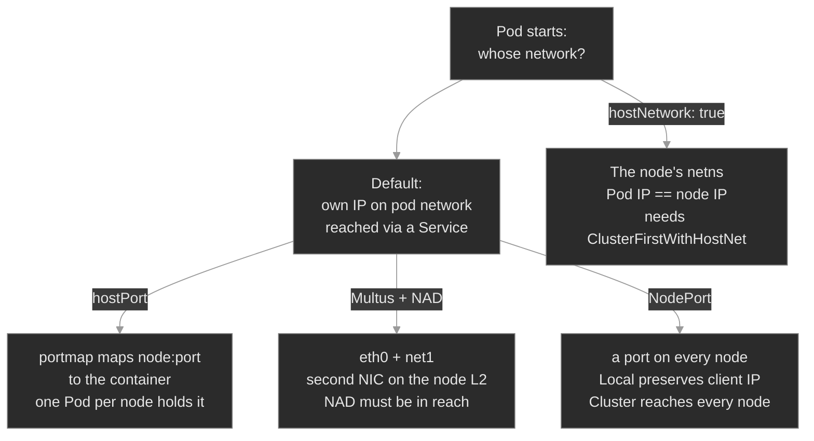

# M22 — Host Networking & Multi-NIC

> When a Pod steps off the default pod network to reach the node's own NIC and ports — hostNetwork, hostPort, a second interface via Multus, and the NodePort policy that decides which nodes actually serve traffic — and the four places each trade bites.

## What you'll learn

- Explain what the default pod network hides, and the four deliberate ways a Pod un-hides the node: `hostNetwork`, `hostPort`, a second NIC via Multus, and NodePort exposure
- Put a Pod on the node's network namespace with `hostNetwork`, know that its Pod IP *is* the node IP, and remember the DNS caveat that comes with it (`dnsPolicy: ClusterFirstWithHostNet`)
- Map a single container port onto a node port with `hostPort`, and explain why that port becomes a node-level scheduling resource
- Give a Pod a second interface with Multus and a `NetworkAttachmentDefinition`, and diagnose the `ContainerCreating` hang when the NAD isn't where the Pod looks
- Reason about how external traffic reaches Pods through a NodePort, and choose `externalTrafficPolicy: Local` vs `Cluster` knowing the source-IP-vs-reachability trade
- Work the host-network differential: `Running`-but-no-cluster-DNS vs stuck `ContainerCreating` vs reachable-from-one-node-only

## Why it matters

The pod network is a convenience: every Pod gets its own IP, talks to every other Pod, and never has to know which node it landed on or what that node's real interfaces are. For most workloads that indirection is exactly right. For a real-time media plane it sometimes isn't. RTP and SIP push UDP at line rate, expect to bind the node's actual ports, and often need the caller's real source IP for routing and rate-limiting. The overlay hop, the source-NAT, and the single shared interface that make the platform portable are precisely the things a media edge gives up.

Host networking is the set of escape hatches for those cases — and each one trades away a slice of the platform's convenience for direct access to the node. `hostNetwork` gives you the node's ports but takes cluster DNS unless you ask for it back. `hostPort` publishes one port on the node but makes that port a finite node resource. A second NIC via Multus gives you a dedicated media path but only if its definition lives where the Pod looks. A NodePort with `externalTrafficPolicy: Local` preserves the client IP but blackholes any node without a local endpoint. The failures are quiet and the top-line objects look healthy — a `Running` Pod, a normal `get svc`, a populated EndpointSlice — so an SRE who knows *which convenience each hatch traded away* fixes them in minutes, and one who doesn't restarts Pods that were never the problem.

## Scope

**Covers:** the default pod-network model and the CNI beneath it (enough to place the escape hatches); `hostNetwork` and its `dnsPolicy: ClusterFirstWithHostNet` requirement; `hostPort` and the `portmap` CNI plugin, including the node-port scheduling constraint; Multus as a meta-CNI, the `NetworkAttachmentDefinition` (NAD) object, the `k8s.v1.cni.cncf.io/networks` annotation, and macvlan/ipvlan secondary interfaces; NodePort external exposure and `externalTrafficPolicy` (`Local` vs `Cluster`) with source-IP preservation; and the host-network failure differential.

**Doesn't cover:** in-cluster Services, EndpointSlices, and cluster DNS mechanics (that's M04, assumed here); NetworkPolicy and Ingress (M14); service mesh sidecars (M15); the internals of the *default* CNI's pod-to-pod routing (treated as a working black box); LoadBalancer provisioning and BGP/MetalLB specifics (cloud- and add-on-dependent); and SR-IOV / DPDK hardware acceleration (named as the production endpoint of this path, not built).

**Assumes:** M00 (`get → describe → events → logs`), M01 (Pods, Deployments, labels, readiness), M04 (Services, ClusterIP, EndpointSlices, and the cluster DNS scheme `<svc>.<ns>.svc.cluster.local` — this module leans on it hard), and M06 (a node's finite resources gate scheduling — `hostPort` is one more such resource).

## Vocabulary

| Term | Definition |
|------|------------|
| **pod network** | The overlay every Pod is attached to by default: each Pod gets its own cluster-internal IP on a single interface (`eth0`), wired by the cluster's CNI plugin. Pod-to-Pod traffic rides it without touching the node's real IP. |
| **CNI** | Container Network Interface — the plugin contract the kubelet calls to wire (and un-wire) a Pod's network when it starts. The default plugin makes `eth0`; other plugins (portmap, macvlan) do narrower jobs. |
| **`hostNetwork`** | A Pod spec field. `true` means the Pod shares the **node's** network namespace instead of getting its own: its Pod IP *is* the node IP, and its containers bind the node's real ports. |
| **`dnsPolicy`** | Controls which resolver a Pod uses. The default `ClusterFirst` is silently ignored on a `hostNetwork` Pod — to keep cluster DNS there you must set **`ClusterFirstWithHostNet`**. |
| **`hostPort`** | A container-port field mapping one port on the **node** to that container's port, via the `portmap` CNI plugin. The Pod keeps its normal pod-network IP; only the one port is published on the node. |
| **`portmap`** | The chained CNI plugin that implements `hostPort` by writing node iptables/nftables DNAT rules from `node:hostPort` to the Pod. |
| **Multus** | A "meta" CNI plugin: it runs the cluster's default plugin for `eth0`, then attaches **additional** interfaces described by NetworkAttachmentDefinitions. The basis of multi-NIC Pods. |
| **NetworkAttachmentDefinition (NAD)** | A **namespaced** custom resource holding a CNI config (e.g. a macvlan setup). A Pod references it by name to get an extra interface. `apiVersion: k8s.cni.cncf.io/v1`. |
| **`k8s.v1.cni.cncf.io/networks`** | The Pod annotation that requests extra networks by NAD name. A bare name resolves in the Pod's own namespace; `<namespace>/<name>` crosses namespaces. |
| **macvlan / ipvlan** | CNI plugins that put a secondary interface directly on the node's L2 network over a `master` NIC. macvlan gives each interface its own MAC; ipvlan shares the master's MAC and splits by IP. |
| **NodePort** | A Service type that opens a fixed port on **every** node's IP and forwards it to the Service's Pods — external reach without a cloud load balancer. |
| **`externalTrafficPolicy`** | On a NodePort/LoadBalancer Service: `Cluster` (default) forwards to endpoints on any node (SNAT hides the client IP); `Local` serves only nodes with a local endpoint (preserves the client IP, drops elsewhere). |

## Mental model

Every Pod answers one question when it starts: *whose network am I on?* By default the answer is "my own" — an IP on the pod network, one interface, reached through a Service. Host networking is a set of deliberate, narrow overrides to that default, and the single idea that ties them together is: **each override un-hides the node in one specific way, and gives up one specific piece of platform convenience to do it.**



Read the branches as trade-offs, not features. `hostNetwork` buys the node's ports and loses cluster DNS by default. `hostPort` buys one published node port and spends a node scheduling slot. Multus buys a second interface and depends on a namespaced NAD being findable. A NodePort buys external reach and forces a choice between the client's source IP (`Local`) and even reachability (`Cluster`). Three of this module's four failure modes are simply the un-hidden node biting back: the hostNetwork Pod that can't resolve `session-broker.media`, the multi-NIC Pod stuck because its NAD is one namespace over, and the NodePort that answers on one node and drops on the next.

## Concept walkthrough

### The default pod network, and what a CNI plugin does

When the kubelet starts a Pod it calls a **CNI** plugin to build the Pod's network namespace<sup><a href="https://kubernetes.io/docs/concepts/cluster-administration/networking/">[1]</a></sup>. The default plugin (Calico, Cilium, flannel — whatever the cluster runs) allocates the Pod an IP from the pod-network range and wires up `eth0`. From then on the Pod reaches other Pods and Services on that overlay, and the node's own interfaces are invisible to it. The Kubernetes networking model guarantees every Pod can reach every other Pod without NAT<sup><a href="https://kubernetes.io/docs/concepts/cluster-administration/networking/">[1]</a></sup> — which is exactly the abstraction M04's Services are built on.

CNI is a *chain*, not a single plugin, and that detail is what makes the escape hatches possible. The kubelet can call several plugins in order: the default for `eth0`, then `portmap` to publish a host port, or Multus to add a second interface<sup><a href="https://kubernetes.io/docs/concepts/extend-kubernetes/compute-storage-net/network-plugins/">[4]</a></sup>. Everything below is a different link in that chain. Two of the module's escape hatches (`hostNetwork`, NodePort) are core Kubernetes; two (`hostPort` via portmap, multi-NIC via Multus) are CNI plugins doing narrow jobs the default plugin doesn't.

### hostNetwork and hostPort: sharing the node's stack

`hostNetwork: true` is the bluntest override: the Pod does not get its own network namespace at all — it shares the **node's**<sup><a href="https://kubernetes.io/docs/reference/kubernetes-api/workload-resources/pod-v1/">[2]</a></sup>. The consequences follow directly. The Pod's reported IP *is* the node's IP. A process that binds `:5004` inside the container is binding the node's `:5004`, reachable at the node's address with no Service in front of it — which is why a high-throughput RTP relay uses it: no overlay encapsulation, no extra hop, the kernel's UDP path straight to the wire. And because there is only one network namespace on the node, two `hostNetwork` Pods that both want `:5004` collide; the second won't come up.

The trap is DNS. A Pod's `dnsPolicy` defaults to `ClusterFirst`, which points its resolver at CoreDNS — but `ClusterFirst` is **silently ignored when `hostNetwork` is true**, and the kubelet hands the Pod the node's `/etc/resolv.conf` instead<sup><a href="https://kubernetes.io/docs/concepts/services-networking/dns-pod-service/#pod-s-dns-policy">[3]</a></sup>. The node's resolver knows nothing about `svc.cluster.local`, so the Pod can't resolve any in-cluster Service by name — while every other Pod on the cluster resolves them fine. The Pod is `Running`; only Service DNS is broken. The fix is one field: `dnsPolicy: ClusterFirstWithHostNet`, which is "`ClusterFirst`, and yes I know I'm on the host network"<sup><a href="https://kubernetes.io/docs/concepts/services-networking/dns-pod-service/#pod-s-dns-policy">[3]</a></sup>. The rule to carry: **any `hostNetwork` Pod that talks to cluster Services needs `ClusterFirstWithHostNet`.**

`hostPort` is the surgical version of the same idea. Instead of taking the whole node network, a container port declares `hostPort: 5060`, and the `portmap` CNI plugin writes a DNAT rule so the node's `:5060` forwards to that container — while the Pod keeps its normal pod-network IP<sup><a href="https://www.cni.dev/plugins/current/meta/portmap/">[5]</a></sup>. You publish exactly one port on the node and nothing else changes. The cost is scheduling: a `hostPort` is a node-level resource, tracked like CPU or memory (M06). Only one Pod per node can hold a given `hostPort`, so a second Pod requesting the same port stays `Pending` with a `didn't have free ports` event, and a DaemonSet using a `hostPort` is capped at one Pod per node by construction. Use it sparingly — it pins scheduling and bypasses Service load-balancing — but it's the right tool when a fixed, well-known node port must map to a specific workload.

<details>
<summary>📖 Going deeper: how hostPort actually works — the portmap chained plugin<sup><a href="https://www.cni.dev/plugins/current/meta/portmap/">[5]</a></sup></summary>

`hostPort` is not implemented by Kubernetes core — it's a CNI plugin, and it only works if the cluster's CNI configuration *chains* `portmap` after the main plugin<sup><a href="https://kubernetes.io/docs/concepts/extend-kubernetes/compute-storage-net/network-plugins/">[4]</a></sup>. A CNI config is a list: the kubelet runs the main plugin to create `eth0`, then hands the result to `portmap`, which reads the Pod's `hostPort` entries and installs node iptables/nftables DNAT rules from `node:hostPort` to `podIP:containerPort`<sup><a href="https://www.cni.dev/plugins/current/meta/portmap/">[5]</a></sup>.

The practical consequence: on a cluster whose CNI *doesn't* include `portmap` in the chain, a `hostPort` is silently accepted and does nothing — the Pod runs, but the node port never opens. That's why "my `hostPort` isn't reachable" is sometimes a CNI-configuration problem, not a Pod problem: check that the node's CNI conf list (`/etc/cni/net.d/`) actually has a `portmap` entry. On the managed backends and kubeadm clusters used here, it's present by default.

</details>

### Multus and multi-NIC: a second interface from a NAD

A Pod normally has one interface. A media plane sometimes wants two — `eth0` on the pod network for control traffic, and a dedicated second interface for media, isolated onto its own L2. **Multus** makes that possible: it's a meta-CNI that Kubernetes calls in place of the default plugin, runs the default plugin first to produce `eth0`, then attaches any extra interfaces the Pod asked for<sup><a href="https://github.com/k8snetworkplumbingwg/multus-cni">[8]</a></sup>. Multus itself moves no packets; it delegates each attachment to a real plugin like macvlan or ipvlan.

The extra network is described by a **NetworkAttachmentDefinition** — a namespaced custom resource whose `spec.config` is a plain CNI JSON block<sup><a href="https://github.com/k8snetworkplumbingwg/multi-net-spec">[9]</a></sup>. A Pod requests one (or several) by adding the annotation `k8s.v1.cni.cncf.io/networks: <nad-name>` to its template. When the Pod starts, Multus reads the annotation, looks up the NAD, runs the plugin in its `config`, and the Pod comes up with `net1` alongside `eth0`. The gotcha is namespacing, and it mirrors M04's DNS lesson exactly: a NAD is a namespaced object, and a **bare** network name is resolved in the *Pod's own* namespace. A Pod in `edge` asking for bare `rtp-macvlan` when the NAD lives in `media` fails — Multus can't find it, sandbox creation fails, and the Pod hangs in `ContainerCreating` (never `Running`, because the network namespace is never completed). The cross-namespace form is `<namespace>/<name>`, e.g. `media/rtp-macvlan`.

<details>
<summary>📖 Going deeper: macvlan vs ipvlan, and why a NAD carries an IPAM block<sup><a href="https://www.cni.dev/plugins/current/main/macvlan/">[10]</a></sup></summary>

The second interface has to get its addresses from somewhere, and the default plugin's IPAM doesn't apply — so a NAD's CNI config carries its own `ipam` block. A common choice is `host-local` with a static subnet and range (`192.168.99.0/24`), which hands out addresses from that pool without any external DHCP; larger deployments point `ipam` at a real DHCP server or a whereabouts plugin for cluster-wide coordination.

The plugin choice matters too. **macvlan** clones the node's `master` NIC into virtual interfaces, each with its **own MAC** on the node's L2 — the closest thing to giving the Pod a real second network card, and the textbook media path<sup><a href="https://www.cni.dev/plugins/current/main/macvlan/">[10]</a></sup>. **ipvlan** shares the master's single MAC and splits traffic by IP instead — handy where the network or a cloud fabric rejects extra MACs (many virtualized NICs do). Both put the interface directly on the underlay, bypassing the pod-network overlay; the trade is that this traffic is now the underlying network's concern (its ACLs, its IPAM, its MTU), not the cluster's. The production endpoint of this same path is **SR-IOV** — handing a Pod a hardware NIC virtual function for kernel-bypass throughput — which is the same NAD mechanism pointed at a different plugin.

</details>

### External traffic: NodePort and externalTrafficPolicy

Everything above is about traffic *inside* the node or cluster. The last hatch is how traffic gets *in* from outside. A **NodePort** Service opens a fixed high port (default range 30000–32767) on **every** node's IP and forwards it to the Service's Pods — the portable way to accept external traffic without a cloud load balancer<sup><a href="https://kubernetes.io/docs/concepts/services-networking/service/#type-nodeport">[6]</a></sup>. A LoadBalancer Service is a NodePort with a cloud LB automatically placed in front; the policy below applies to both.

That policy is `externalTrafficPolicy`, and it decides what a node does when external traffic arrives but the backing Pod is elsewhere<sup><a href="https://kubernetes.io/docs/tutorials/services/source-ip/">[7]</a></sup>:

```text
externalTrafficPolicy: Cluster (default)     externalTrafficPolicy: Local
  client -> nodeB:30080                         client -> nodeB:30080
    nodeB has no local Pod                         nodeB has no local Pod
    -> SNAT + forward to a Pod on nodeA             -> DROP (silent)
  reachable on every node                        client -> nodeA:30080 (has a Pod) -> served
  client's source IP is hidden (SNAT)            client's real source IP is preserved
```

`Cluster` load-balances across all endpoints cluster-wide: a node with no local endpoint source-NATs the packet and forwards it to a Pod on another node. Reachable from every node, at the cost of an extra hop and a SNAT that replaces the client's IP with the node's — so the Pod never sees who called<sup><a href="https://kubernetes.io/docs/tutorials/services/source-ip/">[7]</a></sup>. `Local` refuses to forward across nodes: a node serves the NodePort only if it has a local endpoint, and **silently drops** the traffic otherwise. That preserves the client's real source IP (nothing SNATs it) — which real-time media often needs for routing and rate-limiting — but it means any node without a local endpoint is a blackhole. Pair `Local` with a single-replica backend and every node except one drops external traffic, while `get svc` and the EndpointSlice look perfectly healthy. The fixes are the two honest options: switch to `Cluster` if even load-balancing matters more than the source IP, or keep `Local` and guarantee an endpoint on every node (a DaemonSet, or topology spread) so no serving node is ever empty.

## Hands-on

Four steps in the baseline, three break/fix scenarios — all on the full Polyphone fleet, plus four workloads this module layers on (`rtp-relay`, `sip-edge`, `media-probe`, `rtp-ingress`) and a Multus install. Reachability is checked with `curl` against node IPs from the lab terminal.

- **`baseline/`** — each escape hatch healthy: a `hostNetwork` relay whose Pod IP is the node IP (with cluster DNS intact via `ClusterFirstWithHostNet`), a `hostPort` mapped onto the node's `:5060`, a multi-NIC Pod with `eth0` + a macvlan `net1` from a NAD, and a NodePort reachable from every node under `Cluster`.
- **`breakfix-01-hostnetwork-dns`** — the `hostNetwork` DNS trap. The relay is `Running` but can't resolve cluster Service names; its `dnsPolicy` fell back to the node's resolver. Fix: `ClusterFirstWithHostNet`.
- **`breakfix-02-multus-missing-nad`** — the multi-NIC Pod stuck `ContainerCreating` because it asks for its NAD by bare name from the wrong namespace. Fix: the `<namespace>/<name>` reference.
- **`breakfix-03-etp-local-blackhole`** — the NodePort that answers on one node and drops on another under `externalTrafficPolicy: Local`. Fix: `Cluster`, or an endpoint per node.

The three scenarios walk the host-network differential — `Running`-but-no-DNS → stuck-`ContainerCreating` → reachable-from-one-node-only — so each isolates one hatch and one signature. Check yourself against `ANSWER-KEY.md` after each.

## Common failure modes

| Symptom | Likely cause | Where to look |
|---------|--------------|---------------|
| `hostNetwork` Pod `Running` but can't resolve cluster Service names | `dnsPolicy` left at default; ignored on host network | the Pod's `dnsPolicy` (needs `ClusterFirstWithHostNet`); `cat /etc/resolv.conf` inside the Pod |
| `hostNetwork` Pod stuck `Pending` / `CrashLoopBackOff` on a port bind | another process (or Pod) already holds that node port | `ss -lntup` on the node; other `hostNetwork` Pods on the same node |
| Pod with `hostPort` won't schedule, `Pending` | the node port is already taken by another Pod | the `FailedScheduling` event (`didn't have free ports`); other Pods' `hostPort` on that node |
| `hostPort` accepted but the node port never opens | CNI chain has no `portmap` plugin | `/etc/cni/net.d/` conf list for a `portmap` entry |
| Multi-NIC Pod stuck `ContainerCreating` | requested NAD not found in the Pod's namespace | `describe pod` events (`FailedCreatePodSandBox`); `get network-attachment-definitions -A` |
| Multi-NIC Pod `ContainerCreating`, NAD exists | macvlan `master` interface wrong, or IPAM pool exhausted | the NAD's `config` (`master`, `ipam`); Multus/kubelet logs |
| NodePort reachable from one node, times out from another | `externalTrafficPolicy: Local` with no local endpoint on the failing node | `svc.spec.externalTrafficPolicy`; `get pod -o wide` vs which nodes serve |
| External clients all see the node IP as the source, not the real client | `externalTrafficPolicy: Cluster` SNATs the client IP | switch to `Local` (with per-node endpoints) if the source IP is needed |

## Recap

- **A Pod is on the default pod network unless it deliberately steps off.** Host networking is four narrow overrides — `hostNetwork`, `hostPort`, Multus multi-NIC, NodePort exposure — and each trades a piece of platform convenience for direct access to the node. Diagnose by asking *which convenience did this hatch give up.*
- **`hostNetwork` makes the Pod IP the node IP and takes cluster DNS with it.** A hostNetwork Pod needs `dnsPolicy: ClusterFirstWithHostNet` or it silently uses the node's resolver — `Running` but blind to `svc.cluster.local`. Check `dnsPolicy` before you suspect CoreDNS.
- **`hostPort` publishes one node port via `portmap` and spends a node scheduling slot.** One Pod per node per port; a second is `Pending` with `didn't have free ports`. If the port never opens at all, the CNI chain is missing `portmap`.
- **Multus adds interfaces from a namespaced NAD, referenced by annotation.** A bare NAD name resolves in the Pod's namespace — the same trap as M04's cross-namespace DNS. Wrong namespace → `ContainerCreating` + `FailedCreatePodSandBox`; fix with `<namespace>/<name>`.
- **A NodePort's `externalTrafficPolicy` is a source-IP-vs-reachability choice.** `Cluster` reaches every node but SNATs the client IP; `Local` preserves the client IP but drops on nodes with no local endpoint. `Local` + single-node backend = a per-node blackhole with a healthy-looking Service.

## Production thinking

- Your media team ships an RTP relay as a `hostNetwork` DaemonSet so every node can terminate media on a fixed UDP port. It works in the lab and blackholes signaling in staging: the relay can't resolve the SIP control plane by name. Nothing is `CrashLooping`. What one field is missing, and what's your standing rule so the next `hostNetwork` workload doesn't repeat it?
- A NodePort front-end runs `externalTrafficPolicy: Local` to keep the caller's source IP for per-tenant rate-limiting. During a rolling update a node drains, its local endpoint disappears for ten seconds, and the external LB keeps sending it traffic — which is now dropped. What health signal should the LB have been keyed to (hint: `Local` publishes a dedicated one), and what deployment shape would have kept an endpoint on every node throughout the roll?
- You need a second, isolated interface for media on a cloud backend whose virtual NICs reject extra MAC addresses, so macvlan won't attach. Which plugin do you reach for instead, what changes about how that traffic is addressed, and what new external dependency (IPAM, MTU, ACLs) does putting Pods directly on the underlay hand you that the pod network used to hide?

## References

1. Kubernetes — Cluster Networking (the networking model): https://kubernetes.io/docs/concepts/cluster-administration/networking/
2. Kubernetes — Pod API reference (`hostNetwork`, host fields): https://kubernetes.io/docs/reference/kubernetes-api/workload-resources/pod-v1/
3. Kubernetes — DNS for Services and Pods (`dnsPolicy`, `ClusterFirstWithHostNet`): https://kubernetes.io/docs/concepts/services-networking/dns-pod-service/#pod-s-dns-policy
4. Kubernetes — Network Plugins (CNI, chaining, portmap): https://kubernetes.io/docs/concepts/extend-kubernetes/compute-storage-net/network-plugins/
5. CNI — portmap plugin (hostPort): https://www.cni.dev/plugins/current/meta/portmap/
6. Kubernetes — Service type NodePort: https://kubernetes.io/docs/concepts/services-networking/service/#type-nodeport
7. Kubernetes — Using Source IP (`externalTrafficPolicy` Local vs Cluster): https://kubernetes.io/docs/tutorials/services/source-ip/
8. Multus CNI (the multi-network meta-plugin): https://github.com/k8snetworkplumbingwg/multus-cni
9. NetworkAttachmentDefinition — Kubernetes Network Custom Resource De-facto Standard: https://github.com/k8snetworkplumbingwg/multi-net-spec
10. CNI — macvlan plugin: https://www.cni.dev/plugins/current/main/macvlan/
